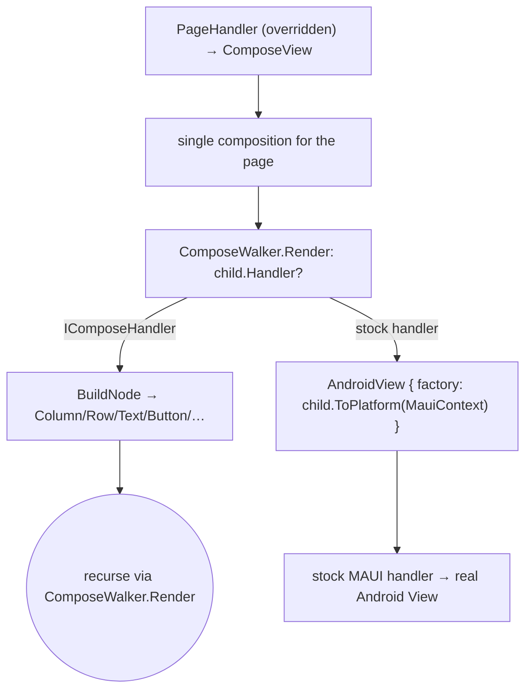

# Microsoft.AndroidX.Compose.Maui — agent instructions

This project re-skins .NET MAUI's Android handlers with Jetpack Compose
via `Microsoft.AndroidX.Compose`. Consumers opt in with one call:

```csharp
MauiApp.CreateBuilder()
    .UseMauiApp<App>()
    .UseAndroidXCompose();          // ← our extension, must be after UseMauiApp
```

`UseAndroidXCompose()` calls `ConfigureMauiHandlers(...)` to overwrite
MAUI's stock handlers in the DI-backed handler registry. **Last
`AddHandler<TVirtualView, THandler>()` per virtual-view type wins**, so
ordering matters.

See `docs/maui-backend.md` for the full multi-phase plan. This file is
the rule set for adding new Compose-backed handlers.

## Layout

- `Hosting/AppHostBuilderExtensions.cs` — the public
  `UseAndroidXCompose()` extension. Add new handler registrations here.
- `Handlers/` — one handler per file, named `<MauiType>Handler.cs`.
  `<MauiType>` is the **MAUI cross-platform virtual-view name** (e.g.
  `Label`, `Button`, `Slider`), not the platform-view name.

## Pinned package versions (read first if you touch the csproj)

`Microsoft.AndroidX.Compose 1.11.x` pins
`Xamarin.AndroidX.Core` to `1.18.0` via `include="All"`.

`Microsoft.Maui.Controls` is intentionally pinned to **10.0.20** in
`Directory.Build.targets`. MAUI 10.0.70 added a call to
`AndroidX.Core.View.Accessibility.AccessibilityNodeInfoCompat.set_Checked(bool)`
in `SemanticExtensions.UpdateSemanticNodeInfo`, but that setter was
removed in `Xamarin.AndroidX.Core 1.18.0` in favor of a `CheckedState`
enum. The result is a runtime `MissingMethodException` on every view
that publishes accessibility info. **Do not bump MAUI past 10.0.20**
until a MAUI release ships that's compiled against
`Xamarin.AndroidX.Core 1.18+`.

The csproj also pins **six** AndroidX parent packages to versions that
align Compose 1.11.x's chain with MAUI 10.0.20's transitive demands
(`Lifecycle.LiveData`, `Lifecycle.LiveData.Core.Ktx`,
`Navigation.Fragment`, `Navigation.UI`, `Fragment.Ktx`,
`Emoji2.ViewsHelper`). Don't trim them — they're load-bearing for
NU1107/NU1608.

## Architecture — one `ComposeView` per page

`Microsoft.AndroidX.Compose.Maui` rewires MAUI's Android handler chain
so that the page is the composition boundary, not the leaf:

- `PageHandler` is the **only** handler that creates a `ComposeView`.
  It's a `ViewHandler<IContentView, ComposeView>` (not the stock
  `ContentViewHandler` which lives on `ContentViewGroup` and routes
  measure/arrange through `ICrossPlatformLayout`). Standard Android
  measure-spec sizes the `ComposeView` to fill whatever container
  Shell / Navigation puts the page in; Compose owns layout for
  everything below.
- `LayoutHandler` (`VerticalStackLayout`, `HorizontalStackLayout`),
  `ScrollViewHandler`, and every leaf (`LabelHandler`, `ButtonHandler`,
  `EntryHandler`, `ImageHandler`) implement `IComposeHandler` and
  derive from `ComposeElementHandler<T>`. They contribute a
  `ComposableNode` to the page's composer via
  `BuildNode(IComposer)` — **zero per-leaf `ComposeView`s** in fully
  converted subtrees.
- Anything not in our handler list (Grid, AbsoluteLayout, FlexLayout,
  CollectionView, BoxView, Switch, customer renderers) keeps its
  stock handler and is hosted via Compose's `AndroidView { factory }`
  interop from inside the same composition. The walker
  (`ComposeWalker.Render`) does the dispatch.



**Consumer-facing invariant.** `UseAndroidXCompose()` is the only
Compose surface the consumer touches. Their XAML / C# stays pure MAUI;
they don't pick a "Compose root", don't see `ComposeView`, don't import
`Microsoft.AndroidX.Compose`. The page handler installs the single
`ComposeView` and the walker bridges everything else.

**uiautomator-dump invariant.** A page whose root content uses only our
converted handlers (Page → VSL/HSL/ScrollView → Label/Button/Entry/Image)
contains exactly **one** `androidx.compose.ui.platform.ComposeView` node.
A page whose root content uses an unconverted container (`Grid`,
`CollectionView`) may contain additional `ComposeView` nodes — one per
Compose-backed leaf inside a stock container, because such leaves can't
fold into a parent composer that doesn't exist.

## Canonical handler shape

Two skeletons depending on whether the handler contributes to the page
composition (`IComposeHandler` path) or owns the page composition
(`PageHandler`). Concrete examples in `Handlers/LabelHandler.cs`,
`Handlers/ButtonHandler.cs`, `Handlers/LayoutHandler.cs`.

### Page-content handler — `ComposeElementHandler<T>` + `BuildNode`

```csharp
public partial class FooHandler : ComposeElementHandler<IFoo>
{
    public static IPropertyMapper<IFoo, FooHandler> Mapper =
        new PropertyMapper<IFoo, FooHandler>(ViewHandler.ViewMapper)
        {
            [nameof(IText.Text)] = MapText,
            // … other properties
        };

    public static CommandMapper<IFoo, FooHandler> CommandMapper =
        new(ViewCommandMapper);

    // One MutableState<T> per Compose slot the composition reads.
    readonly MutableState<string> _text = new(string.Empty);

    public FooHandler() : base(Mapper, CommandMapper) { }

    public FooHandler(IPropertyMapper? mapper, CommandMapper? commandMapper = null)
        : base(mapper ?? Mapper, commandMapper ?? CommandMapper) { }

    /// <inheritdoc/>
    public override ComposableNode BuildNode(IComposer composer)
        => new Foo(/* read _text.Value etc. */);

    public static void MapText(FooHandler handler, IFoo foo) =>
        handler._text.Value = foo.Text ?? string.Empty;
}
```

`ComposeElementHandler<T>` is a `ViewHandler<T, AView>` whose
`CreatePlatformView()` returns a tiny marker `Android.Views.View`
(MAUI requires a non-null `PlatformView` for attach / focus /
animation bookkeeping; the marker satisfies the contract without
being added to any `ViewGroup`). All actual rendering happens via
`BuildNode` inside the page's single composition. There is no
`ComposeView` per handler, no per-handler composer, no per-handler
`DisposeComposition`.

### Container / scope handler

Containers (`LayoutHandler`, `ScrollViewHandler`) follow the same
shape but their `BuildNode` walks `IView` children via
`ComposeWalker.Render`:

```csharp
public override ComposableNode BuildNode(IComposer composer)
{
    var container = new Column { Modifier = BuildModifier() };
    foreach (var child in VirtualView!.Children)
        container.Add(c => ComposeWalker.Render(child, c, MauiContext!));
    return container;
}
```

The walker dispatches each child to `IComposeHandler.BuildNode` or to
`AndroidView { factory = child.ToPlatform(MauiContext) }` if the
child's handler isn't ours.

### Rules the skeletons encode

1. **Type the mapper against the concrete handler, not the interface.**
   `PropertyMapper<TVirtualView, TViewHandler>.UpdateProperty` casts the
   handler arg of every mapper callback to `TViewHandler`. If you type
   the mapper as `IPropertyMapper<IFoo, IFooHandler>` and don't
   implement `IFooHandler`, the **first property mapping crashes with
   `InvalidCastException`** at attach time. Use
   `IPropertyMapper<IFoo, FooHandler>` and the cast lands on the
   concrete type for free. (This is the WPF backend's pattern.)

2. **One `MutableState<T>` per Compose-readable slot.** `BuildNode`
   reads slots; mapper callbacks write them. Compose's snapshot system
   schedules a recomposition on the next frame — no manual invalidation
   needed. **`MutableState<T>` only supports a fixed set of `T`** —
   `Java.Lang.Object` subclasses, `string`, `bool`, `char`, primitives,
   and `Nullable<T>` of primitives. MAUI structs (`Thickness`, `Size`,
   `Rect`, `Color`, …) and user-defined .NET enums throw
   `NotSupportedException` at field-initializer time. For structs use
   the **version-counter pattern**: `MutableState<int> _padVersion` +
   read the live value off `VirtualView` inside `BuildNode`. For enums
   use `MutableState<int>` and cast back. See
   `LayoutHandler._paddingVersion` and `LabelHandler._hTextAlign`.

3. **`BuildNode` is the render entry point** for `IComposeHandler`s
   (every handler except `PageHandler`). The composer is the page's
   composer; reading `MutableState<T>` slots inside `BuildNode`
   registers the right slot-table dependencies. Don't allocate a fresh
   `IComposer` — there is one and only one per page.

4. **`PageHandler` owns the single `ComposeView`**, and is therefore the
   only handler that:
   - Inherits `ViewHandler<IContentView, ComposeView>` directly.
   - Overrides `CreatePlatformView()` to return a `ComposeView`.
   - Calls `DisposeComposition()` in `DisconnectHandler`.

   The page's composition root wraps the walker output in a
   `new Box { Modifier = Modifier.FillMaxSize() }` so an `AndroidView`
   fallback at the root (Grid, FlexLayout, …) fills the page instead
   of collapsing to wrap-content.

5. **Inherit from `ViewHandler.ViewMapper` / `ViewCommandMapper`** so
   the standard view-level mappings (Background, Opacity, IsEnabled, …)
   come for free. Exception: when the underlying composable owns its
   own surface (Material 3 widgets with `*Colors` slots), route
   `IView.Background` into the composable's colour slot instead — see
   `ButtonHandler.MapBackground`.

6. **`PropertyMapper` auto-runs every entry once at attach.** Initial
   values flow through your `MapXxx` callbacks for free — you don't
   have to read `VirtualView` in `BuildNode`. (Except for struct-typed
   live reads — see rule 2.)

7. **Constructors come in pairs.** Parameterless for DI, then a
   `(IPropertyMapper?, CommandMapper?)` overload for consumers who
   want to extend the mapper. Standard MAUI handler convention.

### Adding a new page-content handler

1. Create `Handlers/<MauiType>Handler.cs` following the
   `ComposeElementHandler<T>` skeleton.
2. Map each MAUI interface property you care about to a
   `MutableState<T>` slot. See rule 2 above for `T` restrictions.
3. `BuildNode` reads slots and builds the Compose widget tree.
   Use `Microsoft.AndroidX.Compose`'s existing facades (`Text`,
   `Button`, `Column`, …). For containers, walk children via
   `ComposeWalker.Render(child, composer, MauiContext!)`.
4. Register the handler in `Hosting/AppHostBuilderExtensions.cs`:

   ```csharp
   handlers.AddHandler<MauiFoo, FooHandler>();
   ```

   where `MauiFoo` is the cross-platform MAUI control
   (e.g. `Microsoft.Maui.Controls.Slider`).
5. Add a Phase entry in `docs/maui-backend.md`.
6. **Add a demo in `Microsoft.AndroidX.Compose.Maui.Sample`** so manual
   smoke-test deploys exercise the new handler.
7. Build + deploy with `dotnet build
   src/Microsoft.AndroidX.Compose.Maui.Sample -t:Install`. Resolve the
   launchable activity (the JCW class name is a per-assembly hash that
   changes — never hardcode it):

   ```pwsh
   adb shell cmd package resolve-activity --brief net.compose.maui.sample
   # → net.compose.maui.sample/crc6XXXXXXXX.MainActivity
   adb shell am start -n net.compose.maui.sample/<resolved activity>
   ```

   Confirm exactly one `androidx.compose.ui.platform.ComposeView` per
   converted page via `uiautomator dump`, then exercise it (tap, type,
   drag).

### Event forwarding

If the MAUI interface defines events the host expects in a specific
order (e.g. `IButton` fires `Pressed → Clicked → Released` on touch),
**forward all of them** from your single Compose callback. Compose
typically surfaces only the logical event; behaviors and gesture
recognizers subscribed to the others break silently if you skip them.
See `ButtonHandler.OnClicked` for the pattern.

### Mapper rules learned the hard way

These came out of getting Label / Button / Entry / Image to render
identically to the stock template. Apply on every new handler.

- **Don't replicate `MapBackground` with a no-op — map it onto the
  composable's own colour slot.** Compose Material 3 widgets paint
  their own pill / card / surface, so a default
  `ViewMapper.MapBackground` painting a `SolidPaint` on the outer
  `ComposeView` produces a wide rectangle behind the smaller M3 pill.
  The first instinct (Phase 1) was to **suppress** the entry with a
  `(h, v) => { }` no-op. That works for "match stock M3 theme" but
  loses the caller's `BackgroundColor=` entirely — a MAUI button with
  `BackgroundColor="Primary"` then renders in M3 primary
  (`#6750A4`) instead of MAUI Primary (`#512BD4`).

  The right pattern is to **route the colour into the composable's
  own slot**. For `Button`, that's `ButtonColors.containerColor` via
  `composer.ButtonColors(containerColor: ...)`. The mapper extracts
  the packed `long?` from a `SolidPaint`; gradients / images / `null`
  leave the slot unset so M3's theme default applies:

  ```csharp
  public static void MapBackground(ButtonHandler handler, IButton button) =>
      handler._containerColor.Value = button.Background is SolidPaint solid
          ? ColorMapping.ToPackedLong(solid.Color)
          : null;
  ```

  Then inside `SetContent(c => ...)`:

  ```csharp
  if (container is not null || content is not null)
      button.Colors = c.ButtonColors(
          containerColor: container,
          contentColor:   content);
  ```

  The `c => ...` signature (not `_ =>`) is important — you need the
  composer for `composer.ButtonColors(...)` to allocate inside the
  current composition. See `ButtonHandler.cs` for the canonical
  pairing. The same pattern extends to any future Compose-skinned
  widget with a `*Colors` slot (`Card`, `Surface`, `TextField`).

- **`MapBackground` and `MapTextColor` come as a pair on coloured
  surfaces.** M3's `contentColorFor(arbitraryColor)` returns
  `Color.Unspecified` when the container colour isn't one of the
  theme's tokens — so a Compose `Text` inside a button with
  `BackgroundColor="#512BD4"` reads transparent and disappears.
  Always map `TextColor` (when `IButton is ITextStyle`) into the
  matching `contentColor` slot:

  ```csharp
  public static void MapTextColor(ButtonHandler handler, IButton button)
  {
      if (button is ITextStyle textStyle)
          handler._contentColor.Value = ColorMapping.ToPackedLong(textStyle.TextColor);
  }
  ```

  Apply to any handler whose composable owns its own surface (any
  `*Colors`-bearing Material 3 widget). Leaves with no intrinsic
  surface (`Label`) don't need it.

- **Map `HorizontalLayoutAlignment` → `Modifier.fillMaxWidth()`** when
  the caller asks to `Fill` (Button, Entry) or `Fill`/`Center`
  (Label). Compose's `Text` only honours `textAlign` when its
  measured width spans the available space, so
  `HorizontalTextAlignment="Center"` on a `Headline`/`SubHeadline`
  `Label` renders left-aligned until the Compose `Text` also fills
  its slot. Same trick for Material 3 `Button` (hugs its content by
  default, would otherwise render as a small pill on the left edge
  for `HorizontalOptions="Fill"`) and `OutlinedTextField` (otherwise
  renders as a tiny pill on the left for an Entry with
  `HorizontalOptions="Fill"`). See `LabelHandler.MapHorizontalLayoutAlignment`,
  `ButtonHandler.MapHorizontalLayoutAlignment`,
  `EntryHandler.MapHorizontalLayoutAlignment`.

### Two-way input — the feedback-loop guard

`Entry`-style handlers wire MAUI → Compose **and** Compose → MAUI.
The MAUI `Text` mapper writes the Compose state from `view.Text`;
the Compose `onValueChange` writes back to `view.Text` so MAUI's
`TextChanged` event and bound `Command` fire. If you naively forward
both directions you get either a feedback loop (Compose write →
MAUI `TextChanged` → MAUI mapper → Compose write → ...) or dropped
keystrokes (Compose doesn't see your write until the next frame, so
the rendered value snaps back to the old state).

The pattern (see `EntryHandler.OnValueChanged`):

```csharp
void OnValueChanged(string newValue)
{
    // 1. Update Compose state synchronously so the rendered value
    //    stays pinned to what the user typed.
    _text.Value = newValue;
    // 2. Update VirtualView.Text. Triggers MAUI's TextChanged event
    //    + property pipeline (data binding, behaviors, validation),
    //    which re-enters MapText with the same string. That's a
    //    no-op on MutableState<string>'s equality check — no loop.
    if (VirtualView is { } entry)
        entry.Text = newValue;
}
```

No explicit `_suppressMauiWrite` flag needed — the `MutableState<T>`
equality check breaks the cycle. **Don't use `entry.SetValueFromRenderer(...)`**;
that's internal and bypasses the equality short-circuit. The same
pattern works for any property pair where MAUI and Compose both
own the read side (`Slider.Value`, `Switch.IsToggled`).

### `IImage` / image source resolution (`ImageHandler` pattern)

Hybrid pipeline. Reuse stock dotnet/maui plumbing wherever it fits;
fork only for the per-density-bucket / vector-drawable fast path.

**Fast path — `IFileImageSource` resolved to a packaged drawable.**
Use the public `Context.GetDrawableId(file)` from
`Microsoft.Maui.Platform.ContextExtensions` (it lower-cases the file
name and asks `Resources.GetIdentifier(name, "drawable", PackageName)`
— same lookup `FileImageSourceService` does). If `> 0`, push it into
a `MutableState<int?>` and render via the source-gen `Image(int)`
ctor, which calls `painterResource(id, composer)` — preserves vector
drawables and density buckets.

```csharp
if (src is IFileImageSource file &&
    handler.Context.GetDrawableId(file.File ?? string.Empty) is var id && id > 0)
{
    handler._loader?.Reset();
    handler._painter.Value = null;
    handler._drawableResourceId.Value = id;
    return;
}
```

**General path — every other source.** `UriImageSource`,
`StreamImageSource`, `FontImageSource`, plus files that aren't
packaged as drawable resources, all go through MAUI's
`ImageSourcePartLoader(IImageSourcePartSetter)`. Because the platform
view isn't an `ImageView`, MAUI's `ImageSourcePartExtensions.UpdateSourceAsync`
takes the `GetDrawableAsync(...)` branch and invokes
`setImage(drawable)` on our setter. The setter wraps the `Drawable`
as a Compose `BitmapPainter` and writes it into a second
`MutableState<Painter?>` slot. The `SetContent` lambda prefers the
painter slot over the drawable-id slot, so a freshly-loaded URI
image immediately replaces a stale fast-path render.

`Loader` is lazy — handlers that only ever see file sources never
allocate the setter at all. The setter holds a `WeakReference<>` back
to the handler so a stale continuation can't root a disconnected
handler.

**`Drawable` → Compose `Painter` conversion.** Zero-copy wrap of
`BitmapDrawable.Bitmap` when present; rasterize once at intrinsic
size (fallback 1×1) for vector / layer-list / font glyph drawables.
Pack `IntSize` as `((long)w << 32) | (uint)h` (matches Compose's
`packInts` lowering for the `@JvmInline value class`). Pass
`IntOffset.Zero` as `0L` and `FilterQuality.Low` as `1`.

`d.IntrinsicWidth` / `d.IntrinsicHeight` are JNI getters — cache
each in a local before clamping. Reuse those locals (not
`bitmap.Width` / `bitmap.Height`) when packing `srcSize`:
`DrawableKt.ToBitmap(d, w, h, config: null)` either zero-copies a
size-matching `BitmapDrawable` or allocates fresh at exactly
`(w, h)`, so the bitmap dimensions are guaranteed to equal our
local `w`/`h` and reading them back would pay two more JNI getters
for no information.

```csharp
int intrinsicW = d.IntrinsicWidth;
int intrinsicH = d.IntrinsicHeight;
var w = intrinsicW > 0 ? intrinsicW : 1;
var h = intrinsicH > 0 ? intrinsicH : 1;
var bitmap = DrawableKt.ToBitmap(d, w, h, config: null);

var imageBitmap = AndroidImageBitmap_androidKt.AsImageBitmap(bitmap);
var srcSize = ((long)w << 32) | (uint)h;
return BitmapPainterKt.BitmapPainter(
    image: imageBitmap, srcOffset: 0L, srcSize: srcSize, filterQuality: 1);
```

**Async-void mapper.** `Microsoft.Maui.TaskExtensions.FireAndForget`
is **internal**, so we can't follow MAUI's stock pattern of
`UpdateImageSourceAsync().FireAndForget(handler)` after a sync
mapper. Instead, declare `MapSource` itself `async void` —
`PropertyMapper<,>` stores mapper delegates as `Action<,>` and
invokes them synchronously without awaiting, so an `async void`
mapper has the same fire-and-forget shape from MAUI's POV. The
inner `UpdateSourceAsync` already catches `Exception` and routes
failure to `setImage(null)`, so the catch here is defence-in-depth
— primarily covers `ObjectDisposedException` from a disconnected
handler.

```csharp
public static async void MapSource(ImageHandler handler, MauiIImage image)
{
    // ...fast-path branches with sync `return` above...
    handler._drawableResourceId.Value = null;
    try { await handler.Loader.UpdateImageSourceAsync().ConfigureAwait(false); }
    catch (Exception ex)
    {
        System.Diagnostics.Debug.WriteLine(
            $"[ImageHandler] image source load failed: {ex.Message}");
    }
}
```

**Cancellation.** `_loader?.Reset()` calls `BeginLoad()` +
`CompleteLoad(null)` under the hood, cancelling the prior token. Do
it on `DisconnectHandler`, on an empty source, and on a successful
fast-path resolve so a stale URI continuation can't write into the
painter slot. The prior task's catch block swallows
`OperationCanceledException` *without* calling `setImage(null)`, so
rapid `MapSource` changes don't flash blank — the old painter stays
until the new one loads.

**Don't add a 1-arg `Image(int)` overload by hand** — `Image.cs`
already declares both `Image(int)` and `Image(Painter)` stub ctors
that delegate to the source-gen `Image(int, string?)` /
`Image(Painter, string?)` ctors. Both are part of the public surface.

### Color conversion convention

`Microsoft.Maui.Graphics.Color` carries four floats in `[0, 1]`.
`AndroidX.Compose.Color` wraps Compose's packed `ULong` sRGB layout.
**Always go through `ColorMapping` — never hand-pack the bytes.**
`AndroidX.Compose.Color`'s `(byte alpha, byte red, byte green, byte blue)`
ctor already owns the ARGB layout, and `ColorMapping.ToByte` does
round-to-nearest (`* 255f + 0.5f`) so we don't drop one quantization
level on every channel.

```csharp
// In your mapper:
handler._color.Value = ColorMapping.ToPackedLong(label.TextColor);
```

`ToPackedLong` returns `long?` (nullable to model "no color set" so a
mapper can clear the slot by passing `null`). Store it as a
`MutableState<long?>` field on the handler and reconstitute
`new AndroidX.Compose.Color(packed.Value)` inside the composition.
See `LabelHandler.MapTextColor` for the canonical wiring and
`ColorMapping.cs` for the helper itself. If you need the unwrapped
`AndroidX.Compose.Color` (e.g. building a `ButtonColors` slot), use
`ColorMapping.ToCompose(mauiColor)` directly.

### What we override (and what we don't)

`UseAndroidXCompose()` registers handlers for:

- **`Microsoft.Maui.Controls.Page`** → `PageHandler` (the only handler
  that creates a `ComposeView`).
- **`VerticalStackLayout`**, **`HorizontalStackLayout`** → `LayoutHandler`
  (`Column` / `Row`).
- **`ScrollView`** → `ScrollViewHandler`
  (`Modifier.verticalScroll` / `horizontalScroll`).
- **Leaves**: `Label`, `Button`, `Entry`, `Image`.

We do **not** override `Grid`, `AbsoluteLayout`, `FlexLayout`,
`StackLayout`, `Border`, `ContentView`, or any of the non-converted
controls (`CollectionView`, `BoxView`, `Switch`, third-party
renderers). MAUI registers a single `LayoutHandler` for the abstract
`Microsoft.Maui.Controls.Layout` base — the concrete subtype (Grid,
FlexLayout, …) lives in the layout's `CrossPlatformLayout`
(`ILayoutManager`). Registering for VSL / HSL specifically means our
handler only intercepts those two concrete types; everything else
keeps the stock `LayoutHandler` and is hosted via `AndroidView`
fallback from inside the parent composition (when the parent is one
of ours) or stays fully stock (when the parent is also stock).

Don't add new handlers to `UseAndroidXCompose()` unless they're either:
- A leaf with a clear Compose Material 3 equivalent (`Slider`,
  `Switch`, `CheckBox`, `ProgressBar`).
- A container whose layout maps cleanly to a Compose container
  without needing the generic `Layout {}`-with-`CrossPlatformMeasure`
  adapter (which is still TODO).

### Activity

`MauiAppCompatActivity` extends `ComponentActivity` (via
`FragmentActivity`), so it already satisfies `ComposeView`'s host
requirements. **Don't ship a custom `MauiComposeActivity`** — it
duplicates the stock behavior without adding anything.

## Anti-patterns

- ❌ `IPropertyMapper<IFoo, IFooHandler>` when `FooHandler` doesn't
  implement `IFooHandler` → `InvalidCastException` at first map.
- ❌ Putting a `ComposeView` anywhere outside `PageHandler` — one
  composition per page is the whole point. New leaves go on
  `ComposeElementHandler<T>` and contribute via `BuildNode`.
- ❌ `MutableState<MauiStruct>` (Thickness, Color, Size, …) or
  `MutableState<MauiEnum>` (TextAlignment, …) →
  `NotSupportedException` at field-initializer time. Use the
  version-counter pattern (struct) or store the underlying `int` and
  cast back inside `BuildNode` (enum).
- ❌ Reading `VirtualView` inside `BuildNode` for properties that
  flow through the mapper pipeline → mixes the composition's snapshot
  system with MAUI's mutable element graph. Push state into
  `MutableState<T>` slots first. Exception: struct-typed live reads
  paired with a version counter (see `LayoutHandler.BuildStack`'s
  `VirtualView.Padding` read).
- ❌ Calling `UseAndroidXCompose()` **before** `UseMauiApp<TApp>()` →
  stock handlers register after ours and win. Order is enforced by
  `Last AddHandler wins` in MAUI's `MauiServiceCollection`.

## Style

- One handler class per file, file name = class name.
- File-scoped namespaces.
- XML docs on every public type and member.
- `ArgumentNullException.ThrowIfNull(x)` for parameter null checks.
- Don't add `// ---- Section ----` banners — one file per type makes
  them noise.
