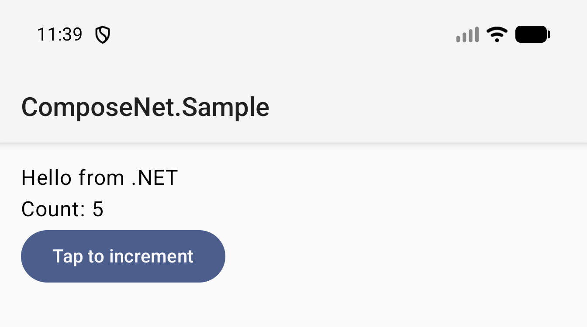

# Microsoft.AndroidX.Compose

Build Android UI with **Jetpack Compose** from a .NET for Android app — pure C#, no Kotlin in the project, on top of the existing `Xamarin.AndroidX.Compose.*` bindings.

<p align="center">
  
</p>

*Material 3 sample inside the gallery's "Hello from .NET" demo: `Text`, a `Button`, and a counter driven by `mutableStateOf` — all authored from C#.*

## Why

[*Android UI Development is Compose First*](https://android-developers.googleblog.com/2026/05/android-ui-development-is-compose-first.html) (Nick Butcher, May 2026) puts Views, Fragments, RecyclerView, and the View-based tooling into **maintenance mode**. All new Android UI APIs target Compose. .NET for Android needs a story — analogous to UIKit→SwiftUI in 2019.

This repo provides two C# authoring styles over the existing
`androidx.compose.*` runtime and Xamarin bindings: a tree-style facade and
Tier 2 `[Composable]` static methods lowered by a Roslyn source generator.
Both are pure C# with no Kotlin source or custom runtime.

## Build & run

Requires the .NET 10 SDK with the `android` workload and an Android API 34+ emulator or device.

```pwsh
dotnet workload restore
dotnet build src/Microsoft.AndroidX.Compose.Gallery -t:Run    # deploys to the connected device/emulator
```

Generator unit tests run without an Android SDK:

```pwsh
dotnet test src/Microsoft.AndroidX.Compose.SourceGenerators.Tests
```

## What it looks like

The same counter flow in Kotlin and both supported C# authoring styles.

### Kotlin

```kotlin
class MainActivity : ComponentActivity() {
    override fun onCreate(savedInstanceState: Bundle?) {
        super.onCreate(savedInstanceState)
        setContent {
            MaterialTheme(colorScheme = dynamicLightColorScheme(this)) {
                var count by remember { mutableStateOf(0) }
                Column(Modifier.padding(16.dp)) {
                    Text("Hello from .NET")
                    Text("Count: $count")
                    Button(onClick = { count++ }) {
                        Text("Tap to increment")
                    }
                }
            }
        }
    }
}
```

### C# tree style (Tier 1.5)

```csharp
[Activity(Label = "@string/app_name", MainLauncher = true,
          Theme = "@android:style/Theme.Material.Light.NoActionBar")]
public class MainActivity : ComponentActivity
{
    protected override void OnCreate(Bundle? savedInstanceState)
    {
        base.OnCreate(savedInstanceState);
        this.SetContent(c =>
        {
            var count = c.MutableStateOf(0);
            return new MaterialTheme
            {
                new Column
                {
                    Modifier.SafeDrawingPadding(),
                    new Text("Hello from .NET"),
                    new Text($"Count: {count}"),
                    new Button(onClick: () => count++)
                    {
                        new Text("Tap to increment"),
                    },
                },
            };
        });
    }
}
```

The translation is mechanical — `new` instead of bare calls, commas instead of newlines, `c => ` lambdas thread the `IComposer` explicitly (the equivalent of Kotlin's IR-injected `$composer`):

| Kotlin                                        | C# (this repo)                                                  |
| --------------------------------------------- | --------------------------------------------------------------- |
| `setContent { … }`                            | `this.SetContent(c => { … })` on `ComponentActivity`            |
| `Text("Hi")`                                  | `new Text("Hi")`                                                |
| `Column { … }`                                | `new Column { … }` (collection-initializer)                     |
| `Button(onClick = { x++ }) { … }`             | `new Button(onClick: () => x++) { … }`                          |
| `MaterialTheme { … }`                         | `new MaterialTheme { … }`                                       |
| `var count by remember { mutableStateOf(0) }` | `var count = c.MutableStateOf(0)`                               |
| `count++`                                     | `count++` (operator on `MutableNumberState<T>`, picked by overload resolution for `int`/`long`/`float`/`double`) |
| `"Count: $count"`                             | `$"Count: {count}"` (via `MutableState<T>.ToString`)            |
| `if (count > 0) …`                            | `if (count > 0) …` (implicit `MutableState<T>` → `T`)           |

That's an end-to-end Material 3 counter app in ~13 lines of composition.
Tree style remains available for collection initialization and dynamically
constructed UI. The actual
[`src/Microsoft.AndroidX.Compose.Gallery/MainActivity.cs`](src/Microsoft.AndroidX.Compose.Gallery/MainActivity.cs)
is a larger gallery app that exercises every facade across a navigable
catalog.

### C# static style (Tier 2)

The tree-style facade above is Tier 1.5 — every recomposition allocates a fresh `ComposableNode` tree. Tier 2 is the C# moral equivalent of Kotlin's compose-compiler plugin: an incremental source generator emits a per-call-site `[InterceptsLocation]` wrapper that opens a Compose restart group, runs per-parameter `DiffSlot` diffing, and skips the underlying call when nothing changed. When the skip path fires the body — and therefore the tree allocation it would have made — never runs. One user method, one shape, same as Kotlin (mirrors `dotnet/maui`'s `BindingSourceGen`).

```csharp
using Composable = AndroidX.Compose.ComposableAttribute;
using static AndroidX.Compose.Composables;

[Activity(Label = "@string/app_name", MainLauncher = true,
          Theme = "@android:style/Theme.Material.Light.NoActionBar")]
public class MainActivity : ComponentActivity
{
    protected override void OnCreate(Bundle? savedInstanceState)
    {
        base.OnCreate(savedInstanceState);
        this.SetContent(() => Counter());
    }

    [Composable]
    static void Counter()
    {
        var count = Remember(
            () => new MutableNumberState<int>(0));

        Column(() =>
        {
            Text("Hello from .NET");
            Text($"Count: {count.Value}");
            Button(
                () => count.Value++,
                () => Text("Tap to increment"));
        });
    }
}
```

`ComposeFacadeGenerator` emits public Tier 2 entry points alongside the
tree-style facade catalog. Every generated facade has a composerless overload,
and common handwritten composition APIs cover layout, state, effects,
resources, theme reads, and composition locals. Existing explicit-composer
overloads remain available as low-level escape hatches. The composable facade
entry points are themselves `[Composable]`, so unchanged calls skip before
their bodies execute; when they do execute, the generator lowers modifier,
callback, content-slot, state-holder, and default-mask plumbing directly to
the corresponding Compose bridge without constructing a tree-style adapter.
Generic lowering also exposes typed animation, pager, carousel, and lazy
collection facades. Generated ambient overloads cover the handwritten
`MaterialTheme`, `Scaffold`, `SnackbarHost`, both `SegmentedButton` modes,
`Layout`, `TextField`, `OutlinedTextField`, the complete search family, and
`BottomSheetScaffold` without duplicating their rendering logic. Navigation
DSLs and similar deferred graph-building shapes remain tree-style for now.

The Jetchat, JetNews, and Reply ports use composerless Tier 2 roots matching
upstream Kotlin's top-level `@Composable` app function. Their activities call
the `Action` `SetContent` overload and use implicit `Remember`, `MutableStateOf`,
`ViewModel`, and lazy-list state APIs. The roots retain one
`ComposableContext.Current` render escape hatch while `MaterialTheme`,
`Scaffold`, navigation, lazy collections, and text fields remain tree-style.
The Gallery's real-app benchmark compares equivalent tree, adapter Tier 2,
and direct-lowered Tier 2 lanes.
See
[docs/architecture.md → Tier 2](docs/architecture.md) for the emission shape,
the sibling-skip proof demo, diagnostics (CN5001-CN5010), and remaining
follow-ups. The two tiers coexist freely. The
`Microsoft.AndroidX.Compose` NuGet package includes the Tier 2 source
generator and its compiler configuration; package consumers need no separate
generator reference.

## What's wrapped today

The facade [`Microsoft.AndroidX.Compose`](src/Microsoft.AndroidX.Compose) covers the common Material 3 + Foundation surface:

| Category                | Composables |
| ----------------------- | ----------- |
| Theme & layout          | `MaterialTheme` (parameterizable `ColorScheme`/`Typography`/`Shapes`/`Dark`/`UseDynamicColor`, plus `composer.ColorScheme()`/`composer.Typography()`/`composer.Shapes()` reads), `Column`, `Row` (`Arrangement`), `Box`, `Spacer`, `Scaffold`, `HorizontalDivider`, `VerticalDivider`, `BoxWithConstraints` |
| Lazy lists & paging     | `LazyColumn<T>`, `LazyRow<T>`, `LazyVerticalGrid<T>`, `LazyHorizontalGrid<T>`, `LazyVerticalStaggeredGrid<T>`, `LazyHorizontalStaggeredGrid<T>` (+ `GridCells`/`StaggeredGridCells`), `HorizontalPager`, `VerticalPager` (+ `PagerState`), `FlowRow`, `FlowColumn` |
| Carousels & pull        | `HorizontalMultiBrowseCarousel`, `HorizontalCenteredHeroCarousel`, `HorizontalUncontainedCarousel`, `PullToRefreshBox` (+ `PullToRefreshState`) |
| Surfaces                | `Surface`, `Card`, `ElevatedCard`, `OutlinedCard` |
| App bars                | `TopAppBar` family (Center/Medium/Large/Flexible — with optional subtitles via Phase 9 branching), `BottomAppBar`, `FlexibleBottomAppBar` |
| Tabs                    | `TabRow` family (Primary/Secondary, scrollable variants), `Tab`, `LeadingIconTab`, `CustomTab` |
| Buttons                 | `Button`, `OutlinedButton`, `TextButton`, `ElevatedButton`, `FilledTonalButton`, `IconButton`, `OutlinedIconButton`, `FilledIconButton`, `FilledTonalIconButton`, full `IconToggleButton` family, `FloatingActionButton` (+ `Small`/`Large`/`Extended` variants) |
| Text & input            | `Text` (`TextStyle`/`FontWeight`/`FontStyle`/`FontFamily`/`TextDecoration`/`TextAlign`/`TextOverflow`), `TextField`, `OutlinedTextField`, `SecureTextField`, `OutlinedSecureTextField` |
| Media                   | `Image`, `Icon` (drawable-resource and `ImageVector` overloads), `Icons` (Filled/Outlined/Rounded/Sharp/TwoTone + AutoMirrored) |
| Chips                   | `AssistChip`, `FilterChip`, `InputChip`, `SuggestionChip` (+ `Elevated*` variants) |
| Selection               | `Checkbox`, `TriStateCheckbox`, `RadioButton`, `Switch`, `Slider`, `RangeSlider`, `SegmentedButton`, `SingleChoiceSegmentedButtonRow`, `MultiChoiceSegmentedButtonRow` |
| Progress & feedback     | `CircularProgressIndicator`, `LinearProgressIndicator`, `ListItem`, `Badge`, `BadgedBox` |
| Menus & search          | `DropdownMenu` + `DropdownMenuItem`, `ExposedDropdownMenuBox` + `ExposedDropdownMenu`, `SearchBar` family (Top, ExpandedDocked, ExpandedFullScreen, `DockedSearchBar`) |
| Navigation              | `NavHost`, `NavController`, `NavBackStackEntry`, `NavOptions` (+ `BackHandler`), `NavigationBar`, `NavigationRail`, `WideNavigationRail`, `ModalWideNavigationRail` (+ items) |
| Drawers                 | `ModalNavigationDrawer`, `DismissibleNavigationDrawer`, `PermanentNavigationDrawer`, `NavigationDrawerItem` (+ matching sheets, generated via Phase 10 `[ConfirmStateChange]`) |
| Sheets & pickers        | `ModalBottomSheet`, `BottomSheetScaffold`, `DatePicker`/`DatePickerDialog`, `DateRangePicker`/`DateRangePickerDialog`, `TimePicker`/`TimeInput`/`TimePickerDialog` |
| Overlays                | `AlertDialog`, `Snackbar` + `SnackbarHost`, `Tooltip` |
| Animation               | `AnimatedVisibility`, `AnimatedContent`, `Crossfade` |
| Effects                 | `composer.LaunchedEffect`, `composer.DisposableEffect`, `composer.SideEffect`, `composer.RememberCoroutineScope()` + `scope.Launch(...)` for event handlers |
| Modifier chains         | `Padding`, `FillMaxWidth/Height/Size`, `Width`, `Height`, `Size`, `AspectRatio`, `Offset`, `Alpha`, `Background`, `Border`, `Clip`, `Clickable`, `Weight`, `VerticalScroll`/`HorizontalScroll` (+ `ScrollState`), `Draggable` (+ `DraggableState`), focus/semantics/gestures, full `WindowInsets` support (`WindowInsetsPadding`, consumption, inset-sized spacers, set operations, fixed insets), plus `SafeDrawingPadding`, `SystemBarsPadding`, and every per-inset convenience helper |
| Value types             | `Color` (+ `FromRgb`/`FromArgb`/`FromHex` and theme reads), `Dp`, `Sp`, `FontWeight`, `TextAlign`, `Shape`, `RoundedCornerShape`, `PaddingValues` |
| State                   | `Remember` (+ keyed `Remember(factory, key1, …)`, `RememberKeyed`), `RememberSaveable` (+ keyed), `MutableState<T>`, `MutableNumberState<T>`, `MutableStateList<T>`, `MutableStateMap<K,V>`, `DerivedStateOf`, `ProduceState`, `SnapshotFlow` (→ `IAsyncEnumerable<T>`), `IStateFlow<T>.CollectAsStateWithLifecycle()` / `IFlow.CollectAsStateWithLifecycle(initialValue, composer)`, plus `DatePickerState`, `DateRangePickerState`, `TimePickerState`, `SearchBarState`, `SnackbarHostState`, `ScrollState`, `PagerState`, `PullToRefreshState`, `DraggableState`, `DrawerStateHolder` (+ `OpenAsync`/`CloseAsync`), `WideNavigationRailState`, `FocusRequester`/`FocusState` |
| Adaptive layout         | `composer.CurrentWindowAdaptiveInfo()` → `WindowAdaptiveInfo` / `WindowSizeClass` predicates for size-class branching |
| Composition locals      | `CompositionLocalProvider`, plus built-in `LocalContext`, `LocalConfiguration`, `LocalResources`, `LocalLifecycleOwner`, `LocalView`, `LocalColorScheme` |
| Async                   | `SuspendBridge` — Kotlin `suspend` functions surfaced as C# `Task` / `Task<T>`; launch them safely from event handlers with `composer.RememberCoroutineScope()` + `scope.Launch(ct => ...)` |

## Samples

[`samples/`](samples) mirrors the official [`android/compose-samples`](https://github.com/android/compose-samples) repo in C#. See [`samples/README.md`](samples/README.md) for the scoreboard of which samples are ported and what was simplified.

## Status

The gallery builds, deploys to an Android 16 (API 36) emulator, and renders a real Material 3 UI end-to-end: dynamic Material You colors via parameterizable `MaterialTheme`, edge-to-edge layout, an interactive `Button` that increments `MutableNumberState<int>` and recomposes the count. The catalog app in [`src/Microsoft.AndroidX.Compose.Gallery`](src/Microsoft.AndroidX.Compose.Gallery) exercises the full facade across a category-organized, navigable, searchable surface (text styling, lists, pickers, dialogs, sheets, navigation, animation, effects, search, dropdowns, draggable modifiers, …).

The facade and sample reference the official `Xamarin.AndroidX.Compose.*` 1.11.2.x and `Xamarin.AndroidX.Compose.Material3` 1.4.0.x NuGets directly — the per-binding projects this repo originally needed have been deleted.

## Docs

- [docs/architecture.md](docs/architecture.md) — how the facade works, JNI bridges, the `$default` source generator, what's missing on the C# side.
- [docs/compose-internals.md](docs/compose-internals.md) — how Jetpack Compose actually works (Kotlin compiler plugin, IR pipeline), why we can't just port it, and the Maven/NuGet artifact map.
- [docs/maui-backend.md](docs/maui-backend.md) — plan for a .NET MAUI backend that swaps MAUI's stock Android handlers (`AppCompatTextView`, `MaterialButton`, …) for Compose-backed ones. Phase 2 collapses all per-leaf compositions into one `ComposeView` per page, owned by `PageHandler`. Lives in `src/Microsoft.AndroidX.Compose.Maui` + `src/Microsoft.AndroidX.Compose.Maui.Sample`.
- [docs/api-coverage.md](docs/api-coverage.md) — Compose ⇄ `Microsoft.AndroidX.Compose` API coverage report (per-module, per-symbol). Regenerated via `scripts/api-comparison.cs` whenever a `Xamarin.AndroidX.Compose.*` package is bumped or a facade is added.
- [docs/manual-jni.md](docs/manual-jni.md) — surface area of every C# member still calling `JNIEnv.*` directly (i.e. what's left for the source generators to absorb). Regenerated via `scripts/manual-jni-report.cs`.
- [docs/NOTES.md](docs/NOTES.md) — historical notes from the original Tier 1 experiment, including the in-repo binding projects that have since been deleted.
