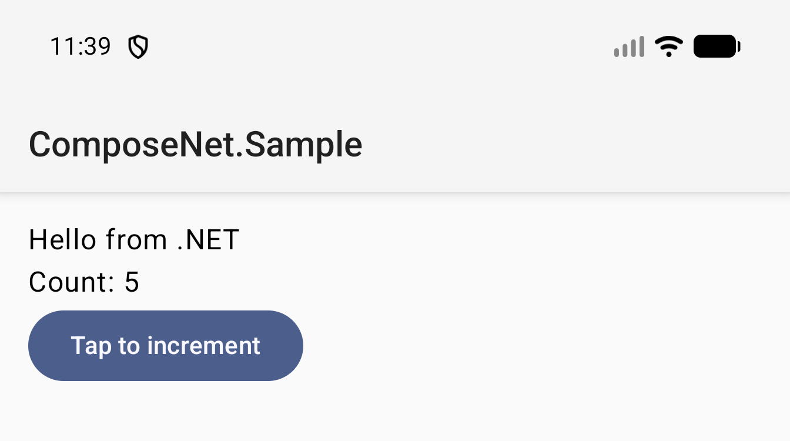

# Microsoft.AndroidX.Compose

Build Android UI with **Jetpack Compose** from a .NET for Android app — pure C#, no Kotlin in the project, on top of the existing `Xamarin.AndroidX.Compose.*` bindings.

<p align="center">
  
</p>

*Material 3 sample inside the gallery's "Hello from .NET" demo: `Text`, a `Button`, and a counter driven by `mutableStateOf` — all authored from C#.*

## Why

[*Android UI Development is Compose First*](https://android-developers.googleblog.com/2026/05/android-ui-development-is-compose-first.html) (Nick Butcher, May 2026) puts Views, Fragments, RecyclerView, and the View-based tooling into **maintenance mode**. All new Android UI APIs target Compose. .NET for Android needs a story — analogous to UIKit→SwiftUI in 2019.

This repo provides two C# authoring styles over the existing
`androidx.compose.*` runtime and Xamarin bindings: a tree-style facade and
`[Composable]` static methods lowered by a Roslyn source generator.
Both are pure C# with no Kotlin source or custom runtime.

## Build & run

Requires the .NET 10 SDK with the `android` workload and an Android API 34+ emulator or device.

```pwsh
dotnet workload restore
dotnet build src/Microsoft.AndroidX.Compose.Gallery -t:Run    # deploys to the connected device/emulator
```

Generator unit tests run without an Android SDK:

```pwsh
dotnet test src/Microsoft.AndroidX.Compose.SourceGenerators.Tests
```

### ART Baseline Profile

Release applications built with R8 automatically consume the package's
Jetpack Compose ART Baseline Profile. The build merges any additional
`AndroidArtProfile` items, expands library wildcard rules against the
application's actual Java archives, lets R8 remove or rewrite rules with the
code it optimizes, and packages checksum-bound `baseline.prof` and
`baseline.profm` files for the final DEX.

The latest Android SDK Command-line Tools must be installed because binary
profile generation uses `profgen`. Set
`MicrosoftAndroidXComposeEnableBaselineProfile` to `false` to opt out, or add
an application profile:

```xml
<ItemGroup>
  <AndroidArtProfile Include="MyApplication.baseline-prof.txt" />
</ItemGroup>
```

This is separate from a Startup Profile, NativeAOT, and R8 correctness rules.
The library profile does not control primary-DEX startup layout, and hidden
JNI or reflection access still requires explicit ProGuard configuration.

## Install CI builds

Successful `main` builds publish prerelease packages to
[GitHub Packages](https://github.com/jonathanpeppers?tab=packages&repo_name=Microsoft.AndroidX.Compose)
as `0.1.0-beta.<GitHub Actions run number>`. These builds are intended for
testing before packages are published to NuGet.org.

GitHub requires authentication to download from its NuGet registry, including
public packages. Create a
[classic personal access token](https://github.com/settings/tokens) with the
`read:packages` scope, set it for the current shell, and create `NuGet.Config`
in the directory where the app will be created:

```pwsh
$env:GITHUB_PACKAGES_USER = "your-github-username"
$env:GITHUB_PACKAGES_TOKEN = "your-classic-personal-access-token"
```

```xml
<?xml version="1.0" encoding="utf-8"?>
<configuration>
  <packageSources>
    <clear />
    <add key="github" value="https://nuget.pkg.github.com/jonathanpeppers/index.json" />
    <add key="nuget.org" value="https://api.nuget.org/v3/index.json" />
  </packageSources>
  <packageSourceCredentials>
    <github>
      <add key="Username" value="%GITHUB_PACKAGES_USER%" />
      <add key="ClearTextPassword" value="%GITHUB_PACKAGES_TOKEN%" />
    </github>
  </packageSourceCredentials>
</configuration>
```

Choose a package version from the GitHub Packages page, then install and run
the template:

```pwsh
$version = "0.1.0-beta.<run-number>"

# Prerequisite
# dotnet workload install android

dotnet new install "Microsoft.AndroidX.Compose.Templates@$version"
dotnet new android-compose `
  --name MyComposeApp `
  --applicationId com.example.mycomposeapp `
  --applicationTitle "My Compose App" `
  --composeVersion $version

cd MyComposeApp
dotnet run
```

The final command requires a running Android emulator or connected device.
Keep the token out of `NuGet.Config` and source control.

## What it looks like

The same counter flow in Kotlin and both supported C# authoring styles.

### Kotlin

```kotlin
class MainActivity : ComponentActivity() {
    override fun onCreate(savedInstanceState: Bundle?) {
        super.onCreate(savedInstanceState)
        setContent {
            MaterialTheme(colorScheme = dynamicLightColorScheme(this)) {
                var count by remember { mutableStateOf(0) }
                Column(Modifier.padding(16.dp)) {
                    Text("Hello from .NET")
                    Text("Count: $count")
                    Button(onClick = { count++ }) {
                        Text("Tap to increment")
                    }
                }
            }
        }
    }
}
```

### C# tree style

```csharp
[Activity(Label = "@string/app_name", MainLauncher = true,
          Theme = "@android:style/Theme.Material.Light.NoActionBar")]
public class MainActivity : ComponentActivity
{
    protected override void OnCreate(Bundle? savedInstanceState)
    {
        base.OnCreate(savedInstanceState);
        this.SetContent(c =>
        {
            var count = c.MutableStateOf(0);
            return new MaterialTheme
            {
                new Column
                {
                    Modifier.SafeDrawingPadding(),
                    new Text("Hello from .NET"),
                    new Text($"Count: {count}"),
                    new Button(onClick: () => count++)
                    {
                        new Text("Tap to increment"),
                    },
                },
            };
        });
    }
}
```

The translation is mechanical — `new` instead of bare calls, commas instead of newlines, `c => ` lambdas thread the `IComposer` explicitly (the equivalent of Kotlin's IR-injected `$composer`):

| Kotlin                                        | C# (this repo)                                                  |
| --------------------------------------------- | --------------------------------------------------------------- |
| `setContent { … }`                            | `this.SetContent(c => { … })` on `ComponentActivity`            |
| `Text("Hi")`                                  | `new Text("Hi")`                                                |
| `Column { … }`                                | `new Column { … }` (collection-initializer)                     |
| `Button(onClick = { x++ }) { … }`             | `new Button(onClick: () => x++) { … }`                          |
| `MaterialTheme { … }`                         | `new MaterialTheme { … }`                                       |
| `var count by remember { mutableStateOf(0) }` | `var count = c.MutableStateOf(0)`                               |
| `count++`                                     | `count++` (operator on `MutableNumberState<T>`, picked by overload resolution for `int`/`long`/`float`/`double`) |
| `"Count: $count"`                             | `$"Count: {count}"` (via `MutableState<T>.ToString`)            |
| `if (count > 0) …`                            | `if (count > 0) …` (implicit `MutableState<T>` → `T`)           |

That's an end-to-end Material 3 counter app in ~13 lines of composition.
Tree style remains available for collection initialization and dynamically
constructed UI. The actual
[`src/Microsoft.AndroidX.Compose.Gallery/MainActivity.cs`](src/Microsoft.AndroidX.Compose.Gallery/MainActivity.cs)
is a larger gallery app that exercises every facade across a navigable
catalog.

### C# composable methods

The tree-style facade above allocates a fresh `ComposableNode` tree on every
recomposition. Composable methods are the C# equivalent of Kotlin's
compose-compiler plugin: an incremental source generator emits a per-call-site
`[InterceptsLocation]` wrapper that opens a Compose restart group, runs
per-parameter `DiffSlot` comparisons, and skips the underlying call when
nothing changed. When the skip path fires, the method body—and therefore any
tree allocation it would have made—never runs. One user method, one shape,
matching Kotlin's model (and `dotnet/maui`'s `BindingSourceGen`).

```csharp
using AndroidX.Compose;
using static AndroidX.Compose.Composables;

[Activity(Label = "@string/app_name", MainLauncher = true,
          Theme = "@android:style/Theme.Material.Light.NoActionBar")]
public class MainActivity : ComponentActivity
{
    protected override void OnCreate(Bundle? savedInstanceState)
    {
        base.OnCreate(savedInstanceState);
        this.SetContent(() => Counter());
    }

    [Composable]
    static void Counter()
    {
        var count = Remember(
            () => new MutableNumberState<int>(0));

        Column(() =>
        {
            Text("Hello from .NET");
            Text($"Count: {count.Value}");
            Button(
                () => count.Value++,
                () => Text("Tap to increment"));
        });
    }
}
```

`ComposeFacadeGenerator` emits public composable entry points alongside the
tree-style facade catalog. Every generated facade has a composerless overload,
and common handwritten composition APIs cover layout, state, effects,
resources, theme reads, and composition locals. Explicit-composer catalog
adapters stay internal; custom nodes retain the public `Render(IComposer)`
contract and composition-aware utilities. The composable facade entry points
are themselves `[Composable]`, so unchanged calls skip before
their bodies execute; when they do execute, the generator lowers modifier,
callback, content-slot, state-holder, and default-mask plumbing directly to
the corresponding Compose bridge without constructing a tree-style adapter.
Generic lowering also exposes typed animation, pager, carousel, and lazy
collection facades. Generated ambient overloads cover the handwritten
`MaterialTheme`, `Scaffold`, `SnackbarHost`, both `SegmentedButton` modes,
`Layout`, `TextField`, `OutlinedTextField`, the complete search family, and
`BottomSheetScaffold` without duplicating their rendering logic. Navigation
DSLs and similar deferred graph-building shapes remain tree-style for now.

The Jetchat, JetNews, and Reply ports use composerless `[Composable]` roots matching
upstream Kotlin's top-level `@Composable` app function. Their activities call
the `Action` `SetContent` overload and use implicit `Remember`, `MutableStateOf`,
`ViewModel`, and lazy-list state APIs. The roots retain one parameterless
tree-style `Render()` escape hatch while `MaterialTheme`, `Scaffold`,
navigation, lazy collections, and text fields remain tree-style.
The Gallery's real-app benchmark compares equivalent tree, adapter method,
and direct-lowered method lanes with randomized fresh-process order.
See
[docs/architecture.md → Composable methods](docs/architecture.md) for the emission shape,
the sibling-skip proof demo, diagnostics (CN5001-CN5010), and remaining
follow-ups. The two authoring styles coexist freely. The
`Microsoft.AndroidX.Compose` NuGet package includes the composable-method source
generator and its compiler configuration; package consumers need no separate
generator reference.

### Scaffold content insets

`Scaffold.ContentWindowInsets` and the composable adapter's optional
`contentWindowInsets` parameter accept the existing managed `WindowInsets` type.
Omission or null preserves Material 3's Kotlin default; `new WindowInsets()`
explicitly supplies zero on every edge. To transfer navigation-bar/keyboard
ownership to a pinned editor, use the live default rather than guessing its edges:

```csharp
new Scaffold
{
    ContentWindowInsets = composer.ScaffoldContentWindowInsets()
        .Exclude(composer.NavigationBarsInsets())
        .Exclude(composer.ImeInsets()),
    Body = conversationBody,
};
```

The composerless `ScaffoldContentWindowInsets()` reader supports the same
operations inside a composition. `Body` still receives Scaffold padding
automatically; `BodyContent` and composable content receive `PaddingValues`
explicitly and must apply or forward it once. Insets already consumed by an
ancestor are excluded by Kotlin. The new option does not pad the content twice
or change the top/bottom bar slots.

Original composable CLR signatures remain as required-argument forwarding
overloads for compiled consumers and method-group conversions. Optional defaults
are on the longer inset-capable overloads, preserving unambiguous existing calls.
See [Jetchat inset ownership](samples/Jetchat/README.md#conversation-inset-ownership)
and the Gallery's **Scaffold content insets** demo for an edge-to-edge editor.

### Stable lazy collection and pager keys

All six lazy lists/grids and both pagers accept stable business-record identity.
Tree nodes expose `Key`; the implicit composable APIs and internal explicit
adapters accept an optional trailing `key` argument. Existing constructors,
positional arguments, and omitted-key behavior are unchanged:

```csharp
new LazyColumn<Message>(messages, message => new Text(message.Text))
{
    Key = message => message.Id,
};

// Inside a [Composable] method:
LazyColumn(messages, message => Text(message.Text), key: message => message.Id);
HorizontalPager(stories, story => Text(story.Title), key: story => story.Id);
```

The original public CLR signatures remain as forwarding overloads for compiled
consumers and method-group conversions. Optional defaults live on the longer
key-capable overloads, keeping positional, named, and omitted arguments unambiguous.

Return a **non-null `string`, `int`, or `long`**, unique within that collection
and stable across edits, insertion, deletion, and reorder. These map to Java
String/Integer/Long with value equality and Android Bundle saveability; `42`,
`42L`, and `"42"` are distinct keys. Do not use position, mutable display text,
hash codes, or IDs generated during rendering. Null selectors preserve Compose's
positional default; null results, other result types, and duplicate keys throw
`ArgumentException` before entering Compose, including offending indices.

Keyed rendering snapshots the items and evaluates every key once per render
(O(n) time/storage) so deferred measurement uses matching items and keys.
Publish mutations through observable state to trigger recomposition; selectors
must be pure and item identity must not change while rendering. Item content
remains lazy. Kotlin owns item-local `Remember`/`RememberSaveable` identity and
viewport anchoring; scroll requests override anchoring, and removed items do
not retain an active composition. A supplied `PagerState` callback must match
the collection count at each keyed render. Kotlin receives the last rendered
count until the next render, so it cannot combine a new count with old keys.
Public `PagerState.PageCount` always reads the live callback, including while
the pager is absent, so it can safely drive an empty-state condition.
Rendering without keys also restores native live-count behavior.

This follows the pinned Foundation **1.11.3** `LazyListScope.items`,
`LazyGridScope.items`, `LazyStaggeredGridScope.items`, and `Pager` contracts,
verified in the [published source archive](https://dl.google.com/dl/android/maven2/androidx/compose/foundation/foundation-android/1.11.3/foundation-android-1.11.3-sources.jar).
The **Stable collection keys** Gallery demo exercises all eight surfaces with
per-record counters and insert/delete/reverse controls.

## What's wrapped today

The facade [`Microsoft.AndroidX.Compose`](src/Microsoft.AndroidX.Compose) covers the common Material 3 + Foundation surface:

| Category                | Composables |
| ----------------------- | ----------- |
| Theme & layout          | `MaterialTheme` (parameterizable `ColorScheme`/`Typography`/`Shapes`/`Dark`/`UseDynamicColor`, plus `composer.ColorScheme()`/`composer.Typography()`/`composer.Shapes()` reads), `Column`, `Row` (`Arrangement`), `Box`, `Spacer`, `Scaffold`, `HorizontalDivider`, `VerticalDivider`, `BoxWithConstraints` |
| Lazy lists & paging     | `LazyColumn<T>`, `LazyRow<T>`, `LazyVerticalGrid<T>`, `LazyHorizontalGrid<T>`, `LazyVerticalStaggeredGrid<T>`, `LazyHorizontalStaggeredGrid<T>` (+ `GridCells`/`StaggeredGridCells`), `HorizontalPager`, `VerticalPager` (+ `PagerState`), `FlowRow`, `FlowColumn` |
| Carousels & pull        | `HorizontalMultiBrowseCarousel`, `HorizontalCenteredHeroCarousel`, `HorizontalUncontainedCarousel`, `PullToRefreshBox` (+ `PullToRefreshState`) |
| Surfaces                | `Surface`, `Card`, `ElevatedCard`, `OutlinedCard` |
| App bars                | `TopAppBar` family (Center/Medium/Large/Flexible — with optional subtitles via Phase 9 branching), `BottomAppBar`, `FlexibleBottomAppBar` |
| Tabs                    | `TabRow` family (Primary/Secondary, scrollable variants), `Tab`, `LeadingIconTab`, `CustomTab` |
| Buttons                 | `Button`, `OutlinedButton`, `TextButton`, `ElevatedButton`, `FilledTonalButton`, `IconButton`, `OutlinedIconButton`, `FilledIconButton`, `FilledTonalIconButton`, full `IconToggleButton` family, `FloatingActionButton` (+ `Small`/`Large`/`Extended` variants) |
| Text & input            | `Text` (`TextStyle`/`FontWeight`/`FontStyle`/`FontFamily`/`TextDecoration`/`TextAlign`/`TextOverflow`), `TextField`, `OutlinedTextField`, `SecureTextField`, `OutlinedSecureTextField` |
| Media                   | `Image`, `Icon` (drawable-resource and `ImageVector` overloads), `Icons` (Filled/Outlined/Rounded/Sharp/TwoTone + AutoMirrored) |
| Chips                   | `AssistChip`, `FilterChip`, `InputChip`, `SuggestionChip` (+ `Elevated*` variants) |
| Selection               | `Checkbox`, `TriStateCheckbox`, `RadioButton`, `Switch`, `Slider`, `RangeSlider`, `SegmentedButton`, `SingleChoiceSegmentedButtonRow`, `MultiChoiceSegmentedButtonRow` |
| Progress & feedback     | `CircularProgressIndicator`, `LinearProgressIndicator`, `ListItem`, `Badge`, `BadgedBox` |
| Menus & search          | `DropdownMenu` + `DropdownMenuItem`, `ExposedDropdownMenuBox` + `ExposedDropdownMenu`, state-based `SearchBar` family (`SearchBar`, `TopSearchBar`, `ExpandedDockedSearchBar`, `ExpandedFullScreenSearchBar`) |
| Navigation              | `NavHost`, `NavController`, `NavBackStackEntry`, `NavOptions` (+ `BackHandler`), `NavigationBar`, `NavigationRail`, `WideNavigationRail`, `ModalWideNavigationRail` (+ items) |
| Drawers                 | `ModalNavigationDrawer`, `DismissibleNavigationDrawer`, `PermanentNavigationDrawer`, `NavigationDrawerItem` (+ matching sheets, generated via Phase 10 `[ConfirmStateChange]`) |
| Sheets & pickers        | `ModalBottomSheet`, `BottomSheetScaffold`, `DatePicker`/`DatePickerDialog`, `DateRangePicker`/`DateRangePickerDialog`, `TimePicker`/`TimeInput`/`TimePickerDialog` |
| Overlays                | `AlertDialog`, `Snackbar` + `SnackbarHost`, `Tooltip` + programmatic `TooltipState` |
| Animation               | `AnimatedVisibility`, `AnimatedContent`, `Crossfade`, scoped child `Modifier.AnimateEnterExit` |
| Effects                 | `composer.LaunchedEffect`, `composer.DisposableEffect`, `composer.SideEffect`, `composer.RememberCoroutineScope()` + `scope.Launch(...)` for event handlers |
| Modifier chains         | `Padding`, `FillMaxWidth/Height/Size`, `Width`, `Height`, `Size`, `AspectRatio`, `Offset`, `Alpha`, `Background`, `Border`, `Clip`, `Clickable`, `Weight`, `VerticalScroll`/`HorizontalScroll` (+ `ScrollState`), `Draggable` (+ `DraggableState`), focus/semantics/gestures, full `WindowInsets` support (`WindowInsetsPadding`, consumption, inset-sized spacers, set operations, fixed insets), plus `SafeDrawingPadding`, `SystemBarsPadding`, and every per-inset convenience helper |
| Value types             | `Color` (+ `FromRgb`/`FromArgb`/`FromHex` and theme reads), `Dp`, `Sp`, `FontWeight`, `TextAlign`, `Shape`, `RoundedCornerShape`, `CutCornerShape`, `AbsoluteRoundedCornerShape`, `AbsoluteCutCornerShape`, `GenericShape`, `PaddingValues` |
| State                   | `Remember` (+ keyed `Remember(factory, key1, …)`, `RememberKeyed`), `RememberSaveable` (+ keyed), `MutableState<T>`, `MutableNumberState<T>`, `MutableManagedState<T>`, `MutableStateList<T>`, `MutableStateMap<K,V>`, `DerivedStateOf`, `ProduceState`, `SnapshotFlow` (→ `IAsyncEnumerable<T>`), real Kotlin `IStateFlow.CollectAsStateWithLifecycle<T>(composer)` / `IFlow.CollectAsStateWithLifecycle(initialValue, composer)`, plus `DatePickerState`, `DateRangePickerState`, `TimePickerState`, `SearchBarState`, `SnackbarHostState`, `ScrollState`, `PagerState`, `PullToRefreshState`, `DraggableState`, `DrawerStateHolder` (+ `OpenAsync`/`CloseAsync`), `WideNavigationRailState`, `FocusRequester`/`FocusState` |
| Adaptive layout         | `composer.CurrentWindowAdaptiveInfo()` → live size class and fold posture, `windowAdaptiveInfo.CalculateListDetailPaneScaffoldDirective()`, `composer.RememberListDetailPaneScaffoldNavigator<T>()`, `ListDetailPaneScaffold<T>` / `NavigableListDetailPaneScaffold<T>`, and lifecycle-aware `WindowInfoTracker` layout collection |
| Composition locals      | `CompositionLocalProvider`, plus built-in `LocalContext`, `LocalConfiguration`, `LocalResources`, `LocalLifecycleOwner`, `LocalView`, `LocalColorScheme` |
| Async                   | `SuspendBridge` — Kotlin `suspend` functions surfaced as C# `Task` / `Task<T>`; launch them safely from event handlers with `composer.RememberCoroutineScope()` + `scope.Launch(ct => ...)` |

### Custom and directional shapes

`CutCornerShape`, `AbsoluteCutCornerShape`, and `AbsoluteRoundedCornerShape`
accept either one corner size or four clockwise corner sizes. Use `Dp`
arguments for density-aware geometry and integer arguments for percentages
of the shorter side. Relative cuts use top-start/top-end/bottom-end/bottom-start;
absolute shapes use top-left/top-right/bottom-right/bottom-left and never mirror
in RTL. `Shape.CutCorners` and `Shape.CutCornersPercent` also have four-corner
factory overloads.

`new GenericShape((path, size, direction) => ...)` builds a native outline using
the existing `Path` API. Its callback runs outside composition, receives pixel
bounds and the native layout direction, and chooses any mirroring itself.
Kotlin closes the contour and retains the callback. The supplied path is borrowed:
do not retain it after the callback; use `new Path(path)` for an independent copy.
Remember the shape across recompositions, and replace it when captured geometry
changes so Compose invalidates its cached outline.

The Foundation/Geometry **runtime companion DLLs** were checked at 1.11.3.1:
percentage factories and `IShape.CreateOutline` are bound. Only the stripped
Dp factories, `GenericShape(Function3)` constructor and boxed `Size` unboxing
use generated JNI bridges (binding follow-up:
[dotnet/android-libraries#1416](https://github.com/dotnet/android-libraries/issues/1416)).
The Gallery's **GenericShape** and **Relative and absolute corners** demos
exercise these surfaces, including independent LTR/RTL previews.

## Samples

[`samples/`](samples) mirrors the official [`android/compose-samples`](https://github.com/android/compose-samples) repo in C#. See [`samples/README.md`](samples/README.md) for the scoreboard of which samples are ported and what was simplified.

## Status

The gallery builds, deploys to an Android 16 (API 36) emulator, and renders a real Material 3 UI end-to-end: dynamic Material You colors via parameterizable `MaterialTheme`, edge-to-edge layout, an interactive `Button` that increments `MutableNumberState<int>` and recomposes the count. The catalog app in [`src/Microsoft.AndroidX.Compose.Gallery`](src/Microsoft.AndroidX.Compose.Gallery) exercises the full facade across a category-organized, navigable, searchable surface (text styling, lists, pickers, dialogs, sheets, navigation, animation, effects, search, dropdowns, draggable modifiers, …).

The facade and sample reference the official `Xamarin.AndroidX.Compose.*` 1.11.2.x and `Xamarin.AndroidX.Compose.Material3` 1.4.0.x NuGets directly — the per-binding projects this repo originally needed have been deleted.

## Docs

- [docs/architecture.md](docs/architecture.md) — how the facade works, JNI bridges, the `$default` source generator, what's missing on the C# side.
- [docs/compose-internals.md](docs/compose-internals.md) — how Jetpack Compose actually works (Kotlin compiler plugin, IR pipeline), why we can't just port it, and the Maven/NuGet artifact map.
- [docs/maui-backend.md](docs/maui-backend.md) — plan for a .NET MAUI backend that swaps MAUI's stock Android handlers (`AppCompatTextView`, `MaterialButton`, …) for Compose-backed ones. Phase 2 collapses all per-leaf compositions into one `ComposeView` per page, owned by `PageHandler`. Lives in `src/Microsoft.AndroidX.Compose.Maui` + `src/Microsoft.AndroidX.Compose.Maui.Sample`.
- [docs/api-coverage.md](docs/api-coverage.md) — Compose ⇄ `Microsoft.AndroidX.Compose` API coverage report (per-module, per-symbol). Regenerated via `scripts/api-comparison.cs` whenever a `Xamarin.AndroidX.Compose.*` package is bumped or a facade is added.
- [docs/manual-jni.md](docs/manual-jni.md) — surface area of every C# member still calling `JNIEnv.*` directly (i.e. what's left for the source generators to absorb). Regenerated via `scripts/manual-jni-report.cs`.
- [docs/NOTES.md](docs/NOTES.md) — historical notes from the original Tier 1 experiment, including the in-repo binding projects that have since been deleted.
