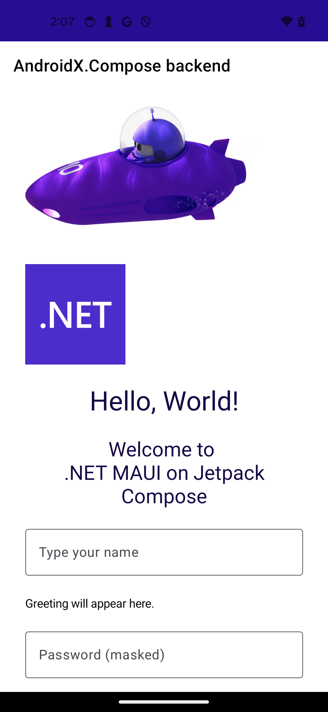
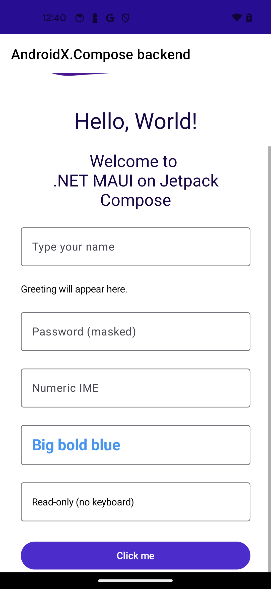

# Compose backend for .NET MAUI

## Problem

.NET MAUI already runs on Android via an **AppCompat / Android View** backend
that lives inside `Microsoft.Maui.Controls`. Google's "Android UI Development
is Compose First" announcement (May 2026) puts the View system into
maintenance mode — all new Android UI APIs target Jetpack Compose.

`Microsoft.AndroidX.Compose` (this repo) already exposes Material 3 + Foundation
Compose as a C# facade. The opportunity is to plug that facade into MAUI as a
**custom platform backend**, the way `maui-labs` already ships custom
backends for desktops:

| Backend | TFM | UI tech | Repo |
| --- | --- | --- | --- |
| Windows.WPF | `net10.0-windows` | WPF | `dotnet/maui-labs/platforms/Windows.WPF` |
| MacOS (AppKit) | `net10.0-macos` | AppKit | `dotnet/maui-labs/platforms/MacOS` |
| Linux.Gtk4 | `net10.0` + GTK4 | GTK4 | `dotnet/maui-labs/platforms/Linux.Gtk4` |
| **Compose (this)** | `net10.0-android` | **Jetpack Compose** | (new) |

This would be the first **mobile-replacement** backend (the maui-labs ones
are all desktop) — directly competing with MAUI's stock AppCompat Android
backend and offering Material 3 / dynamic color / edge-to-edge out of the
box.

## How a MAUI backend is built (from `maui-labs/platforms/Windows.WPF`)

Each backend is a single `net10.0-<platform>` library project under
`platforms/<Name>/src/<Name>/`. The shape is identical across the three
existing ones:

```text
src/<Name>/
  Handlers/           # one pair of files per MAUI control
    ButtonHandler.cs              # cross-platform PropertyMapper + ctor
    ButtonHandler.<Platform>.cs   # partial: CreatePlatformView, Connect/DisconnectHandler, Map*
    LabelHandler.cs / .Windows.cs
    LayoutHandler.cs / .Windows.cs
    ...
  Hosting/
    AppHostBuilderExtensions.cs   # UseMauiAppXxx<TApp>() + SetupDefaults() + ViewMapper.ModifyMapping fixups
  Platform/
    MauiXxxApplication.cs         # WPF Application / NSApplication / Gtk.Application base class
    MauiXxxWindow.cs              # native window wrapper
    XxxViewHandler.cs             # generic base ViewHandler<TVirtual, TPlatform>
    LayoutPanel.cs                # ViewGroup-equivalent hosting MAUI layouts
    ContentPanel.cs               # ContentControl-equivalent hosting pages
    DispatcherProvider.cs         # IDispatcherProvider impl
    XxxFontManager.cs             # IFontManager / IFontRegistrar
    XxxTicker.cs                  # Microsoft.Maui.Animations.Ticker on the UI thread
    XxxAlertManagerSubscription.cs # DispatchProxy hack for the internal AlertManager
    ModalNavigationManager.cs     # push/pop modal pages
    GestureManager.cs             # MAUI gesture recognizers → native input
    ThemeManager.cs               # dark / light detection + AppTheme changed event
```

### The hand-off contract

1. Consumer's `App.xaml.cs` (or equivalent) calls
   `MauiApp.CreateBuilder().UseAndroidXCompose<App>().Build()`.
2. `UseAndroidXCompose<TApp>()` calls `SetupDefaults()` which:
   - Registers every handler via `builder.ConfigureMauiHandlers(...)`
     mapping MAUI control types to platform handler types
     (`handlers.AddHandler<Button, ButtonHandler>()`).
   - Registers `IDispatcherProvider`, `Ticker`, `IFontManager`,
     `IEmbeddedFontLoader`, `IFontRegistrar`, alert subscription, theme
     manager, lifecycle.
   - Calls `RemapForControls()` which uses
     `ViewHandler.ViewMapper.ModifyMapping(nameof(IView.Width), ...)`
     to bridge cross-platform properties (`IView.Width`/`Height`/
     `Background`/`Margin`/`Visibility`/`Opacity`/`IsEnabled`/
     `Translation`/`Scale`/`Rotation`/`Shadow`/`Clip`) onto the actual
     platform widget type. The base MAUI mapper targets WinUI types;
     backends override every entry.
3. Each handler is a `partial class XxxHandler : <Backend>ViewHandler<IXxx, TPlatform>` with:
   - **`XxxHandler.cs`** — pure cross-platform: the
     `PropertyMapper<IXxx, XxxHandler>` listing
     `[nameof(IButton.Text)] = MapText`, the `CommandMapper`, and two
     `()`/`(mapper, commandMapper)` ctors. Only references MAUI
     abstractions.
   - **`XxxHandler.<Platform>.cs`** — `CreatePlatformView()`,
     `ConnectHandler`/`DisconnectHandler` (wire native events), and the
     `static MapText(...)` etc. methods that mutate the platform
     widget. Uses `using` aliases to disambiguate (e.g.
     `using WButton = System.Windows.Controls.Button`) because MAUI and
     the platform share type names.
4. `<Backend>ViewHandler<TVirtual, TPlatform>` is the **critical
   adapter**. Cross-platform `ViewHandler` has no-op `PlatformArrange`
   and returns `Size.Zero` from `GetDesiredSize`. The backend overrides
   them to call native measure/arrange:
   - On WPF: `platformView.Measure(...)` / `platformView.Arrange(...)`.
   - On Android (today, MAUI stock): `View.Measure(widthSpec, heightSpec)`
     / `View.Layout(l, t, r, b)`.
5. **Layouts** reuse MAUI's cross-platform `ILayoutManager` (Grid / Stack /
   Flex / Absolute). The only platform-specific piece is a `LayoutPanel`:
   a native container (WPF `Panel`, AppKit `NSView`, GTK `Widget`,
   Android `ViewGroup`) whose `MeasureOverride` / `ArrangeOverride`
   delegates to MAUI's `LayoutManager` which in turn measures/arranges
   each child native control.
6. **Modal navigation, alerts, font registration, animation ticking,
   gestures, theme** are each implemented as small platform glue classes
   talking to MAUI's published interfaces (`IModalNavigationManager`,
   `IFontManager`, `Microsoft.Maui.Animations.Ticker`, etc.).

`WPFFontManager`, `WPFTicker`, `WPFAlertManagerSubscription` (a
`DispatchProxy` over the internal `AlertManager`), `ModalNavigationManager`,
`GestureManager`, `ThemeManager`, `LifecycleManager` are all 60–250 lines
each — small, focused, single responsibility.

## Why Compose maps cleanly onto the same shape

The MAUI handler protocol is **imperative + mutation** (`MapText` reaches
into `handler.PlatformView.Content = ...`). Compose is **declarative +
recomposition** — you don't mutate a `Button`, you call the
`Button(text=...)` function every recomposition.

The bridge is `ComposeView` (already used throughout this library —
`samples/Jetchat`, every gallery demo). `ComposeView` is an **Android
View** (`ViewGroup` subclass) that owns a private composition. Set its
content once with `view.SetContent(c => ...)` and the composition lambda
re-runs whenever any `MutableState<T>` read inside it changes.

So per-handler (Phase 2 shape — single `ComposeView` per page):

```csharp
// Handlers/ButtonHandler.cs
public partial class ButtonHandler : ComposeElementHandler<IButton>
{
    readonly MutableState<string>  _text     = new("");
    readonly MutableState<bool>    _enabled  = new(true);
    readonly MutableState<long>    _container = new(0L);
    Action? _click;

    // Contributes one node into the page's single composition.
    public override void BuildNode(IComposer composer)
    {
        composer.Button(
            onClick: () => _click?.Invoke(),
            colors:  composer.ButtonColors(containerColor: _container.Value),
            enabled: _enabled.Value)
        {
            new Text(_text.Value),
        };
    }

    public static void MapText(ButtonHandler h, IButton b)  => h._text.Value = b.Text ?? "";
    public static void MapIsEnabled(ButtonHandler h, IView v) => h._enabled.Value = v.IsEnabled;
    // ...
}
```

The handler's `PlatformView` is a tiny zero-size marker `Android.Views.View` — MAUI's measure/arrange still routes through it for normal layout participation, but it's never drawn. The actual rendering happens via `BuildNode` inside the page's single `ComposeView`, which `PageHandler` owns and `ComposeWalker` walks for it. Mappers write to `MutableState<T>` slots; Compose recomposes the affected sub-tree automatically.

### One-ComposeView-per-handler vs. single-root composition

| Strategy | Pros | Cons |
| --- | --- | --- |
| Option 1 — per-handler `ComposeView` (shipped Phase 1) | Trivially maps to existing handler shape; works with MAUI layout system unchanged; matches WPF/AppKit/GTK precedent; ships fast | Each leaf has its own composer + recomposer + snapshot subscription; no cross-sibling animations; M3 theming has to be re-installed per island |
| **Option 2 — single root composition per page** ✅ adopted Phase 2 | One composer / recomposer / snapshot graph per page; cross-sibling animations work; one M3 `MaterialTheme` per page; on-tree `LazyColumn` / `LazyRow` would Just Work | Needs an `IComposeHandler` + `ComposableNode` graph mirroring MAUI's VisualTree; layouts not in our converted set (Grid, AbsoluteLayout, FlexLayout) host via `AndroidView` interop; full `Layout {}`-with-`CrossPlatformMeasure` adapter still TODO |

**Status**: shipped. `PageHandler` is the only handler that creates a
`ComposeView`. Every other handler (`LayoutHandler`,
`ScrollViewHandler`, `LabelHandler`, `ButtonHandler`, `EntryHandler`,
`ImageHandler`) implements `IComposeHandler` and contributes a
`ComposableNode` via `BuildNode(IComposer)` to the page's composition.
Unknown / unconverted controls bubble up through `ComposeWalker.Render`
which wraps them in Compose's `AndroidView { factory = child.ToPlatform(MauiContext) }`.
The handler API for new leaves is `ComposeElementHandler<T>` +
`BuildNode` — no `CreatePlatformView`, no `DisposeComposition`, no
per-leaf `ComposeView`. See `compose-maui.instructions.md` for the
canonical handler shape.

#### Phase 1 Option 1 mapper rules (lessons learned)

Per-leaf `ComposeView` rendering only matches stock MAUI's defaults
once a handful of fix-ups are applied in the mappers. Document these
so subsequent handlers don't re-discover them:

- **Suppress MAUI background painting on Compose-skinned widgets.**
  Material 3 composables like `Button`, `Card`, `Surface` paint their
  own pill/card surface. If `IView.Background` runs as well, MAUI
  drops a `SolidColorBrush` drawable onto the outer `ComposeView` and
  you see a wide rectangle behind the small Material pill. Override
  the entry with a no-op:

  ```csharp
  [nameof(IView.Background)] = (h, v) => { /* Compose owns the surface */ }
  ```

  Apply to any handler whose composable owns its visual surface
  (`Button`, future `Border`, `Card`-backed controls). Leaves with no
  intrinsic surface (`Label`) should let the default `ViewMapper`
  mapping run.

- **Map `HorizontalLayoutAlignment` → `Modifier.fillMaxWidth()`** when
  the caller asks to fill or centre. Compose's `Text` only honours
  `textAlign` when its measured width spans the available space, so
  `HorizontalTextAlignment="Center"` on a stock MAUI `Label` (e.g. a
  `Headline`/`SubHeadline` style) renders left-aligned until the
  Compose `Text` also fills its slot.

- **`MutableState<T>` only handles primitives, `string`, and
  `Java.Lang.Object` subclasses.** A `MutableState<TextAlignment>`
  (MAUI enum) throws `NotSupportedException` at field-initializer
  time — crashes the app before any frame paints. Store the enum's
  backing primitive (`MutableState<int>`) and cast back inside
  `SetContent`. This is now codified in
  [`compose-maui.instructions.md`][instructions].

- **Centralise MAUI `Color` → Compose packed `long` conversion** in
  [`ColorMapping.ToPackedLong`][colormapping] so every mapper goes
  through `AndroidX.Compose.Color`'s own packing (round-to-nearest,
  no truncation off-by-one) instead of hand-rolling the bit twiddling
  per handler.

[instructions]: ../.github/instructions/compose-maui.instructions.md
[colormapping]: ../src/Microsoft.AndroidX.Compose.Maui/ColorMapping.cs

## Proposed repo layout

> **Status:** this is the **original design proposal** kept for
> historical context. The shipping shape is much smaller — Phase 1
> shipped with no `MauiComposeActivity`, no custom `ComposeViewHandler`
> base, no `ModifierBridge` / `DispatcherProvider` / `ComposeTicker` /
> `ComposeFontManager` / `ComposeAlertManagerSubscription` /
> `ModalNavigationManager` / `ThemeManager` / `Platform/` folder, and
> a single `Handlers/<Name>Handler.cs` per control rather than the
> `.cs` + `.Android.cs` partial split below. Phase 2 Slice 2 then
> collapsed all per-leaf compositions into one `ComposeView` per
> page; the actual handler base is `ComposeElementHandler<T>` (a
> marker-view shell whose only job is to contribute a
> `ComposableNode` via `BuildNode(IComposer)` to the page's single
> composition), and the only "platform" types that exist are
> `ComposeWalker.cs`, `IComposeHandler.cs`, and the new
> `Handlers/PageHandler.cs` / `Handlers/LayoutHandler.cs` /
> `Handlers/ScrollViewHandler.cs`. The detailed proposal stays
> because it outlines what still has to land for the broader phases.

Add a new project alongside the existing facade. Mirrors the maui-labs
layout 1:1:

```text
src/
  Microsoft.AndroidX.Compose/                        # existing facade  (no changes)
  Microsoft.AndroidX.Compose.SourceGenerators/       # existing         (no changes)
  Microsoft.AndroidX.Compose.Maui/                   # NEW — the backend
    Handlers/
      ButtonHandler.cs            ButtonHandler.Android.cs
      LabelHandler.cs             LabelHandler.Android.cs
      EntryHandler.cs             EntryHandler.Android.cs
      EditorHandler.cs            EditorHandler.Android.cs
      ImageHandler.cs             ImageHandler.Android.cs
      CheckBoxHandler.cs / SwitchHandler / SliderHandler / ProgressBarHandler / ...
      LayoutHandler.cs            LayoutHandler.Android.cs        # Grid/Stack/Flex/Absolute
      ScrollViewHandler.cs        ScrollViewHandler.Android.cs    # Compose VerticalScroll/HorizontalScroll
      CollectionViewHandler.cs    CollectionViewHandler.Android.cs # LazyColumn<T>/LazyRow<T>
      PageHandler.cs              PageHandler.Android.cs          # Scaffold + ContentPanel
      NavigationViewHandler.cs    TabbedViewHandler.cs            # NavHost + NavigationBar / TabRow
      FlyoutViewHandler.cs        ShellHandler.cs                 # ModalNavigationDrawer + Shell
      ApplicationHandler.cs       WindowHandler.cs
      ImageButtonHandler / RadioButtonHandler / PickerHandler / DatePickerHandler /
      TimePickerHandler / StepperHandler / SearchBarHandler / RefreshViewHandler /
      ActivityIndicatorHandler / BorderHandler / ContentViewHandler / WebViewHandler /
      GraphicsViewHandler / IndicatorViewHandler / SwipeViewHandler / ...
    Hosting/
      AppHostBuilderExtensions.cs       # UseAndroidXCompose<TApp>() + SetupDefaults() + RemapForControls()
    Platform/
      ComposeViewHandler.cs             # ViewHandler<TVirtual, TPlatform : Android.Views.View> bridge
      MauiComposeActivity.cs            # AppCompatActivity replacement (extends ComponentActivity, EnableEdgeToEdge)
      ComposeLayoutViewGroup.cs         # Android.Views.ViewGroup hosting MAUI ILayoutManager (analogue of LayoutPanel)
      ComposeContentViewGroup.cs        # single-child content panel for pages (analogue of ContentPanel)
      ModifierBridge.cs                 # IView.Width/Height/Margin/Background/Transforms → AndroidX.Compose.Modifier
      DispatcherProvider.cs             # IDispatcherProvider via Android Handler/Looper.MainLooper
      ComposeTicker.cs                  # Microsoft.Maui.Animations.Ticker via Choreographer
      ComposeFontManager.cs             # IFontManager / IFontRegistrar (forwards to MAUI's existing Android font loader)
      ComposeAlertManagerSubscription.cs # DispatchProxy intercepting AlertManager → AndroidX.Compose.AlertDialog
      ModalNavigationManager.cs         # push/pop modal pages via overlay ComposeView
      ThemeManager.cs                   # Configuration.UiMode change → AppTheme
      MauiContext.cs / ApplicationExtensions.cs / ResourceProvider.cs
    Microsoft.AndroidX.Compose.Maui.csproj  # net10.0-android, references ../Microsoft.AndroidX.Compose
  Microsoft.AndroidX.Compose.Maui.Sample/   # NEW — a tiny MAUI app proving the bootstrap
    MauiProgram.cs                          # builder.UseAndroidXCompose<App>()
    App.cs / MainPage.cs                    # ContentPage with Button/Entry/Slider/CollectionView
    MainActivity.cs                         # MauiComposeActivity
```

`Microsoft.AndroidX.Compose.Maui` references `Microsoft.AndroidX.Compose` as a
project reference. The existing facade does the heavy lifting (JNI bridges,
`$default` enums, value-type packing, suspend bridges); the backend project
is **only** glue.

## Handler scope — phased plan

### Phase 1 — bootstrap + smallest possible working set ✅ shipped

Goal: render a single-page MAUI app with a button and a label using the
Compose backend.

**Delivered:**

- `Microsoft.AndroidX.Compose.Maui.csproj` (net10.0-android), project ref
  to the facade.
- `Hosting/AppHostBuilderExtensions.UseAndroidXCompose()` overlay over
  `UseMauiApp<TApp>()` that overwrites stock Android handler
  registrations for the controls we own.
- `Handlers/LabelHandler.cs`, `Handlers/ButtonHandler.cs` —
  per-leaf `ComposeView` (Option 1) backed by `MutableState<T>` slots
  for text/colour/font/alignment/fill-width. Mappers documented in the
  [Option 1 mapper rules](#phase-1-option-1-mapper-rules-lessons-learned)
  section above.
- `ColorMapping` helper — centralises every MAUI → Compose colour
  conversion through `AndroidX.Compose.Color`'s ARGB ctor.
- `Microsoft.AndroidX.Compose.Maui.Sample` — `dotnet new maui` shape
  (Shell + `Styles.xaml` + `Resources/Fonts/Images`) with
  `.UseAndroidXCompose()` flipped on, deployable via
  `dotnet build src/Microsoft.AndroidX.Compose.Maui.Sample -t:Run`.
  Visually matches stock-MAUI defaults.

**Deferred to a future phase** (not blocking Phase 1):

- ~~`ComposeViewHandler<TVirtual, TPlatform>` base class with a custom
  `PlatformArrange` / `GetDesiredSize`.~~ Phase 2 went the other way:
  collapsed all per-leaf compositions into one `ComposeView` per page,
  owned by `PageHandler`. Leaves derive from `ComposeElementHandler<T>`
  (a marker-view shell whose only job is to contribute a `ComposableNode`
  via `BuildNode(IComposer)` to the page's composition).
- `MauiComposeActivity` / `ComponentActivity` host. The sample still
  uses MAUI's stock `MauiAppCompatActivity` because `ComposeView`
  works inside it.
- ~~`PageHandler`, `LayoutHandler`~~ — both now overridden in Phase 2.
  `ApplicationHandler`, `WindowHandler`,
  `ComposeLayoutViewGroup` / `ComposeContentViewGroup`,
  `DispatcherProvider`, `ComposeTicker` all still stock — Phase 2's
  page-level composition runs inside `MauiAppCompatActivity` unchanged.
- `BackgroundColor` mapping on `Button` — needs a `ButtonColors`
  bridge in the facade (current `Button` facade only exposes
  `Shape`/`ContentPadding`). Accept M3 primary-purple default for now.
- Custom `FontFamily`, italic, `FontAttributes.Italic`, decoration,
  line-height passthrough.
- Image handler — stock MAUI handler keeps rendering
  `dotnet_bot.png`; replacing with Compose's `Image` lands later.

### Phase 2 — input + visual breadth (target: "Control Gallery parity for leaves")

The full leaf list (delivered across multiple slices):

`Entry`, `Editor`, `Image` (file/uri/stream/font sources), `ImageButton`,
`CheckBox`, `Switch`, `Slider`, `ProgressBar`, `ActivityIndicator`,
`Stepper`, `RadioButton`, `Picker`, `DatePicker`, `TimePicker`,
`SearchBar`, `Border`, `BoxView`, `ContentView`, `ScrollView`,
`RefreshView`, `IndicatorView`.

Each is a ~150-line handler backed by the existing facade
(`Button`, `Text`, `TextField`, `OutlinedTextField`, `Switch`,
`Slider`, `CircularProgressIndicator`, `LinearProgressIndicator`,
`Checkbox`, `RadioButton`, `Image`, `Icon`, `BoxView`-equivalent,
`Card`, `Border`, `LazyColumn`-with-PullToRefreshBox, `IndicatorView`-as-`Row`-of-dots).

Also in Phase 2: `ComposeAlertManagerSubscription` (intercept
`AlertManager` → render via `AlertDialog`), `ComposeFontManager`,
`ThemeManager`, `ModifierBridge` for visibility/opacity/transforms/clip/shadow.

#### Phase 2 Slice 1 — `Button.MapBackground`, `EntryHandler`, `ImageHandler` ✅ shipped

Goal: close the visible regression from Phase 1 (sample's button was
M3 `#6750A4`; should be MAUI Primary `#512BD4`) and add the two most
visible input/leaf controls so MAUI sample pages start to look right.

**Delivered:**

- **`Button.Colors` slot wired through the generator.** Added
  `colors: ButtonColors?` between `shape` and `elevation` on all 5
  Material 3 button bridges (`Button`, `ElevatedButton`,
  `FilledTonalButton`, `OutlinedButton`, `TextButton`) in
  `ComposeBridges.cs`, with matching `[assembly: ComposeDefaults]`
  entries reordered to match the Kotlin bytecode signature.
  Generator picks up `ButtonColors?` as a normal reference-type slot
  (`ComposeReferenceTypes.cs`), so `[ComposeFacade]` emits
  `public ButtonColors? Colors { get; set; }` on each generated
  facade class — no new attribute or codegen branch needed. Sibling
  `composer.ButtonColors(containerColor:, contentColor:, ...)`
  extension in `ComposeExtensions.ButtonDefaults.cs` so call sites
  don't hand-build the `$default` bitmask; goes through bound
  `ButtonDefaults.Instance.ButtonColors(...)`. Gallery demo:
  `Buttons/ColorOverridesDemo.cs`.

- **`ButtonHandler.MapBackground` + `MapTextColor`.** Replaces
  Phase 1's `(h, v) => { /* no-op */ }` placeholder. Extracts
  `SolidPaint.Color` → packed `long?` →
  `c.ButtonColors(containerColor: …)`. Also maps `ITextStyle.TextColor`
  → `contentColor`. **Both mappers are required.** M3's
  `contentColorFor(arbitraryColor)` returns `Color.Unspecified` when
  the container colour isn't a theme token, so a Compose `Text`
  inside the button reads transparent and disappears against the
  caller-supplied background. Both mappers ship in this slice so
  MAUI Primary `#512BD4` + white text round-trip correctly on the
  sample's first frame.

- **`EntryHandler` over `OutlinedTextField`.** Mappers: `Text`,
  `TextColor`, `Font` (size + bold), `Placeholder`, `IsPassword`,
  `Keyboard`, `IsReadOnly`, `HorizontalLayoutAlignment` →
  `FillMaxWidth`. Two-way binding via Compose `onValueChange` →
  `VirtualView.Text`; the re-entry through `MapText` is broken by
  `MutableState<string>`'s equality check (no `_suppressMauiWrite`
  flag needed). `IsPassword` selects
  `PasswordVisualTransformation('•')`. `Keyboard` (MAUI) lowers to a
  Compose `KeyboardType` int forwarded to
  `KeyboardOptionsCompanion.Default.Copy(...)` — see
  [`KeyboardOptionsCompanion.cs`][kopts-companion] for why the JNI
  bootstrap exists (filed under [`dotnet/android-libraries`][andx-libs]
  follow-up).

- **`ImageHandler` over Compose `Image`.** Hybrid source pipeline:
  - **Fast path** — `IFileImageSource` whose file name resolves to a
    packaged drawable via `Context.GetDrawableId(file)` goes through
    Compose's `painterResource(int)` directly. Keeps vector drawables
    + per-density buckets intact and skips a `Drawable` → `Bitmap`
    round trip.
  - **General path** — every other source (`UriImageSource`,
    `StreamImageSource`, `FontImageSource`, plus files that aren't
    packaged as drawable resources) routes through MAUI's own
    `ImageSourcePartLoader` + `IImageSourceServiceProvider` pipeline.
    Because the platform view isn't an `ImageView`, MAUI takes the
    `GetDrawableAsync(...)` branch and invokes our
    `IImageSourcePartSetter`, which wraps the produced `Drawable` as
    a Compose `BitmapPainter` (`AndroidImageBitmap_androidKt.AsImageBitmap`
    + `BitmapPainterKt.BitmapPainter`) and writes it into the
    `Image(Painter)` ctor.

  `Aspect` maps `AspectFit` → `ContentScale.Fit`, `AspectFill` →
  `Crop`, `Fill` → `FillBounds`.

  

- **`AppHostBuilderExtensions.UseAndroidXCompose()`** now registers
  `EntryHandler` + `ImageHandler` alongside the Phase 1 pair.

- Sample `MainPage.xaml` extended with three Entries (plain w/
  `TextChanged` → label echo, password, numeric) and pins the
  counter button to MAUI Primary so the new `MapBackground` /
  `MapTextColor` path is exercised end-to-end.

  

**Generator-side adds** (shared with the gallery side of this PR):

- `TextField` + `OutlinedTextField` gained `TextStyle?`,
  `IVisualTransformation?`, and `KeyboardOptions?` slots so the new
  password / keyboard / colour-override mappers have somewhere to
  write. Gallery demos in `TextInputs/`.
- `KeyboardOptionsCompanion` (public) — JNI bootstrap for
  `KeyboardOptions.Companion` because Mono's binder skips the
  static `Companion` field accessor on Kotlin `object` companions.
  Same pattern as `TextStyleCompanion`. Fix-up tracked against
  `dotnet/android-libraries` Metadata.xml.

[kopts-companion]: ../src/Microsoft.AndroidX.Compose/KeyboardOptionsCompanion.cs
[andx-libs]: https://github.com/dotnet/android-libraries

##### Lessons learned (Slice 1)

- **Don't suppress `MapBackground` — route it onto the composable's
  own colour slot.** Phase 1's no-op pattern was a regression: the
  caller's `BackgroundColor=` got dropped silently. The right
  pattern is "extract the SolidPaint, pack it, write it into the
  *Colors slot via a `composer.XxxColors(...)` helper".
- **`*Colors` slots come in container/content pairs.** Set one
  without the other and M3's `contentColorFor` returns
  `Color.Unspecified` — text disappears. Always map `TextColor` →
  `contentColor` next to `Background` → `containerColor`.
- **The Compose `onValueChange` → `VirtualView.Text` write does
  *not* need a feedback-loop guard flag.** `MutableState<T>`'s
  equality short-circuit breaks the re-entry. (`SetValueFromRenderer`
  is internal and bypasses the equality check — avoid.)
- **Mono's binder generates Kotlin `object` companion classes but
  skips the outer-class `Companion` field accessor.** Until that
  fix-up lands upstream, JNI bootstrap with a static cached global
  ref is the only path. Adopted from `TextStyleCompanion`'s Phase 1
  pattern.

**Deferred to a future Phase 2 slice:**

- `Editor` (multi-line `OutlinedTextField`).
- `CheckBox`, `Switch`, `Slider`, `ProgressBar`,
  `ActivityIndicator`, `RadioButton`, `Stepper`, `Picker`,
  `DatePicker`, `TimePicker`, `SearchBar`, `Border`, `BoxView`,
  `ContentView`, `ScrollView`, `RefreshView`, `IndicatorView`,
  `ImageButton`.
- `ComposeAlertManagerSubscription`, `ComposeFontManager`,
  `ThemeManager`, `ModifierBridge`.

**Landed since Slice 1:**

- ✅ **Non-file image sources** (URI / stream / font) via MAUI's
  `IImageSourceService<TSource>` pipeline — see the hybrid
  `ImageHandler` description above.
- ✅ **Single `ComposeView` per page** (Slice 2 — see below).

#### Phase 2 Slice 2 — Single `ComposeView` per page ✅ shipped

Goal: collapse all per-leaf compositions into one composition per
page so cross-sibling animation, semantics, and a single
`MaterialTheme` work the way Compose expects.

**Delivered:**

- **`PageHandler`** — overridden, inherits `ViewHandler<IContentView,
  ComposeView>` directly (not `ContentViewHandler`). The
  `ComposeView` *is* the platform view; standard Android measure-spec
  sizes it via `MATCH_PARENT` to fill Shell's Fragment container.
  Sole owner of the page's composition; calls
  `compose.SetContent(c => Box{Modifier.FillMaxSize()}.Add(ComposeWalker.Render(content, c, MauiContext)))`.
  Trade-off: `ContentPage.Padding` / `BackgroundColor` from stock
  `ContentViewHandler` mappers don't flow — apply via Compose modifiers.
- **`IComposeHandler` + `ComposeElementHandler<T>`** — handler
  contract for Compose-aware leaves and containers. The shell
  `PlatformView` is a tiny zero-size marker `Android.Views.View`
  participating in MAUI measure/arrange; the visible rendering
  happens through `BuildNode(IComposer)`.
- **`ComposeWalker`** — given a MAUI child, dispatches to
  `IComposeHandler.BuildNode` if the handler is one of ours, else
  wraps the child in Compose's `AndroidView { factory = child.ToPlatform(MauiContext) }`
  so unknown / unconverted controls bubble up through standard MAUI
  handler resolution and render correctly inside the page composition.
- **Rewrote leaves** — `LabelHandler`, `ButtonHandler`, `EntryHandler`,
  `ImageHandler` now derive from `ComposeElementHandler<T>` and
  contribute a `ComposableNode` via `BuildNode`.
- **`LayoutHandler` (overridden)** — registered for
  `Microsoft.Maui.Controls.VerticalStackLayout` →
  Compose `Column`, `Microsoft.Maui.Controls.HorizontalStackLayout`
  → Compose `Row`. `Grid`, `AbsoluteLayout`, `FlexLayout`,
  `StackLayout` stay on MAUI's stock `LayoutHandler` and host via
  `AndroidView` interop.
- **`ScrollViewHandler` (overridden)** — wraps content in
  `Modifier.verticalScroll` / `horizontalScroll` driven by Compose's
  `rememberScrollState`.
- **`AndroidView` (public facade in `Microsoft.AndroidX.Compose`)** —
  Compose ↔ Android view interop wrapper used by the walker for the
  fallback path.

**Verified on device:**

- Fully-converted pages (Page → VSL/HSL/ScrollView → Label/Button/Entry/Image)
  render with **exactly one** `androidx.compose.ui.platform.ComposeView`
  node per `adb shell uiautomator dump`. Confirmed on Counter, Buttons,
  Labels, Entries, ImageSources sample pages.
- Pages with stock containers in the middle (e.g. `<Border>` wrapping
  Compose-backed `<Image>` on `ImageAspectsPage`, or HomePage's
  `CollectionView` item template) get one extra `ComposeView` per
  Compose-backed leaf hosted inside the stock container. Documented
  expected behaviour: a Compose-backed leaf inside a stock container
  has no parent composer to fold into.

**Lessons learned (Slice 2):**

- **`MutableState<T>` only handles primitives, `string`, `bool`,
  `char`, `Java.Lang.Object` subclasses, and `Nullable<T>` of those
  primitives.** MAUI structs (`Thickness`, `Size`, `Rect`, `Color`)
  and user-defined .NET enums (`TextAlignment`) all throw
  `NotSupportedException` at ctor time. Workarounds:
  *version-counter* (`MutableState<int>`, bump in mapper, read live
  `VirtualView.<prop>` inside `BuildNode`) for structs; cast through
  the backing primitive (`MutableState<int>` for an enum) when the
  shape is small.
- **Stock `ContentViewGroup` ignores Android `LayoutParams`.** Its
  `OnMeasure` / `OnLayout` route through `CrossPlatformLayout =
  VirtualView`, which measures `PresentedContent`'s stock view —
  not whatever child you `AddView` into it. Owning the platform
  view directly (Page → `ComposeView` not Page → `ContentViewGroup`
  with a `ComposeView` child) is the only way to get standard
  Android measure-spec sizing.
- **Compose-backed leaf inside a stock `CollectionView` item template
  swallows `TapGestureRecognizer` on parent containers.** `ComposeView`
  consumes pointer events for its own composition. Workaround: put
  a stock leaf in the cell, or convert the container.

### Phase 3 — collection + container (target: list-driven apps)

`CollectionView` → `LazyColumn<T>` / `LazyRow<T>` / `LazyVerticalGrid<T>`
chosen by `ItemsLayout`. `ListView` → same. `CarouselView` →
`HorizontalPager` (+ PagerState). `TableView` → grouped `LazyColumn`.
`SwipeView` → `Modifier.Swipeable` (or `SwipeToDismissBox` if/when
wrapped).

This phase is also where lazy-list scaling lands. With the Phase 2
single-ComposeView-per-page model in place, `CollectionViewHandler`
becomes a single Compose `LazyColumn<T>` whose items render *managed*
`ComposableNode`s built from MAUI's `DataTemplate` — directly inside
the page's composition, no per-cell `ComposeView` islands, snapshot
graph + theming inherited from the page root.

### Phase 4 — navigation (target: real apps)

- `NavigationViewHandler` → Compose `NavHost` + `NavController` (already
  wrapped). Push/pop maps to `navController.Navigate` / `PopBackStack`.
- `TabbedViewHandler` → `NavigationBar` (bottom) or `TabRow` (top
  depending on `BarPosition`).
- `FlyoutViewHandler` → `ModalNavigationDrawer`.
- `ShellHandler` → `Scaffold` + `ModalNavigationDrawer` + `NavigationBar`
    - `NavHost` (URI-routed). This is the biggest single handler — keep
  scope tight, target Shell's tabbed shape first, flyout second, routing
  third.
- `ModalNavigationManager` — overlay `ComposeView` on the activity's
  decor view; animate with `AnimatedVisibility`.

### Phase 5 — graphics, gestures, shapes, BlazorWebView, infra

- `GraphicsViewHandler` → reuse MAUI's `PlatformGraphicsView` (Android
  `View` subclass) inside an `AndroidView { ... }` composable, OR map
  `ICanvas` to Compose's `Canvas` composable.
- `WebViewHandler` / `HybridWebViewHandler` → Android `WebView` inside
  `AndroidView { ... }`. `BlazorWebViewHandler` already has an
  Android-specific implementation in
  `Microsoft.AspNetCore.Components.WebView.Maui` — reuse, just plug into
  Compose's interop.
- Shapes (`Rectangle`/`Ellipse`/`Path`/...) → Compose `Canvas` drawing
  via `DrawScope`.
- Gestures: MAUI's gesture recognizers already work on any Android
  `View`. The challenge is `Tap`/`Pan`/`Pinch` competing with Compose's
  own gesture detectors — `Modifier.PointerInput { }` may need to
  forward gestures to MAUI's `GestureManager`.

### Phase 6 — Essentials (parallel work, optional)

A `Microsoft.AndroidX.Compose.Maui.Essentials` project that maps MAUI's
`IFilePicker`, `IShare`, `IBattery`, `IConnectivity`, `IPreferences`,
`ISecureStorage`, `IGeolocation` to Android's stock APIs (mostly
identical to what MAUI's stock Essentials already does — likely just
delegate, but some essentials might need Compose-aware UIs like
`FilePicker` using a Compose `BottomSheet`).

## Open design questions (resolve before implementation starts)

1. **`AppCompatActivity` vs `ComponentActivity`** — MAUI's stock
   Android backend assumes `AppCompatActivity`. This backend would
   require apps to use `ComponentActivity` (Compose's host). Document
   the migration; provide `MauiComposeActivity` base class so consumers
   just inherit.
2. **Does `Microsoft.Maui.Controls` even resolve under
   `net10.0-android` without dragging in the stock AppCompat
   handlers?** The maui-labs WPF/MacOS/GTK backends explicitly use the
   **platform-agnostic** `net10.0` MAUI assemblies and rely on the fact
   that `ToPlatform()` returns `object` on net10.0 (handlers register
   themselves). On `net10.0-android`, MAUI's `Controls` package will
   resolve to the Android-specific build and try to register its own
   handlers. The hosting extension needs to either:
   - Run `SetupDefaults` *after* the stock `UseMauiApp` and overwrite
     every handler registration (verified pattern in WPF backend);
   - Or short-circuit `UseMauiApp` and skip the stock platform's
     `ConfigureMauiHandlers`.

   **Action:** prove this with a Phase 1 smoke test before designing
   anything else.

3. **One ComposeView per handler — is the per-island theme acceptable
   for v1?** ✅ **Resolved in Phase 2 Slice 2** by going to a single
   `ComposeView` per page. The page-level composition lives inside
   one `ComposeView`, which means there's exactly one Compose
   `MaterialTheme` scope (currently the M3 default) for the entire
   page; every `ComposableNode` contributed by
   `IComposeHandler.BuildNode` inherits it via `CompositionLocal`.
   Wiring an explicit `MaterialTheme { ... }` wrapper bridged from
   MAUI's `Application.Resources` colour palette is a follow-up; the
   per-island wrapping problem is gone.

4. **Layout sizing** — Compose composables size themselves; MAUI wants
   you to honor an explicit `widthSpec`/`heightSpec`. Need to
   translate MAUI's `MeasureFlags` to Compose constraints, probably
   inside the `ComposeView` host: `Modifier.Width(constraint.maxWidth)`
   when the spec is `Exactly`, no width modifier when `AtMost`. This
   is the same problem AndroidView/ComposeView interop already solves
   in the Android team's docs — copy that.

5. **AOT/Trimming** — every handler reference cascades into JNI
   bridge usage. The existing facade is already AOT-friendly (no
   reflection on JNI types). The MAUI handler registration uses
   `DynamicallyAccessedMembers` annotations — keep those consistent
   with the WPF backend's pattern.

## Out of scope

- iOS / catalyst — Jetpack Compose is Android-only. Compose
  Multiplatform exists but isn't what this library wraps.
- The proposed Roslyn source generator that lets you author
  `[Composable]`-attributed C# methods directly (Tier 2 from
  [`architecture.md`](architecture.md)). The Compose MAUI backend uses
  the existing Tier 1 tree facade — not blocked on that.
- Replacing MAUI's `BindingContext` / XAML loader / hot reload — those
  all live above the handler boundary and just work.