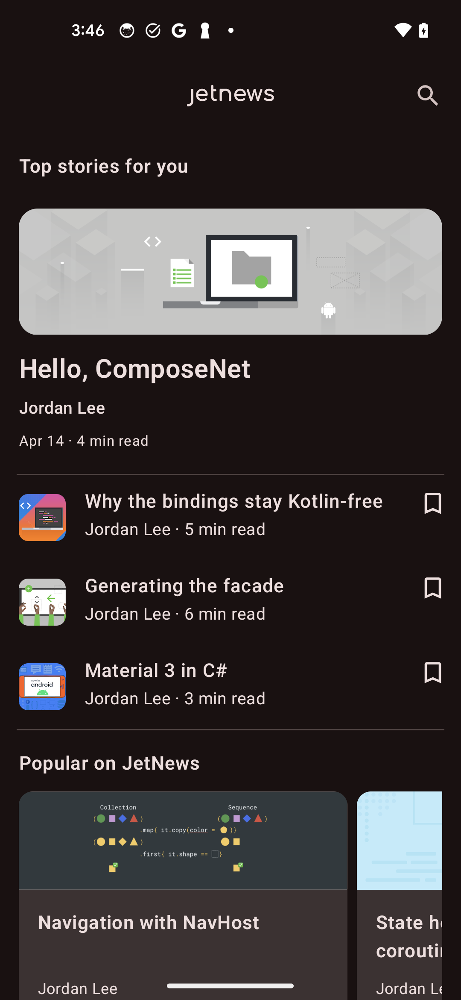

# JetNews (compose-net port)

A simplified C# port of
[android/compose-samples ▸ JetNews](https://github.com/android/compose-samples/tree/main/JetNews).
Upstream is labelled **Medium complexity**; this port targets the
phone-only single-pane flow and leans on the same data-shape ideas
without copying any Kotlin source.



Run with:

```pwsh
dotnet build samples/JetNews -t:Run
```

## What's faithful

- Three top-level screens: **Home**, **Article**, **Interests**, all
  wired through `NavHost` + `NavController` with a typed `Routes`
  helper for the route strings.
- **Navigation drawer** (`ModalNavigationDrawer` + `ModalDrawerSheet`)
  with a JetNews logo header, divider, and two destination rows
  (Home, Interests) that highlight whichever route is currently
  active and navigate via the shared `NavController`. Tapping a row
  fires `DrawerStateHolder.CloseAsync()` so the drawer slides shut
  behind the navigation; tapping the top-bar hamburger fires
  `OpenAsync()` to slide it back open. Both go through the
  `SuspendBridge` plumbing around `DrawerState.open()` / `close()`.
- **Home feed**: `Scaffold` + `CenterAlignedTopAppBar` (hamburger +
  title + search icon action) with a `LazyColumn` that flattens the
  highlighted post, a "Recommended for you" section, a "Popular on
  JetNews" section, and a "Based on your history" section into a
  single lazy list — same structure upstream's `PostList` produces
  with `LazyColumn` and section headers.
- **Article reader**: `Scaffold` + `TopAppBar` with a back arrow that
  pops the back stack, a hero card with title / subtitle / metadata,
  and per-paragraph rendering keyed off `ParagraphType` (Title /
  Caption / Header / Subhead / Text / CodeBlock / Quote / Bullet) —
  the same eight styles upstream's `Paragraph` enum defines.
  `BottomAppBar` hosts the bookmark toggle and a share button.
- **Interests** screen: `PrimaryTabRow` with Topics / People /
  Publications tabs (driven by a remembered `MutableState<int>`),
  per-tab toggleable lists backed by three `MutableStateList<string>`
  selections, with check / add leading icons reflecting current
  membership.
- **Bookmarks**: per-post `IconToggleButton` (Phase 2
  `[Callback(typeof(bool))]`) that flips membership in a shared
  `MutableStateList<string>` of post ids — both the home cards and
  the article bottom bar use the same component.
- **Theme**: `MaterialTheme` wraps the whole tree, so the device's
  Material You dynamic color scheme drives surface / primary / etc.
- **Resource-backed icons** via the Phase 7 `[PainterResource]`
  `Icon` facade (menu, search, back, bookmark, bookmark-filled,
  share, home, interests, check, add, logo) — twelve vector drawables
  under `Resources/drawable/`.

## What's omitted

Each row links to the upstream issue tracking the missing facade
feature.

| Upstream feature                                                | Tracking issue |
|-----------------------------------------------------------------|----------------|
| Adaptive list-detail two-pane layout on wider devices            | [#143](https://github.com/jonathanpeppers/compose-net/issues/143) (WindowSizeClass), plus a SharedTransitionLayout / ListDetailScene binding |
| Real hero PNGs in card / article (currently a solid `Box` filled with a per-post `HeroColor`) | [#145](https://github.com/jonathanpeppers/compose-net/issues/145) — `ContentScale.Crop` on the `Image` facade; without it small vector hero images letterbox |
| Inline-run paragraph styling (Link / Bold / Italic / Code spans inside one paragraph) | [#141](https://github.com/jonathanpeppers/compose-net/issues/141) — `AnnotatedString` + `SpanStyle` |
| Top-bar elevation / collapse on scroll (`pinnedScrollBehavior`, `enterAlwaysScrollBehavior`) | [#142](https://github.com/jonathanpeppers/compose-net/issues/142) — `Modifier.nestedScroll` + `TopAppBarDefaults` |
| Adaptive Topics two-column layout (`InterestsAdaptiveContentLayout`) — port renders one column | [#144](https://github.com/jonathanpeppers/compose-net/issues/144) — custom `Layout {}` primitive |
| `stringResource(R.string.x)` — port uses inline string literals      | [#146](https://github.com/jonathanpeppers/compose-net/issues/146) |
| `CompositionLocal` reads (`LocalContext`, `LocalDensity`, …)         | [#59](https://github.com/jonathanpeppers/compose-net/issues/59) |
| `MaterialTheme.colorScheme.*` / `typography.*` reads (port hard-codes hex colors and sp/weight values) | [#58](https://github.com/jonathanpeppers/compose-net/issues/58) / [#61](https://github.com/jonathanpeppers/compose-net/issues/61) — facade lands but JetNews not migrated yet |
| WindowInsets / edge-to-edge                                          | [#69](https://github.com/jonathanpeppers/compose-net/issues/69), [#20](https://github.com/jonathanpeppers/compose-net/issues/20) |
| Snackbar-based error / refresh, search-while-typing, deep links, share intents | not facade gaps — out of scope for the port |
| ViewModel / Hilt / `kotlinx.coroutines` / `kotlinx.serialization` data layer | replaced by a static `PostsRepo` returning six condensed posts |

## Implementation notes

### Seed data is original content about ComposeNet itself

`PostsRepo.cs` ships six articles whose bodies discuss the
ComposeNet project (binding strategy, Material 3 facade,
navigation, state holders, …). This sidesteps reproducing
upstream's Android-team Kotlin blog posts and keeps the sample
self-documenting.

### Hero images are solid color blocks, not bitmaps

Each `Post` carries a `HeroColor` (a `Color.FromHex(…)` value) and
the home / article hero region is just a
`Box { Modifier.Height(180).FillMaxWidth().Background(HeroColor) }`.
This avoids two awkward things at once: bundling several real PNGs
with copyright / attribution implications, **and** the
ContentScale-Fit-letterbox look that small vector hero images get
without [#145](https://github.com/jonathanpeppers/compose-net/issues/145).
Different colors per post still distinguish the rows visually.

### Paragraph runs are uniform per paragraph

Each `Paragraph` carries a single `Type` plus a single `Text` string.
The upstream `Markup` data class lets one paragraph mix Link /
Code / Bold / Italic spans inline; without `AnnotatedString`
([#141](https://github.com/jonathanpeppers/compose-net/issues/141)) the
port renders each paragraph in a uniform style and silently drops
the runs. `Quote` skips italic too — `FontStyle.Italic` is
available, but `Italic` runs *inside* an otherwise-upright paragraph
still need AnnotatedString.

### Drawer items auto-close on tap

`JetnewsDrawer.Build` navigates on tap, updates a
`MutableState<string>` mirror of the active route, and fires
`DrawerStateHolder.CloseAsync()` so the drawer slides shut behind
the navigation. Re-tapping the already-active row also closes the
drawer (no navigation, just dismiss). The top-bar hamburger on
Home / Interests fires `OpenAsync()` to slide it back open. Both
go through the `SuspendBridge` plumbing wired up in
[#140](https://github.com/jonathanpeppers/compose-net/issues/140).

### Search / share icons are visual-only

The top-bar search icon and the article bottom-bar share button
both wire to no-op `Action` callbacks. The icons read as real
affordances but don't trigger anything — same shape as upstream's
placeholder handlers.

### Interests is a single column

Upstream's `InterestsAdaptiveContentLayout` is a custom `Layout {}`
that splits topics into multiple columns based on available width.
Without bound `Layout` primitives
([#144](https://github.com/jonathanpeppers/compose-net/issues/144))
the port renders the Topics tab as a flat single-column list with
section headers.

### Static builders, not `ComposableNode` subclasses

Same pattern as Jetchat: each screen is a `public static class` with
a `Build(…)` method returning `ComposableNode`. `Render(IComposer)`
is `internal` to the facade assembly so a sample-side subclass
can't override it. Cost: every recomposition allocates the tree
inside `JetnewsApp.Build`. NavHost caches the per-destination tree
via `Compose.Remember` (see `NavHost.cs`), so the screen subtrees
inside `Composable("home") { … }` etc. are walked only on first
render.

### State lives at MainActivity scope

Most `MutableState` / `MutableStateList` instances (current route,
three interests selections, interests-tab index) live in
`MainActivity.OnCreate` via `Remember(...)`. They flow as
parameters through `JetnewsApp.Build` → per-screen builders. This
keeps the screen builders pure functions of their inputs and lets
the same `MutableState` reference survive recompositions and
navigation transitions.

Bookmarks are an exception: they live in a
`BookmarksViewModel` acquired via `Compose.ViewModel<T>(…)` at the
activity scope, so the set survives configuration change (the
activity's `ViewModelStore` retains the instance across
`Activity.OnCreate` calls). The home feed and the article screen
both receive the same `BookmarksViewModel` reference, so toggling a
bookmark from either screen is observed by the other.

### Per-screen state lives in `HomeViewModel`

The Home feed state is owned by a `HomeViewModel : ComposeNet.ViewModel`
acquired in `HomeScreen.Build` via `Compose.ViewModel(...)`. The VM
is rooted in the current `NavBackStackEntry`'s `ViewModelStore`, so
it survives recomposition and configuration change, and clears
when the user pops the destination off the back stack.
