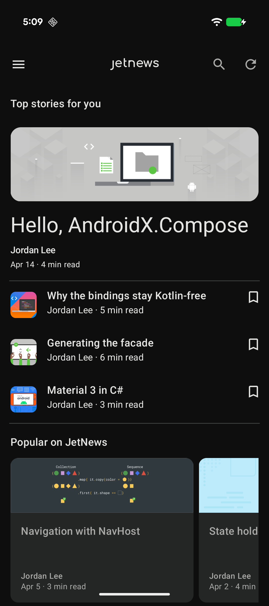

# JetNews (Microsoft.AndroidX.Compose port)

A simplified C# port of
[android/compose-samples ▸ JetNews](https://github.com/android/compose-samples/tree/4c1fe7586e2fbf1c934925ef8ab64d3803361423/JetNews).
Upstream is labelled **Medium complexity**; this port targets the
phone-only single-pane flow and leans on the same data-shape ideas
without copying any Kotlin source.

Documentation reconciled against C# revision
`b8c93a68579a2430a54cbe3271730047516edec9` for
[#349](https://github.com/jonathanpeppers/Microsoft.AndroidX.Compose/issues/349).
JetNews is a source/documentation check only in the
[sample parity baseline](../parity-baseline.md), not a matched-device comparison.
The #159 sample follow-up was compared with pinned upstream
`4c1fe7586e2fbf1c934925ef8ab64d3803361423` and current upstream
`0bbd72d69834ec86a9a72bd3513118755fb286c5` (2026-09-18).



Run with:

```pwsh
dotnet build samples/JetNews -t:Run
```

## What's faithful

- Three top-level screens: **Home**, **Article**, **Interests**, all
  wired through `NavHost` + `NavController` with a typed `Routes`
  helper for the route strings.
- **Navigation drawer** (`ModalNavigationDrawer` + `ModalDrawerSheet`)
  with a JetNews logo header, divider, and two destination rows
  (Home, Interests) that highlight whichever route is currently
  active and navigate via the shared `NavController`. Tapping a row
  fires `DrawerStateHolder.CloseAsync()` so the drawer slides shut
  behind the navigation; tapping the top-bar hamburger fires
  `OpenAsync()` to slide it back open. Both go through the
  `SuspendBridge` plumbing around `DrawerState.open()` / `close()`.
- **Home feed**: `Scaffold` + `CenterAlignedTopAppBar` (hamburger +
  title + search icon action) with a `LazyColumn` that flattens the
  highlighted post, a "Recommended for you" section, a "Popular on
  JetNews" section, and a "Based on your history" section into a
  single lazy list — same structure upstream's `PostList` produces
  with `LazyColumn` and section headers.
  The bar uses `pinnedScrollBehavior`; its nested-scroll connection is
  attached to the feed.
- **Article reader**: `Scaffold` + `TopAppBar` with a back arrow that
  pops the back stack, a hero card with title / subtitle / metadata,
  and per-paragraph rendering keyed off `ParagraphType` (Title /
  Caption / Header / Subhead / Text / CodeBlock / Quote / Bullet) —
  the same eight styles upstream's `Paragraph` enum defines.
  `BottomAppBar` hosts the bookmark toggle and a share button.
- **Article assets and markup**: home cards and the article reader use
  bundled hero/thumbnail PNGs. Paragraphs with markup use `AnnotatedText`
  and `SpanStyle` for bold, italic, links, and monospace code; quotes are
  italic. Link spans use `LinkAnnotation.Clickable` and open
  `Markup.Href` through the host activity, with snackbar feedback when
  the URL is invalid or no installed app can handle it.
- **Interests** screen: `PrimaryTabRow` with Topics / People /
  Publications tabs (driven by a remembered `MutableState<int>`),
  per-tab toggleable lists backed by three `MutableStateList<string>`
  selections, with check / add leading icons reflecting current
  membership. Topics use the custom `Layout` primitive to switch from
  one to two columns at the upstream 600dp breakpoint.
- **Bookmarks**: per-post `IconToggleButton` (Phase 2
  `[Callback(typeof(bool))]`) that flips membership in a shared
  `MutableStateList<string>` of post ids — both the home cards and
  the article bottom bar use the same component.
- **Theme and resources**: `MaterialTheme` wraps the whole tree, so
  active Material typography and colors drive cards, article paragraphs,
  labels, code backgrounds, and secondary text. User-visible chrome and
  content descriptions come from Android string resources.
- **Feed state and feedback**: destination-scoped `HomeViewModel` exposes
  loading, content, error/retry, and refresh state. `PullToRefreshBox` and
  the toolbar refresh action invoke `RefreshAsync`; bookmark actions show
  sample-managed snackbar feedback. The inline query filters title,
  subtitle, author, and paragraph text immediately.
- **Resource-backed icons** via the Phase 7 `[PainterResource]`
  `Icon` facade (menu, search, back, bookmark, bookmark-filled,
  share, home, interests, check, add, close, refresh, JetNews logo,
  and JetNews wordmark) — fourteen vector drawables under
  `Resources/drawable/`.

## What's omitted

These are remaining sample differences, not a list of missing bindings.
Closed API issues identify delivered prerequisites; sample-side follow-up
is tracked in [#159](https://github.com/jonathanpeppers/Microsoft.AndroidX.Compose/issues/159).

| Upstream feature                                                | Tracking issue |
|-----------------------------------------------------------------|----------------|
| Adaptive list-detail two-pane layout on wider devices | Depends on the Navigation 3/list-detail architecture decision below. The size-class read shipped in [#143](https://github.com/jonathanpeppers/Microsoft.AndroidX.Compose/issues/143). |
| Navigation 3 list/detail scenes | Major navigation architecture work. A 2026-09-18 NuGet catalog and `dotnet/android-libraries` metadata search found no Microsoft package for `androidx.navigation3`; the repository mentions Navigation 3 only as an excluded alpha transitive dependency. The similarly named Material3 adaptive-navigation packages are not Navigation 3. This is bounded package-discovery evidence, not proof that no future or differently named artifact can exist. The current `NavHost` compatibility layer remains intentionally in place pending an explicit product decision. |
| `SharedTransitionLayout` / `SharedTransitionScope` | The pinned `Xamarin.AndroidX.Compose.Animation.Android` 1.11.3.1 runtime companion publicly binds both composables and the shared-element scope members. The remaining work is facade/callback integration plus navigation-scene design, not a missing official runtime binding. |
| Inbound deep links and serialization-backed route keys | The share chooser emits an article-shaped URL, but the activity does not claim or deserialize inbound links. Depends on the navigation decision above. |
| Hardware/IME key interception | The pinned `Xamarin.AndroidX.Compose.UI.Android` 1.11.3.1 companion publicly binds `KeyEvent`, `OnKeyEvent`, and `OnPreviewKeyEvent`. The facade has no reusable modifier helper, but one is not required for this port's immediate live filtering. |
| Glance app widget | Separate remote-views toolkit and product surface. A 2026-09-18 NuGet catalog and `dotnet/android-libraries` metadata search found no Microsoft Glance package or mapping; this remains bounded discovery evidence rather than a universal absence claim. |
| Hilt / Kotlin Flow / serialization-backed repository | Intentional C# adaptation: `HomeViewModel`, `BookmarksViewModel`, `IPostsRepository` and `PostsRepository` over six original seed articles; not an absence of ViewModel support. |

## Implementation notes

### Seed data is original content about Microsoft.AndroidX.Compose itself

`PostsRepo.cs` ships six articles whose bodies discuss the
Microsoft.AndroidX.Compose project (binding strategy, Material 3 facade,
navigation, state holders, …). This sidesteps reproducing
upstream's Android-team Kotlin blog posts and keeps the sample
self-documenting.

### Hero images use bundled bitmaps

`HomeCards.cs` and `PostScreen.cs` pass `Post.HeroId` / `Post.ThumbId`
to `Image`. Hero regions use the source image's `992 / 296` aspect
ratio; thumbnails are sized separately. The twelve PNGs come from the
upstream sample under Apache 2.0; see the [asset attribution](../README.md#attribution).
Image support from [#145](https://github.com/jonathanpeppers/Microsoft.AndroidX.Compose/issues/145)
is no longer an implementation blocker. This is not a claim that every
crop, inset or color matches upstream.

### Paragraphs preserve styled runs and URL actions

`Paragraph.Markups` contains ranges passed by `PostBody.BuildAnnotated`
to `AnnotatedStringBuilder.AddStyle` / `AddLink`. Bold, italic, accessible
clickable links and monospace code are rendered using the API delivered in
[#141](https://github.com/jonathanpeppers/Microsoft.AndroidX.Compose/issues/141).
Code backgrounds and link colors come from the active color scheme; quote
paragraphs use `FontStyle.Italic`. URL callbacks use an Android
`ACTION_VIEW` intent, and failures surface through the existing snackbar
controller rather than disappearing.

### Drawer items auto-close on tap

`JetnewsDrawer.Build` navigates on tap, updates a
`MutableState<string>` mirror of the active route, and fires
`DrawerStateHolder.CloseAsync()` so the drawer slides shut behind
the navigation. Re-tapping the already-active row also closes the
drawer (no navigation, just dismiss). The top-bar hamburger on
Home / Interests fires `OpenAsync()` to slide it back open. Both
go through the `SuspendBridge` plumbing wired up in
[#140](https://github.com/jonathanpeppers/Microsoft.AndroidX.Compose/issues/140).

### Search filters immediately; share opens a chooser

The home search icon toggles an `OutlinedTextField` with a remembered
query and a close/reset action. Every edit filters the feed across post
metadata and body text while preserving source order and removing duplicates.
This intentionally goes beyond both pinned and current upstream JetNews:
their `submitSearch` remains a toast-only stub that clears the query.
No hardware-key interception is needed for live filtering.
The article share button opens a confirmation dialog; its "Share anyway"
action invokes `MainActivity.SharePost`, which launches an Android
`ACTION_SEND` chooser with the article title and a synthetic URL.
No share target produces a snackbar, not a silent no-op. The synthetic
URL is not evidence of working inbound deep links.

### Topics adapts at the upstream breakpoint

Upstream's `InterestsAdaptiveContentLayout` is a custom `Layout {}`
that splits topics into multiple columns based on available width.
The port uses the delivered `Layout` primitive
([#144](https://github.com/jonathanpeppers/Microsoft.AndroidX.Compose/issues/144))
with the same 600dp breakpoint, two-column cap, 450dp item cap, row-major
placement, and per-row maximum-height calculation. People and Publications
remain ordinary single-column lists, matching upstream.

### Static builders, not `ComposableNode` subclasses

Each screen uses a static `Build(…)` method returning `ComposableNode`.
This is a sample authoring choice: `ComposableNode.Render(IComposer)` is
public and can be overridden by a sample-side subclass. The builders
construct trees when their composable paths execute; that observation is
not a measured allocation or performance result. NavHost remembers the navigation graph,
not the first per-destination tree (see `NavHost.cs`). Each successful
host render publishes the current destination content and invalidates
visible destinations; inactive screens receive the latest content when
revisited. The first render still defines the registered route topology;
later content updates do not replace the graph or back stack.

### State lives at MainActivity scope

Most `MutableState` / `MutableStateList` instances (current route,
three interests selections, interests-tab index) live in
`MainActivity.OnCreate` via `Remember(...)`. They flow as
parameters through `JetnewsApp.Content` → per-screen builders. This
keeps the screen builders pure functions of their inputs and lets
the same `MutableState` reference survive recompositions and
navigation transitions.

Bookmarks are an exception: they live in a
`BookmarksViewModel` acquired via `composer.ViewModel<T>(…)` at the
activity scope, so the set survives configuration change (the
activity's `ViewModelStore` retains the instance across
`Activity.OnCreate` calls). The home feed and the article screen
both receive the same `BookmarksViewModel` reference, so toggling a
bookmark from either screen is observed by the other.

### Per-screen state lives in `HomeViewModel`

The Home feed state is owned by a `HomeViewModel : Microsoft.AndroidX.Compose.ViewModel`
acquired in `HomeScreen.Build` via `composer.ViewModel(...)`. The VM
is rooted in the current `NavBackStackEntry`'s `ViewModelStore`, so
it survives recomposition and configuration change, and clears
when the user pops the destination off the back stack.
