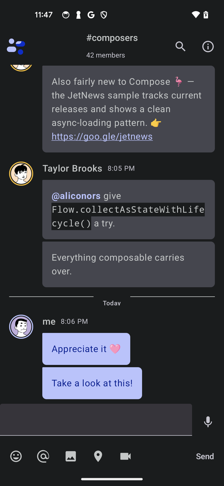

# Jetchat (compose-net port)

A C# port of the official Compose sample
[android/compose-samples ▸ Jetchat](https://github.com/android/compose-samples/tree/main/Jetchat).
The upstream sample is labeled **Low complexity** and is the smallest
of the six showcase apps, which makes it the natural first target for
`ComposeNet.Compose`.



Run with:

```pwsh
dotnet build samples/Jetchat -t:Run
```

## What's faithful

- `MaterialTheme` wrapping the whole tree — picks up the device
  wallpaper-derived dynamic color scheme on Android 12+ (Material You).
- **Live `MaterialTheme.colorScheme.*` reads** via the new `Composed`
  composer-aware wrapper. Bubble, drawer-selection, divider, top-bar
  subtitle, timestamp and member-count colors all flow from the active
  scheme (`Primary`, `PrimaryContainer`, `SurfaceVariant`,
  `OnSurfaceVariant`, `Surface`, `OnSurface`) instead of hardcoded hex.
- **Hamburger nav** — `IconButton` in the top app bar fires
  `DrawerStateHolder.OpenAsync()`; tapping a channel in the drawer
  fires `CloseAsync()`. Both go through new `SuspendBridge` plumbing
  around `DrawerState.open()` / `close()`.
- **Navigation drawer** — `ModalNavigationDrawer` + `ModalDrawerSheet`
  with header logo + brand, divider, "Chats" section, divider, "Recent
  Profiles" section. The drawer column is wrapped in
  `Modifier.VerticalScroll(rememberedScrollState)` so it scrolls when
  it overflows on small heights.
- **Drawer "Settings" section (API 26+)** — on
  `OperatingSystem.IsAndroidVersionAtLeast(26)` an extra section with
  **Settings** and **Pin Widget to home** rows appears below "Recent
  Profiles", matching upstream's `JetchatDrawer` API-gated block.
  Tapping either row closes the drawer and opens the existing
  `FunctionalityNotAvailable` popup; an actual `requestPinAppWidget`
  flow is gated behind a future Glance widget (still listed below).
- **Multi-channel state** — `ConversationUiState` holds a
  `Dictionary<string, ChannelState>` keyed by channel name. Tapping a
  drawer row swaps the active channel; the title, member count, and
  message list all recompose against the newly selected channel's
  `MutableStateList<Message>`. Two channels are seeded
  (`composers`, `droidcon-nyc`) with distinct message logs.
- `Scaffold` + `CenterAlignedTopAppBar` with a two-line title showing
  the current channel name and member count, plus trailing **search**
  and **info** action icons. Search / info open a
  **FunctionalityNotAvailable `AlertDialog`** — the same affordance
  upstream's `FunctionalityNotAvailablePopup` provides for unbound
  features.
- Drawable-resource avatars rendered via the Phase 7
  `Image(int drawableResourceId, …)` facade, the same shape as
  upstream's `painterResource(R.drawable.someone_else)` calls. Where
  upstream reuses a single `someone_else.jpg` photo for every non-`me`
  author, this port ships a **distinct portrait per author** generated
  with [DiceBear](https://www.dicebear.com)'s `lorelei` style
  ([CC0 1.0](https://creativecommons.org/publicdomain/zero/1.0/) —
  deterministic from the author's name).
- **`LazyColumn(reverseLayout = true)`** — newest message at index 0
  sits at the bottom of the viewport, matching upstream's scroll-from-
  bottom behaviour. The new `ReverseLayout` property landed in this
  port.
- **Asymmetric chat bubbles** via the new
  `Shape.RoundedCorners(Dp, Dp, Dp, Dp)` factory: outgoing messages
  use `(20, 4, 20, 20)` to flatten the top-right corner; incoming
  messages use `(4, 20, 20, 20)` to flatten the top-left corner
  pointing at the avatar — same shape upstream's `ChatItemBubble`
  draws.
- A "Today" day-separator row (`HorizontalDivider` + `Text` +
  `HorizontalDivider`) above the message list, with divider color
  pulled from the active scheme.
- Message bubbles with a 40 dp circular avatar tile (16 dp horizontal
  padding around it, mirroring upstream's 74 dp avatar+padding
  reservation) and a rounded coloured bubble for the message body.
- **Typography parity via the `Text` styling surface** — author names
  at 16 sp / `FontWeight.Medium` (M3 `titleMedium`), timestamps at
  12 sp (`bodySmall`), the "Today" separator at 11 sp / Medium /
  1 sp letter-spacing (`labelSmall`, rounded from 0.5 sp because
  `Sp` only takes integers), top-bar channel name at 16 sp / Medium
  with a 12 sp member-count subtitle, and drawer brand / section /
  chat labels at the matching M3 sizes.
- **Streak-aware avatars + per-author spacing** — when a sender
  posts multiple messages in a row, only the chronologically-last
  one shows the avatar tile; subsequent messages indent with a 72 dp
  `Spacer` so the bubbles still align. Author boundaries get an
  extra 4 dp of top padding (8 dp first-in-chain vs 4 dp within a
  streak). Because we use `reverseLayout = true` the streak walk
  mirrors upstream's `isLastMessageByAuthor` directly.
- **`isUserMe` differentiation** for the local user via a primary-
  colored bubble. Layout structure (avatar+spacer + author+text
  column) is identical for me vs others — same as upstream's
  `Message`/`AuthorAndTextMessage` row, no right-alignment.
- A pinned input row at the bottom in a `Surface(tonalElevation=2)`:
  a `TextField` that grows to fill available width via
  `Modifier.Weight(1f)`, plus a `Send` `TextButton` whose label
  color flips to `onSurfaceVariant` when the input is empty (the
  underlying facade doesn't expose an `Enabled` flag yet, so
  `Send` is a no-op on empty text via early-return).
- **5 input-selector icons** — emoji, @ mention, image, location,
  video call — same row upstream's `UserInputSelector` provides.
  Each is a toggleable `IconButton` whose background fills with
  `secondaryContainer` and whose tint flips to `onSecondaryContainer`
  when selected, matching upstream's selection visual. Selecting the
  emoji button opens the real two-tab emoji panel (Emojis/Stickers,
  10-column tappable grid — see `EmojiSelector.cs`); selecting @ /
  image / location / video opens a `FunctionalityNotAvailable` panel —
  the same fallback upstream uses for the unbound selector pages.
- **IME + navigation-bar safe insets** on the input area via
  `Modifier.NavigationBarsPadding().ImePadding()` plus
  `WindowSoftInputMode = SoftInput.AdjustResize` on the activity, so
  the keyboard pushes the input row up without obscuring it (and
  without the system's default `adjustUnspecified` behaviour
  double-shifting the content under edge-to-edge).
- Reactive message list via `MutableStateList<Message>` — tapping
  send appends to the active channel and the UI recomposes.
- Reactive channel selection via `MutableState<string>` — drawer
  taps flow into the title, the member count, the message list, and
  the bolded selected chat row.
- Newly sent messages stamp `"now"` (matching upstream's
  `R.string.now` resource value).

## What's still omitted

These need work upstream of the sample — either a new facade
feature, a new package reference, or simply more sample plumbing:

| Upstream feature                          | Why it's not here |
|-------------------------------------------|--------------------|
| `JumpToBottom` FAB (slides in when scrolled away from bottom) | needs a `LazyListState` facade wrapper plus a suspend bridge over `animateScrollToItem`. `LazyListStateKt.RememberLazyListState` is bindable — confirmed during this port; the wrapper just hasn't been built yet. |
| `BackHandler` to dismiss the expanded input panel via system back | `androidx.activity.compose.BackHandlerKt` lives in `Xamarin.AndroidX.Activity.Compose` which isn't currently referenced. Adding the NuGet + a `[ComposeBridge]` would unblock it. |
| `ClickableText` URL / `@mention` link parsing inside message bodies | needs `AnnotatedString` + `ClickableText` bindings (multi-span text styling). |
| Image / sticker / file message attachments inside bubbles | requires a composable image-loader pipeline (e.g. Coil). |
| User profile screen (`ProfileScreen` reached via `NavHost`) | `NavController` / `NavHost` bindings landed in #60 but the screen + nav graph aren't wired up here. Explicitly out of scope for this port. |
| App-widget discoverability (`@JetchatAppWidget`) | the **drawer entry point** exists on API 26+ (see *What's faithful*) but the actual `androidx.glance.appwidget`-backed widget + `AppWidgetManager.requestPinAppWidget(...)` flow is still out of scope — needs the `Xamarin.AndroidX.Glance.AppWidget` package and a `GlanceAppWidget` subclass. |
| Drag-and-drop image target on the conversation area | explicitly out of scope. |
| Sticky day-headers spanning multiple dates (e.g. "20 Aug" alongside "Today") | needs the `LazyListScope.item { … }` DSL exposed on the `LazyColumn` facade so a per-day header can be emitted between message groups. Only "Today" is rendered. |
| `Sp(float)` for exact M3 letter-spacing (0.5 / 0.1 sp values) | `Sp` is integer-only; `labelSmall` rounds 0.5 → 1, `titleSmall` rounds 0.1 → 0 (dropped). |
| `FocusRequester` programmatic focus into the emoji panel | the panel opens correctly but doesn't grab focus on expand. |
| Full ~80-glyph emoji table | `EmojiSelector.cs` exposes the first 40 glyphs from upstream's `private val emojis = listOf(...)` — the same `EMOJI_COLUMNS × 4` grid Kotlin's `EmojiTable` actually renders. The remaining upstream entries are unused on screen and were dropped. |
| Emoji-tap places cursor at end of input   | Upstream uses `TextFieldValue` with explicit `selection = TextRange(newText.length)` so each emoji append moves the cursor past the appended glyph. This port's `TextField` facade is bound to `MutableState<string>` (Compose's `String`-overload), which preserves the existing cursor position across external value updates. Tapping an emoji appends the glyph to the buffer but the cursor stays where it was — a `TextFieldValue` / `TextRange` binding is needed for parity. Tracked in #204. |

## Facade features added for this port

In addition to the earlier round that landed during the first
iteration (sizing modifiers, `Background` / `Border` / `Clickable` /
`Clip` / `Weight`, `MutableStateList<T>`, drawable-resource
`Image` / `Icon`, `Modifier.VerticalScroll`, `ModalNavigationDrawer`),
this completion round added:

- **`Composed`** — a `ComposableNode` wrapper around
  `Func<IComposer, ComposableNode>` so sample code can read
  `MaterialTheme.CurrentColorScheme(c)` /
  `MaterialTheme.CurrentTypography(c)` from inside a tree builder
  without needing a `partial class : ComposableNode` subclass.
- **`LazyColumn<T>.ReverseLayout`** — surfaces the
  `reverseLayout` parameter that's been on the underlying
  `LazyColumn` Kotlin composable from day one.
- **`DrawerStateHolder.OpenAsync()` / `CloseAsync()`** — `Task`-
  returning helpers backed by new raw-JNI suspend bridges over
  `DrawerState.open()` / `close()`, wired through the existing
  `SuspendBridge` continuation infrastructure.
- **`Shape.RoundedCorners(Dp, Dp, Dp, Dp)`** — asymmetric corner
  factory that calls
  `RoundedCornerShapeKt.RoundedCornerShape(float, float, float, float)`
  directly. (The 4-arg `(Dp, Dp, Dp, Dp)` overload is bindable;
  only the single-radius `(Dp)` overload is mangled.)

## Implementation notes

### Why `Composed` instead of a `ComposableNode` subclass

As of #132, `ComposableNode.Render(IComposer)` is `public abstract`
and `ComposableContainer.Children` / `RenderChildren` are
`protected`, so subclassing from outside the facade assembly is
fully supported. `Composed(Func<IComposer, ComposableNode>)` is
the more concise alternative when all you want is to read
`MaterialTheme.CurrentColorScheme(c)` /
`MaterialTheme.CurrentTypography(c)` from inside an existing builder
without writing a whole new class — the body lambda runs every
composition pass with the live `IComposer`, computes whatever
scheme / typography slots it needs, and returns the subtree built
against them. The Jetchat sample uses it at the top of `Build` so
the entire tree gets recomputed against the active scheme.

### Why hamburger nav fires `_ = drawerState.OpenAsync()`

`DrawerStateHolder.OpenAsync()` returns `Task`, and `IconButton`'s
`onClick` is `Action` (not `Func<Task>`). The fire-and-forget
discard is intentional — the suspend bridge runs on
`AndroidUiDispatcher.Main` and any exception inside the suspend
faults the returned task synchronously, but the click handler has
no way to surface that. `OpenAsync` throws
`InvalidOperationException` only if `Jvm` is null, which is
impossible by the time a click can fire (the field is populated on
the first render of `ModalNavigationDrawer`, which is unavoidable
before any user input).

### `reverseLayout = true` streak walk

With `reverseLayout = true`, item index 0 sits at the bottom of
the viewport. The sample reverses the message list before passing
it to `LazyColumn` so the newest message ends up at index 0. The
streak walk runs back-to-front
(`for (int i = src.Count - 1; i >= 0; i--)`) and emits messages in
chronological order with `IsStreak = prev?.Author == m.Author`
meaning "this message is followed in time by another from the same
author" — so the avatar appears on the chronologically-last
message of each chain, matching the Slack / iMessage convention
upstream uses.

### Send is a no-op on empty input (no `TextButton.Enabled`)

`TextButton`'s facade ctor doesn't expose an `Enabled` flag yet.
The sample mirrors disabled-state visuals by flipping the label
color from `Primary` to `OnSurfaceVariant` when the input is
whitespace, and the `Send` handler early-returns on
`IsNullOrWhiteSpace`.

### Drawer "Settings" section is gated on API 26

Upstream's `JetchatDrawer.kt` wraps the **Settings** + **Pin Widget
to home** rows in `if (Build.VERSION.SDK_INT >= Build.VERSION_CODES.O)`
because `AppWidgetManager.requestPinAppWidget(...)` requires API 26.
The port uses the modern .NET equivalent
(`OperatingSystem.IsAndroidVersionAtLeast(26)`), which the BCL
recognises as a platform guard so the rows can call APIs annotated
`[SupportedOSPlatform("android26.0")]` without an `SYSLIB` warning.
Both row click handlers fire `drawerState.CloseAsync()` and then the
existing `FunctionalityNotAvailable` popup — same affordance the
search and info top-bar icons use. Hooking the **Pin Widget** row to
a real `requestPinAppWidget` call is blocked on landing the Glance
widget itself, tracked in *What's still omitted*.

### Layout and styling decisions vs upstream

Where the port intentionally takes a different path from the Kotlin
original:

- **Search / Info top-bar icons.** Upstream uses bare `Icon`
  composables with `.clickable` (not `IconButton`) so the touch
  target hugs the icon's 24 dp height. The port uses the same
  shape — `new Icon(... ) { Modifier.Clickable(...).Padding(...).Height(24) }`
  — to keep the visuals identical.
- **Avatar double border.** Upstream's `.border(1.5dp, accent,
  CircleShape).border(3dp, surface, CircleShape).clip(CircleShape)`
  composes outside-in: the 3 dp surface ring sits between the
  1.5 dp accent ring and any surrounding background. The port
  uses the same modifier chain.
- **Same chat-bubble silhouette** — upstream's
  `RoundedCornerShape(4, 20, 20, 20)` is the single source of
  truth and applies to both `me` and other-author bubbles. Only
  the fill flips (`primary` ↔ `surfaceVariant`).
- **Inside-streak gap is 4 dp; between-author gap is 8 dp** —
  matches upstream's per-author `Spacer` heights.
- **Selector icon highlight.** Upstream paints a 14 dp rounded-
  square background in `LocalContentColor.current` when an input
  selector is selected; the port's enclosing `Surface` sets
  `contentColor = scheme.secondary`, so the highlight matches.
- **`FunctionalityNotAvailable` collapse.** Upstream has two
  variants — an `AlertDialog` (DM selector) and a full panel
  ("Functionality currently not available / Grab a beverage and
  check back later!"). The port collapses both into one panel for
  the expanded-selector case; the dialog variant still fires from
  the search/info icons.
- **`ModalDrawerSheet` background.** Upstream defaults to
  `surfaceContainerLow`; this port's facade defaults to
  `secondaryContainer`, which in Jetchat's dark palette is a
  saturated blue. The drawer pins to `surface` to match upstream.
- **Drawer divider alpha.** Upstream tints with
  `onSurface.copy(alpha = 0.12f)`; the facade layer doesn't model
  alpha-blended ARGB yet, so the divider falls back to the
  binding default. Tracked alongside the other parity gaps in
  *What's still omitted*.
