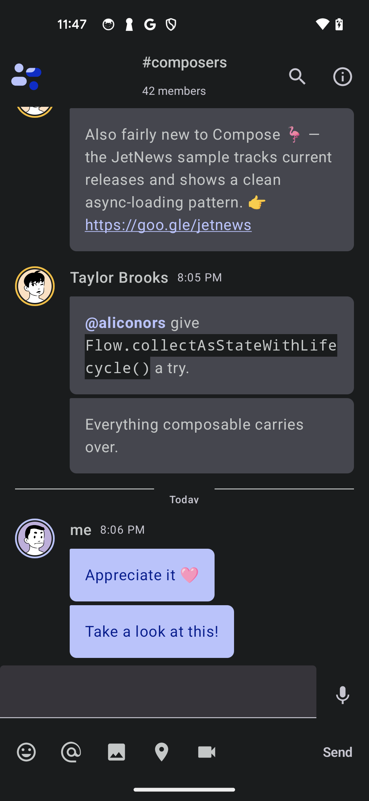

# Jetchat (Microsoft.AndroidX.Compose port)

A C# port of the official Compose sample
[android/compose-samples ▸ Jetchat](https://github.com/android/compose-samples/tree/4c1fe7586e2fbf1c934925ef8ab64d3803361423/Jetchat).
The upstream sample is labeled **Low complexity** and is the smallest
of the six showcase apps, which makes it the natural first target for
`Microsoft.AndroidX.Compose`.



Run with:

```pwsh
dotnet build samples/Jetchat -t:Run
```

Debug builds accept `--es test-palette light` or `--es test-palette dark`
on the activity launch intent for bounded comparisons. This overrides only
that activity's Compose palette; it does not change Android resource
configuration, system-bar appearance, or device settings. An omitted extra
continues to follow the system theme.

## Parity baseline and audit scope (#349)

The source audit below uses **android/compose-samples
`4c1fe7586e2fbf1c934925ef8ab64d3803361423`**, inspected on **2026-09-15**.
See the [shared parity baseline](../parity-baseline.md) for matched Kotlin/C#
capture configuration, artifacts, and results. An individual screenshot can
establish only its recorded screen/state comparison, not whole-app behavior,
animation, restoration, accessibility, or pixel parity.

The source findings below are now accompanied by
[native comparison results](../parity-baseline.md#jetchat) on the dedicated
API 36 emulator. Send/IME, emoji focus handoff, synthetic text drop and the
draft/selector recreation difference have recorded evidence; screen layouts
were also captured in short, medium and expanded windows. Blocked navigation,
link, picker and recording-cancel observations remain explicit.
The older device reports below retain their original build identities and
limitations; they are not relabeled as these new comparisons.
In particular, the pinned Kotlin app already includes **video messages and a
video picker/player**, whereas the C# fixture has nine text/image messages and
no video path. Comparing only the overlapping text screens would hide this gap.

### Finite comparison checklist

These cases define the finite protocol, **not a list of parity passes**.
The shared baseline records verified matches, observed differences and
not-established segments for each case. Begin each independent case
with a fresh launch at `#composers`, 42 members, drawer/selector/dialog closed,
empty unfocused input, IME hidden, and the list at its newest message. Record
device/API, window size/density, font scale, IME, theme/dynamic-color inputs,
network/media fixture, and exact APK identities in the shared baseline.
Use the shared [environment and size matrix](../parity-baseline.md#environment-and-size-matrix)
for exact viewports and font scales. The recorded short-window Jetchat subset
is J01/J04/J07/J09; medium and expanded windows cover J01/J09, in both themes.
The checklist does not imply every case was captured at every size; consult
the [per-case results](../parity-baseline.md#jetchat) for outcomes and limits.
Use identical settings for each Kotlin/C# pair. Do not substitute the Debug
palette extra for a system-theme change.

| Case | Initial state and actions | Expected result / known comparison boundary |
|---|---|---|
| J01 — Conversation | Fresh launch; inspect newest messages, then scroll to both day headers. | Channel/member labels, reverse ordering, sender grouping, markup and sticker are visible. C# has nine rewritten messages; Kotlin has ten including a video. Record resulting wrapping/header-position differences, not pixel equality. |
| J02 — Drawer | Fresh launch; open drawer, choose `droidcon-nyc`, reopen, then choose `composers`. | Highlight changes and drawer closes; both implementations still show the single `#composers` conversation. Neither implements a second channel log. Compare header, row geometry, fonts and conditional widget entry. |
| J03 — Send | Empty editor; enter ` hello ` and use visible Send. Repeat with IME Send; then try whitespace-only input. | Each nonblank action inserts exactly one message preserving surrounding spaces, clears editor/selection/composition and returns to newest content without explicitly clearing focus. Blank input sends nothing. C# stamps `8:30 PM`, Kotlin `now`; C# scroll reset animates. |
| J04 — Emoji/focus | Type `abcd`, place caret between `b`/`c`, open emoji, insert a glyph; focus editor again. Reopen emoji, tap Stickers, dismiss, then Back. | Emoji inserts at the live caret and moves the cursor to buffer end; selector takes focus/ends IME, editor focus closes it, Stickers shows a dialog, Back dismisses selector before navigation. Capture tab/grid geometry; do not assume an earlier selected range survives native focus loss. |
| J05 — Other selectors | Fresh launch; separately tap @, photo, location, and video; dismiss each with Back. | Kotlin @ is a dialog; photo/location are animated unavailable panels; video opens a `video/*` picker. C# shows a static unavailable panel for all four. Selecting an already selected C# icon toggles it off. |
| J06 — Recording | Empty editor; short-tap mic, then long-press/release. Repeat with a left drag ≥200 dp while vertical displacement stays within ±80 dp, and with a drag outside that corridor. | Short tap starts no recording; Kotlin shows a tooltip, C# does not. Long press starts UI-only timer/animation; release stops, qualifying swipe cancels once, outside-corridor movement alone does not cancel. No audio message is produced by either sample. |
| J07 — Recording with text | Enter nonblank text; inspect the mic, then clear text and record for several seconds. | Kotlin keeps the mic beside nonblank text; C# hides it. Compare native button transition separately from C# timer-driven pulse and differing timer/cancellation layout. |
| J08 — Jump to bottom | Scroll beyond 56 dp or the first item, then tap the jump control. | Both return to item 0. Kotlin shows an animated, labeled 36 dp surface/primary control; C# conditionally inserts a collapsed 48 dp control with default container styling. |
| J09 — Profiles | Fresh launch; visit Ali and Taylor separately via drawer; scroll each away from top and back; tap profile FAB and More, dismiss, then Back. | Correct profile values and Edit profile/Message affordance; FAB collapses/expands and opens unavailable dialog. Tertiary-container role is wired. Header clipping, baseline heights, host collapse and custom FAB motion still differ. |
| J10 — Profile history | Open one profile; use drawer gesture to choose the other; press Back. | C# normalizes to home before navigating, so Back returns to conversation. Pinned Kotlin directly navigates and can retain the preceding profile. Record the intentional routing difference. |
| J11 — Links/drop | Scroll to `@aliconors` and URL messages; tap each and return. Drag one plain-text payload over/out/onto the conversation; separately try an image URI. | Mention opens Ali; URL uses the platform handler. Both provide red drag feedback and insert the first text item. C# additionally accepts image MIME types/URI text and animates to item 0; it does not render a dropped URI as an image attachment. |
| J12 — Recreation | Type an unsent draft, open emoji, recreate the activity without clearing app data. | Kotlin explicitly saves editor value/selector; C# uses ordinary composition state and recreates them empty/closed. Record the actual result; process-death, navigation/scroll restoration and TalkBack are not established by this source audit. |
| J13 — Video | Kotlin fresh launch with a playable fixture: open seeded video, use playback controls, Back; choose video from picker, remove preview, choose again and Send with caption. | Kotlin has thumbnail/fullscreen playback and attachment removal/send; C# has no message `videoUri`, picker, preview or player. This is an explicit uncovered flow, not a matched screenshot case. Player/blur/platform dependencies remain uninvestigated. |

### Completed reusable work versus remaining integration

Live issue titles/states were checked on 2026-09-15. These issues are **closed**;
their older motivation/unchecked body lists are not the source of truth:

| Closed issue | Current source evidence / boundary |
|---|---|
| [#333 — Expose AnimatedVisibilityScope child transition modifiers](https://github.com/jonathanpeppers/Microsoft.AndroidX.Compose/issues/333) | `Modifier.AnimateEnterExit` and animated scopes exist. Missing sample animation wiring is not an absent child-transition API. |
| [#334 — Support fractional Sp values](https://github.com/jonathanpeppers/Microsoft.AndroidX.Compose/issues/334) | Fractional typography metrics are supplied by `Theme/Typography.cs`. |
| [#335 — Bind resource-backed Font and custom FontFamily construction](https://github.com/jonathanpeppers/Microsoft.AndroidX.Compose/issues/335) | `JetchatFonts` supplies pinned bundled font families; provider fonts are separate. |
| [#336 — Expose transition value animations for float and color](https://github.com/jonathanpeppers/Microsoft.AndroidX.Compose/issues/336) | `RecordButtonVisuals.Read` uses one native transition for scale, alpha and tint. This is not the recording indicator's infinite pulse. |
| [#337 — Bind pointer-input long-press drag gesture APIs](https://github.com/jonathanpeppers/Microsoft.AndroidX.Compose/issues/337) | `RecordButton.BuildButton` uses `DetectDragGesturesAfterLongPress`; short-tap tooltip is still separate. |
| [#339 — Expose Scaffold contentWindowInsets customization](https://github.com/jonathanpeppers/Microsoft.AndroidX.Compose/issues/339) | Conversation excludes navigation/IME insets and applies them once inside its input Surface. |
| [#340 — Expose BasicTextField and wire Jetchat IME Send](https://github.com/jonathanpeppers/Microsoft.AndroidX.Compose/issues/340) | Both the Foundation editor and shared IME/button send path are present; see scope reconciliation below. |
| [#341 — Add baseline alignment and clipToBounds modifiers](https://github.com/jonathanpeppers/Microsoft.AndroidX.Compose/issues/341) | Recording baseline/clipping and unavailable subtitle baseline padding are wired. Message-author and profile layout still need sample work. |
| [#342 — Expose focus target and focus-manager APIs](https://github.com/jonathanpeppers/Microsoft.AndroidX.Compose/issues/342) | Remembered emoji requester/`FocusTarget` and selector-keyed focus effect are wired. |
| [#343 — Expose complete Material 3 Surface styling slots](https://github.com/jonathanpeppers/Microsoft.AndroidX.Compose/issues/343) | Input/selector tonal and content roles are wired. |
| [#344 — Expose color and elevation slots on Material 3 FAB facades](https://github.com/jonathanpeppers/Microsoft.AndroidX.Compose/issues/344) | Profile supplies live `TertiaryContainer`; jump-control color/geometry remains sample integration, not an unavailable FAB slot. |

**#340 remaining scope:** no missing implementation was found within its stated
Foundation editor / IME Send scope. `ComposeBridges.BasicTextField` delegates to
the existing bound Foundation overload; generated tree/direct surfaces carry
`TextFieldValue`, keyboard actions/options, styling, line limits, cursor brush
and native decoration. `Conversation.BuildTextFieldRow` uses that facade;
both controls route through `MessageInput.Send`. Generator tests cover
decoration/typed callback generation, `BasicTextFieldTests` cover native
selection/composition/Send and authoring routes, and Gallery has a
`BasicTextFieldDemo`. These are inspected test sources, not fresh test results.
Do not reopen #340 to redo those APIs or carry its stale unchecked boxes
forward. Matched input screenshots and remaining surrounding UI differences
belong to [#349](https://github.com/jonathanpeppers/Microsoft.AndroidX.Compose/issues/349).

## Surface styling validation

A bounded Pixel 7 smoke on 2026-09-14 passed against the embedded, merged
`b0d9f97` Jetchat APK (SHA-256
`69956B98CF1759093F843FA2CA22BECB97058BC55E07C4D4320D36FABA0E1A67`).
The installed hash matched, private override files were absent, and the
external app directory did not exist. Light, dark, and no-override cold
launches reached the owned, focused/resumed activity. Native-idle captures
showed distinct input and nested-selector tonal surfaces, readable content,
and selected/unselected icon contrast. Emoji selection followed by editor
focus and typing retained the emoji plus `Surface`, closed the selector,
showed the IME, and enabled Send. Dark emoji and location-placeholder panels
also rendered correctly; normal launch followed the system palette.

This smoke includes the merged inset and baseline changes, but is not
whole-app pixel/font parity or acceptance for other feature work. The
later focus-target integration from #375 is not in that frozen APK. The
separate Gallery styling cycle passed on `8a71bb6` (`080E7771...`), and the
15 strict native Surface transition/identity/pixel/restoration cases passed
on `9ba2c04` (`582282EE...`), as recorded in
[`docs/compose-internals.md`](../../docs/compose-internals.md). Those earlier
APKs are not presented as reruns against this merged Jetchat revision.

## Message identity

Identity was checked against upstream commit
`4c1fe7586e2fbf1c934925ef8ab64d3803361423`:
[`ConversationUiState.kt`](https://github.com/android/compose-samples/blob/4c1fe7586e2fbf1c934925ef8ab64d3803361423/Jetchat/app/src/main/java/com/example/compose/jetchat/conversation/ConversationUiState.kt)
has no message identifier, and
[`Conversation.kt`](https://github.com/android/compose-samples/blob/4c1fe7586e2fbf1c934925ef8ab64d3803361423/Jetchat/app/src/main/java/com/example/compose/jetchat/conversation/Conversation.kt)
uses unkeyed `item` calls for messages and day headers.

The port therefore keeps positional keys rather than pretending that
author/content/timestamp identifies a message. Sending the same text twice
or dropping the same attachment twice creates distinct messages with possibly
identical values; a content hash or concatenation would produce duplicate
keys. In particular, the sample's send timestamp is fixed and cannot serve
as an identifier. The flattened row objects are rebuilt during composition,
so their object identity is not stable either.

Before opting this list into stable keys, a persistent message model must
provide an immutable, unique ID assigned once when each message is created.
It must survive insertions, deletions, reordering, and reconstruction of the
display rows; day-header keys must occupy a separate namespace.
`LazyColumn<T>.Key` accepts non-null `string`, `int`, or `long` values.
Until such business identity exists, message-local state and viewport
anchoring still follow positions, as in the upstream sample.

## Conversation inset ownership

The conversation follows `ConversationContent` and `UserInput` at pinned upstream
commit `4c1fe7586e2fbf1c934925ef8ab64d3803361423`:
`Scaffold.ContentWindowInsets` is the live Material 3 default with navigation-bar
and IME insets excluded. Scaffold's remaining padding is forwarded once to the
body column; the top app bar still owns its status-bar edge. The input's **inner
column**, not its enclosing `Surface`, applies
`NavigationBarsPadding().ImePadding()`. These consuming modifiers use the larger
bottom inset rather than adding the navigation bar to the full keyboard height,
and the Surface remains behind the navigation bar.

Opening the emoji selector moves focus to its remembered `FocusRequester` and
low-level `FocusTarget`, ending the editor's IME session without making the input
container an extra accessibility focus stop. Exactly one selector-keyed effect
requests focus only for the attached emoji panel. Focusing the message field
closes the selector again; Back dismisses the selector. The Foundation
`BasicTextField` shares its focused state and keyboard callbacks with this handoff.
Input/selector tonal styling is also separate from this ownership change.

Omitting `ContentWindowInsets` (including in the profile screen) still uses
Kotlin's regular default. Null means default; `new WindowInsets()` means a supplied
all-zero value, not omission. The composable `Scaffold(..., contentWindowInsets: ...)`
adapter supports the same contract and keeps its original CLR signature for
compiled consumers and method groups.

The Gallery's **Scaffold content insets** demo opens a dedicated edge-to-edge
activity so the catalog's enclosing Scaffold cannot mask the result. Compare
Default, Zero, and Input-owned modes, focus the editor, switch to the selector
and back, dismiss the keyboard, and recreate the activity. Content must stay
above the navigation bar/IME with no extra bottom strip. Device regressions
also measure the actual body bounds and forwarded padding for both tree paths
and both composable adapters. The demo's ordinary body identity must stay the
same while switching inset modes; its saved tap count must also survive
**Recreate activity** (a new ordinary identity after recreation is expected).

## Implemented behavior (not whole-app parity)

- **Input and selector Surface roles** — pinned
  [`UserInput.kt`](https://github.com/android/compose-samples/blob/4c1fe7586e2fbf1c934925ef8ab64d3803361423/Jetchat/app/src/main/java/com/example/compose/jetchat/conversation/UserInput.kt)
  uses 2 dp tonal elevation and `secondary` content color for the input
  Surface, with a nested 8 dp selector Surface. The selector uses the
  theme's surface/on-surface pair and cumulative tonal elevation (10 dp);
  its children no longer paint over that tint with `surfaceVariant`.
  Unselected input icons use `secondary`; selected icons use `onSecondary`.
  These changes leave editor focus, fonts, metrics, and inset ownership intact.
  The merged inset ownership from
  [#369](https://github.com/jonathanpeppers/Microsoft.AndroidX.Compose/pull/369)
  is preserved: the Surface extends behind the bars, and its inner Column
  owns navigation/IME padding once.
- **Bundled Karla / Montserrat families** — the six unmodified fallback TTFs
  from upstream revision `4c1fe7586e2fbf1c934925ef8ab64d3803361423` are wired
  into `JetchatFonts`, theme typography and the conversation/drawer/profile
  text roles. Font assignment preserves the pinned numeric metrics described below.
  These are upstream's local fallbacks, not its Google Fonts provider downloads.
  Jetchat has no bundled italic face, so italic emphasis uses Compose synthesis.
  See [font sources, weights, copyright and SHA-256](Assets/FONT_SOURCES.txt)
  and the bundled [SIL Open Font License](Assets/FONT_LICENSE.txt).
- **Jetchat-branded light/dark theme** — `JetchatTheme` selects the
  upstream blue/yellow palette from `isSystemInDarkTheme()` and supplies
  it through `MaterialTheme`; on Android 12+ it follows upstream by using
  the system dynamic light/dark color scheme.
- **Live `MaterialTheme.colorScheme.*` reads** via the new `Composed`
  composer-aware wrapper. Bubble, drawer-selection, divider, top-bar
  subtitle, timestamp and member-count colors all flow from the active
  scheme (`Primary`, `PrimaryContainer`, `SurfaceVariant`,
  `OnSurfaceVariant`, `Surface`, `OnSurface`) instead of hardcoded hex.
- **Hamburger nav** — `IconButton` in the top app bar fires
  `DrawerStateHolder.OpenAsync()`; tapping a channel in the drawer
  fires `CloseAsync()`. Both go through new `SuspendBridge` plumbing
  around `DrawerState.open()` / `close()`.
- **Navigation drawer** — `ModalNavigationDrawer` + `ModalDrawerSheet`
  with the upstream vector wordmark, divider, "Chats" section, divider, "Recent
  Profiles" section. The drawer column is wrapped in
  `Modifier.VerticalScroll(rememberedScrollState)` so it scrolls when
  it overflows on small heights.
- **Single conversation, two drawer selections** — `ConversationUiState`
  has fixed `ChannelName`/`ChannelMembers` and one `MutableStateList<Message>`.
  Drawer taps change `selectedMenu` and return home, not the conversation.
  This follows pinned `NavActivity.kt` / `ConversationFragment.kt`, which
  also keep the single `exampleUiState`; there is no multi-channel dictionary.
- `Scaffold` + `CenterAlignedTopAppBar` with a two-line title showing
  the current channel name and member count, plus trailing **search**
  and **info** action icons. Search / info open a
  **FunctionalityNotAvailable `AlertDialog`** — the same affordance
  upstream's `FunctionalityNotAvailablePopup` provides for unbound
  features.
- Drawable-resource avatars rendered via the Phase 7
  `Image(int drawableResourceId, …)` facade, the same shape as
  upstream's `painterResource(R.drawable.someone_else)` calls. Where
  upstream reuses a single `someone_else.jpg` photo for every non-`me`
  author, this port's `Message.AuthorImage` likewise chooses one local
  avatar for `me` and a shared local avatar for all other authors.
  Local portrait assets and rewritten prose are comparison differences,
  not distinct per-author identity.
- **`LazyColumn(reverseLayout = true)`** — newest message at index 0
  sits at the bottom of the viewport, matching upstream's scroll-from-
  bottom behaviour. The new `ReverseLayout` property landed in this
  port.
- **Asymmetric chat bubbles** — both outgoing and incoming messages use
  `RoundedCornerShape(4, 20, 20, 20)`, matching upstream's one
  `ChatBubbleShape`. Only the foreground/background colors change.
- **Multiple dated separators** — "Today" and "20 Aug" rows use the same
  hardcoded indices as upstream. Their message-group boundaries differ
  because the pinned Kotlin fixture includes an additional video message.
  Divider color uses `onSurface` at approximately 12% alpha.
- Message bubbles with a 42 dp circular avatar tile (16 dp horizontal
  padding around it, mirroring upstream's 74 dp avatar+padding
  reservation) and a rounded coloured bubble for the message body.
- **Pinned text metrics, including fractional spacing** — `Theme/Typography.cs`
  supplies the upstream font sizes, line heights, weights, and unrounded
  letter spacing to the theme and the conversation, drawer, profile, and
  emoji-selector labels. `Sp(float)` / `0.5f.Sp()` preserve the Kotlin
  `TextUnit` float payload. See the bounded metric comparison below;
  metric equality alone is not whole-app typography or font parity.
- **Streak-aware avatars + per-author spacing** — when a sender
  posts multiple messages in a row, only the chronologically-last
  one shows the avatar tile; subsequent messages indent with a 74 dp
  `Spacer` so the bubbles still align. Author boundaries get an
  top padding of 8 dp; trailing spacers are 8 dp at an author boundary
  and 4 dp within a streak. The neighbor comparisons mirror upstream's
  `isFirstMessageByAuthor` / `isLastMessageByAuthor` directly.
- **`isUserMe` differentiation** for the local user via a primary-
  colored bubble. Layout structure (avatar+spacer + author+text
  column) is identical for me vs others — same as upstream's
  `Message`/`AuthorAndTextMessage` row, no right-alignment.
- **Foundation `BasicTextField` input** — the bound `TextFieldValue` editor
  preserves selection and IME composition without Material field chrome.
  Its native inner-editor decoration supplies the unfocused, empty
  "Message #composers" hint, 32 dp start padding, centered 64 dp input row,
  Karla body-large metrics, secondary-colored text/cursor and `maxLines = 1`.
  IME Send and the visible Send control use the same callback: ignore blank
  text, preserve surrounding whitespace on nonblank messages, clear the
  value/selection/composition, reset the message list and close the selector.
  Neither action clears editor focus, matching the pinned rapid-entry behavior.
  Emoji insertion replaces the current selection (including reversed
  selections), retains composition as upstream's `copy` does, and moves the
  cursor to the end of the resulting buffer. Opening the emoji panel transfers
  focus: Foundation 1.11.3's `CoreTextField` calls `deselect()` on focus loss,
  collapsing a nonempty selection to its maximum offset before insertion.
  Selecting `b` in `abcd` then opening the panel therefore inserts at `ab|cd`;
  the facade does not restore the earlier focused selection. Native diagnostics
  confirm the live value is `2..2` immediately before insertion, even though the
  closed IME session can still report its cached `1..2` range. Focused-selection
  replacement remains covered separately. The Send button's filled/outlined
  enabled and disabled treatment follows upstream.
- **5 input-selector icons** — emoji, @ mention, image, location,
  video — the same icon inventory as upstream's `UserInputSelector`,
  but not the same row geometry or all the same actions.
  Each is a toggleable `IconButton` whose background fills with
  `secondary` and whose tint flips to `onSecondary`
  when selected, matching upstream's selection visual. Selecting the
  emoji button opens the upstream-style pill selector with a vertically
  scrollable 10-column tappable grid. Selecting Stickers opens the
  upstream unavailable-feature dialog and resets to Emojis; selecting @ /
  image / location / video opens a `FunctionalityNotAvailable` panel.
  This differs from pinned upstream: @ is a dialog and the video icon
  launches a video picker. Panel geometry/animation and selector dimensions
  also differ; matching the icon inventory is not interaction parity.
- **IME + navigation-bar safe insets** owned by the input's inner column via
  `Modifier.NavigationBarsPadding().ImePadding()`, excluded from Scaffold's
  content insets, plus
  `WindowSoftInputMode = SoftInput.AdjustResize` on the activity, so
  the keyboard pushes the input row up without obscuring it (and
  without the system's default `adjustUnspecified` behaviour
  double-shifting the content under edge-to-edge).
- **Voice record mic + recording indicator** — when the text field
  is empty the trailing send affordance is joined by a mic
  gesture target that swaps the `BasicTextField` for an animated
  recording overlay (pulsing red dot + MM:SS timer + "Swipe to
  cancel" hint). A native long press starts the UI-only recording;
  release finishes it. Per-event X/Y pixel movement accumulates, and a left
  swipe of at least 200 dp cancels only while the vertical displacement
  is at most 80 dp in either direction. Returning inside that vertical
  corridor after crossing the horizontal threshold also cancels, matching
  pinned `voiceRecordingGesture`. A cancelled gesture cannot later commit.
  Native coroutine cancellation is forwarded to the recording callback only
  while a recording gesture is active: disposing an idle detector or an
  already-cancelled gesture must not emit another recording cancellation.
  The overlay swap rides on the new generic `AnimatedContent<T>`
  facade. Callback updates during recomposition retain the active native
  handler; removing the control cancels its Kotlin pointer-input job.
  The surrounding tooltip disables automatic input so it cannot compete
  for the same long press. See *Remaining differences and classification*
  for the short-tap tooltip and nonblank-input mic gaps.
  The button background scale (spring with medium-bouncy damping and low
  stiffness), alpha (2000 ms tween), and icon tint (200 ms tween) now share one
  native `Transition<bool>`, matching pinned `RecordButton.kt` at
  `4c1fe7586e2fbf1c934925ef8ab64d3803361423`. Background and foreground derive
  from the live `LocalContentColor`/`contentColorFor` roles, with circle clipping.
  Row alignment belongs to the enclosing Tooltip, not its recording anchor:
  animation-driven anchor recomposition can run without the parent Row scope.
  The independent recording-indicator timer and repeating pulse remain unchanged.
  No audio recording or permissions are added.
- **Expanded-input dismissal** — `BackHandler` collapses any open
  selector before system back reaches navigation. A remembered requester
  targets the emoji column with `FocusTarget`, not the editor or its parent.
  A selector-keyed effect requests focus only when the emoji target is
  attached; unrelated recomposition does not steal focus from its children.
  Editor focus gain closes the panel and resets message scroll. The panel
  keeps its accessibility description without adding `Focusable` semantics.
  The pinned `UserInput.kt` at `4c1fe7586e2fbf1c934925ef8ab64d3803361423`
  does not call `clearFocus` after Send (despite the original #342 motivation).
  Send therefore retains upstream keyboard behavior; the explicit
  `LocalFocusManager` clear/force-clear APIs are demonstrated in Gallery.
- **Image attachment bubbles** — the upstream sticker drawable is seeded
  on the second message and rendered in its own 160 dp rounded bubble
  through the existing resource-backed `Image` facade.
- **Jump-to-bottom FAB** — appears after the list moves beyond the
  upstream 56 dp threshold and calls
  `LazyListState.AnimateScrollToItemAsync(0)`.
- **Pinned top-bar scroll behavior** — the conversation scaffold installs
  `Modifier.NestedScroll(...)` and passes the same remembered behavior to
  `CenterAlignedTopAppBar`, matching upstream elevation-on-scroll.
- **Drag-and-drop feedback** — accepted text/image drags add the first
  payload as a new message; the conversation gets the same red border
  and translucent red hover background during the drag lifecycle.
- **Clickable message annotations** — URLs use Compose's platform URI
  handler and `@aliconors` navigates to the matching profile route.
- **Accessibility grouping** — author and timestamp share merged
  semantics so screen readers announce them as one row.
- Reactive message list via `MutableStateList<Message>` — Send inserts at
  index 0 of the one conversation log and the UI recomposes.
- Reactive drawer selection via `MutableState<string>` changes the selected
  row's colors; it does not change the title, count or messages.
- Button/IME sends stamp `"8:30 PM"`; dropped text stamps `"now"`.
  Upstream uses `"now"` for both.
- **`NavController` / `NavHost` routing** between two destinations:
  a `home` route hosting the conversation and a
  `profile/{userId}` route hosting `Profile`. Drawer profile rows
  and message-avatar taps both navigate to the profile route; the
  topbar's back arrow / system back returns. The drawer lives
  above the `NavHost` so it stays available on both screens.
- **Profile screen** (`Profile.cs`) — `Scaffold` with a
  `CenterAlignedTopAppBar` (back + more-options), a vertically
  scrolling body wrapped in `BoxWithConstraints` so the hero
  portrait caps at half the available height and moves at half scroll
  speed for the upstream parallax effect, name / status /
  display-name / position / twitter / timezone rows,
  and an `ExtendedFloatingActionButton` aligned `BottomEnd` that
  expands / collapses based on `scrollState.Value == 0` (the M3
  approximation of upstream's custom `AnimatingFabContent`). The FAB
  reads live `tertiaryContainer`, with the icon/label inheriting Material 3's
  corresponding content color. Color support is complete; custom animation
  and profile geometry are not. FAB
  icon and label switch on `ProfileScreenState.IsMe()`:
  `ic_create` + "Edit profile" for the local user; `ic_chat` +
  "Message" for a colleague.
- **`ProfileViewModel`** tracks the active user id in a
  `MutableState<string>` and resolves it to a
  `ProfileScreenState` via `Profiles.GetById(...)`. The route
  content reads the user id directly from
  `NavBackStackEntry.Arguments` so the route's display state is
  driven entirely by the back-stack argument; nothing is mutated
  during composition. (Upstream uses a `MutableLiveData` here; the
  port keeps the ID in `MutableState<string>` because Compose's
  snapshot system in this binding only safely shuttles
  JVM-convertible values, and the ID is a plain `string`.)
- **Intentional stack normalization on profile navigation.** When the drawer
  fires `onProfileClicked` (or `onChatClicked`) while the profile
  screen is on top of the back stack, `JetchatApp` first calls
  `nav.PopBackStack(Routes.Home, inclusive: false)` and then
  navigates. Without that pop, opening the drawer from one
  profile and tapping a different profile row would push a second
  `profile/{userId}` entry, so back would return to the previous
  profile rather than the conversation. Pinned `NavActivity.kt` directly
  navigates to profiles without this normalization; this is a port policy,
  not a claim of identical back-stack behavior.

## Bounded typography comparison (#334)

The numeric reference is Google's
[`theme/Typography.kt`](https://github.com/android/compose-samples/blob/4c1fe7586e2fbf1c934925ef8ab64d3803361423/Jetchat/app/src/main/java/com/example/compose/jetchat/theme/Typography.kt)
at **`4c1fe7586e2fbf1c934925ef8ab64d3803361423`**, not moving `main`.
`Theme/Typography.cs` mirrors the upstream file organization. Its
`Typography.CreateJetchatTypography()` factory constructs the 15 theme slots
corresponding to Kotlin's top-level `JetchatTypography` value, retaining
per-composition caching in `JetchatTheme`. `JetchatFonts.WithFonts(...)` applies
the bundled Karla/Montserrat families to that baseline without changing its metrics.
The following screen text is explicitly assigned the corresponding metrics;
buttons and the message editor also consume the theme's type slots.

| Text / bounded screen | Upstream slot | Font size (sp) | Line height (sp) | Letter spacing (sp) | Weight |
|---|---|---:|---:|---:|---|
| Conversation channel and author names | titleMedium | 16 | 24 | 0.15 | SemiBold |
| Member count, timestamps; drawer section headings; profile field labels | bodySmall | 12 | 16 | 0.4 | Bold |
| Conversation date separator ("Today", "20 Aug") | labelSmall | 11 | 16 | 0.5 | SemiBold |
| Message body; profile position and field values | bodyLarge | 16 | 24 | 0.15 | Normal |
| Drawer channel and profile rows (selected and unselected) | bodyMedium | 14 | 20 | 0.25 | Medium |
| Profile name | headlineSmall | 24 | 32 | 0 | SemiBold |
| Emoji / sticker selector labels | titleSmall | 14 | 20 | 0.1 | Bold |
| Send button (theme label) | labelLarge | 14 | 20 | 0.1 | SemiBold |

The pinned sample uses **integer font sizes** in these styles; only letter
spacing is fractional. The Gallery's **Fractional typography** demo separately
exercises a 16.25 sp font, 24.75 sp line height, and positive/zero/negative
tracking. No arbitrary fractional font-size adjustments are applied to Jetchat.

`JetchatTypographyTests` compiles the actual sample metric definitions and
font-copy helper into the device test app and checks every native `Typography`
slot's packed font size, line height, letter spacing, and weight, both before
and after applying the resource families. It also checks family assignments
and that explicit families survive `WithTypography`. `ComposeValueTypeTests` checks
the float bit payload through bound `GetSp(float)`, `TextStyle`, and `SpanStyle`.
These are source/interop comparisons, not pixel-equality tests.

The visual checklist is bounded to the initial composers conversation
(channel/member labels, a visible author/timestamp/message and date separator),
the open drawer, the colleague profile's name/fields, and the emoji-selector
labels. Karla/Montserrat resource families from **#335** are now combined with
these metrics. Provider-downloaded font differences, baseline layout, avatars/sample data, dynamic
colors, and other recorded layout differences prevent a whole-screen parity
claim. These historical typography checks did not include a matched Kotlin/C#
screenshot comparison against this exact revision. Consult the
[shared baseline](../parity-baseline.md) for current matched-capture status.

### Device evidence

On 2026-09-14, the embedded Debug build from `a25a8e3` passed **16/16**
focused device cases (value-type and actual Jetchat typography interop),
alongside **4/4** host compatibility/bridge-lowering tests. The Gallery
fractional demo and all four Jetchat checklist states above were captured
and inspected: text was readable, fractional tracking was visible in the
Gallery comparison, and conversation/drawer/profile/emoji navigation completed.
This is C# rendering evidence, not a matched Kotlin visual comparison.

Capture configuration: **Pixel 7**, Android **API 37**,
**1080 x 2400**, **420 dpi**, font scale **1.0**, system **dark** theme with
dynamic colors. No device-wide settings were changed. Screenshots, UI
hierarchies, the TRX, and installed-APK SHA-256 verification were retained
in the issue execution artifacts (`gallery-fractional-typography.png`,
`jetchat-conversation.png`, `jetchat-drawer.png`, `jetchat-profile.png`,
`jetchat-emoji.png`, `sp-device-tests.trx`, `device-evidence.json`).
Light theme, other display/font scales, and resource-font integration
are not established by these captures.

After integrating the resource-font changes from `5b321e4`, **18/18** focused
native cases passed on the Pixel 7, including all 15 typography slots with
and without the bundled families and explicit family retention on `Text`
and `AnnotatedText`. The embedded test APK's installed SHA-256 matched the
host artifact; results are retained in `merge-device-tests.trx`.
This additional interop check does not add combined-font screenshots or
establish pixel parity.

## Baseline alignment and clipping

The recording timer and cancellation viewport now use `Modifier.AlignByBaseline()`.
The moving cancellation content is inside `ClipToBounds()`, rather than moving
the clipping viewport itself. The unavailable-panel subtitle uses
`PaddingFrom(AlignmentLineKt.FirstBaseline, before: 32)` instead of a fixed
8 dp gap. Existing font sizes, family assignments, text metrics and accessibility
labels are unchanged.

These uses follow
[`UserInput.kt` at the pinned revision](https://github.com/android/compose-samples/blob/4c1fe7586e2fbf1c934925ef8ab64d3803361423/Jetchat/app/src/main/java/com/example/compose/jetchat/conversation/UserInput.kt).
The ordinary input editor uses Box center-start alignment upstream, not baseline
alignment; the baseline group belongs to the recording indicator.

The issue's profile-clipping motivation was broader than that pinned source:
[`Profile.kt`](https://github.com/android/compose-samples/blob/4c1fe7586e2fbf1c934925ef8ab64d3803361423/Jetchat/app/src/main/java/com/example/compose/jetchat/profile/Profile.kt)
uses half-scroll top padding and `clip(CircleShape)`, **not** `clipToBounds`.
This change therefore leaves profile geometry untouched. The port's rounded
header, host/collapsing-container behavior, and baseline-height helpers still
differ; adding a rectangular clip would not establish profile parallax parity.

## Remaining differences and classification

Open follow-ups from the #349 audit (issue titles verified on 2026-09-15):

| Tracking | Bounded remaining work |
| --- | --- |
| [#384](https://github.com/jonathanpeppers/Microsoft.AndroidX.Compose/issues/384) | Conversation/selector, recording presentation, author baselines, drawer, jump control and profile integration using delivered APIs. |
| [#388](https://github.com/jonathanpeppers/Microsoft.AndroidX.Compose/issues/388) | Programmatic Tooltip control and recording short tap; inspect the official binding before adding JNI. |
| [#385](https://github.com/jonathanpeppers/Microsoft.AndroidX.Compose/issues/385) | Native infinite float animation for the pulse; separate from completed finite transitions in #336. |
| [#387](https://github.com/jonathanpeppers/Microsoft.AndroidX.Compose/issues/387) | Video attachment/playback flow, beginning with a dependency/API audit. |
| [#386](https://github.com/jonathanpeppers/Microsoft.AndroidX.Compose/issues/386) | Draft/selector activity recreation, including an audit of the TextFieldValue saver contract. |

#349 retains comparison execution and intentional/uninvestigated boundaries.
Closed predecessor links below identify historical work, not open blockers;
the concrete follow-ups above own the remaining implementation.

The following source-confirmed differences feed
[#349](https://github.com/jonathanpeppers/Microsoft.AndroidX.Compose/issues/349).
Closed feature tickets above do not imply these sample behaviors match.
“Missing reusable API” means the inspected public facade lacks that contract;
it does **not** mean the underlying official binding is necessarily absent.

| Difference | Classification and precise remaining work |
|---|---|
| Video messages/picker/player | **Sample integration; reusable prerequisites not investigated.** Pinned [input][upstream-input] launches `video/*`, remembers an attachment, previews/removes it and sends its URI/caption. [Conversation][upstream-conversation] opens the fullscreen [player][upstream-video]. C# `Message` has only `Image`, `FakeData` omits the seeded video, and the video icon opens an unavailable panel. Audit Media3, lifecycle, SurfaceView and blur requirements before proposing new bindings; do not call this upstream-placeholder parity. |
| Composer and selector layout | **Sample integration.** `Conversation.BuildSelectorRow` uses 40 dp height/4 dp horizontal padding rather than upstream's 72 dp row/16 dp padding. @ uses a panel rather than a dialog; photo/location panels lack the upstream centered arrangement and expand/fade animation. `EmojiSelector` uses different tab colors/weights and a fixed 168 dp grid viewport. The primitives for layout, Surface/Button colors and top-level visibility animation already exist. |
| Recording mic and indicator | **Sample integration.** Upstream keeps the mic alongside nonblank text; C# shows it only for blank input or active recording. Timer/cancellation styling differs: C# explicitly sizes the timer at 22 sp and adds an arrow/spacer; upstream uses inherited timer style and centered cancellation text. Native long-press drag and finite button transitions are already implemented. |
| Short-tap recording tooltip | **Missing reusable API plus sample integration.** `Tooltip` internally remembers its state but exposes no caller-controlled state/show operation. C# disables automatic input and has no short-tap handler; [upstream recording][upstream-record] separately detects taps and calls `tooltipState.show()`. Expose state control and integrate a noncompeting tap path; do not replace the working long-press detector. |
| Recording-indicator pulse | **Missing reusable facade / sample approximation.** `Transition<T>` exposes finite float/color animations, not an infinite-transition wrapper. C# updates a linear triangular pulse every 64 ms over a complete 2000 ms cycle; upstream uses `infiniteRepeatable(tween(2000), Reverse)` (2000 ms each direction). Exact native infinite-animation lowering/binding availability has not been audited. Audio capture is absent in upstream too, so it is not a port gap. |
| Message-author baseline | **Sample integration.** C# author/timestamp use bottom padding; [upstream conversation][upstream-conversation] aligns both by `LastBaseline` and applies `paddingFrom(LastBaseline, after = 8.dp)` to the author. `Modifier.AlignBy` and `PaddingFrom` already exist; #341 need not be duplicated. |
| Profile geometry and FAB motion | **Sample integration; intentional all-Compose host.** C# uses a Scaffold, 120 dp rounded header clip and fixed text padding. [Upstream profile][upstream-profile] uses `CircleShape`, a custom [baseline-height layout][upstream-baseline-height], nested-scroll interop with a [CoordinatorLayout host][upstream-profile-host], and a -100 dp FAB compensation offset. Its [custom FAB layout/200 ms transition][upstream-fab] differs from M3 `ExtendedFloatingActionButton`. Keep the now-correct tertiary color role; do not blindly add a host-specific offset to the C# Scaffold. |
| Jump control styling/motion | **Sample integration; typed animation convenience not investigated.** C# conditionally inserts a collapsed 48 dp FAB with default container and 16 dp bottom padding. [Upstream jump control][upstream-jump] is labeled, 36 dp high, surface/primary colored and animated from -32 to +32 dp before applying the negative offset. FAB color slots and float transitions are available; exact `animateDp` support is not established here. |
| Drawer presentation | **Sample integration.** C# header renders the wordmark without upstream's separate 24 dp Jetchat icon. Section/row alignment and fixed heights differ from [upstream drawer][upstream-drawer]. Its scrollable C# column is a deliberate small-height accommodation, not an upstream layout match. |
| Draft and selector recreation | **Sample integration; custom saver contract not investigated.** [Upstream input][upstream-input] uses `rememberSaveable` with `TextFieldValue.Saver` and a saveable selector. `MainActivity` uses ordinary `MutableStateOf` for both. General `RememberSaveable` exists, but exposing/reusing the exact TFV saver still needs an API audit; no rotation or process-death parity is claimed. |
| Sample data and send/drop behavior | **Intentional rewritten prose/local assets; other integration differences explicit.** Nine C# messages versus ten in [upstream data][upstream-data] change wrapping and date-group placement. `Message.AuthorImage` shares the non-me avatar, not one portrait per author. C# send timestamps are fixed `8:30 PM`; drops use `now`, accept image MIME/URI text as an extension, and animate scrolling. Kotlin accepts text/plain drops only and does not reset scroll on drop; ordinary Send resets with nonanimated `scrollToItem(0)`. |
| Deliberate interaction/layout choices | **Intentional deviation.** C# day headers omit the fixed 16 dp height; selector buttons toggle closed; emoji focus is requested once per selector change rather than every upstream `SideEffect`; profile drawer navigation normalizes the stack. These choices require explicit comparison notes, not claims of exact parity. |
| Provider fonts | **Intentional bounded font choice; provider API not investigated.** The six pinned resource fallbacks are bundled, while [upstream typography][upstream-typography] also requests Google Fonts provider faces. Different resolved fonts can change pixels even with equal metrics. |
| Widget discoverability | **Sample omission; binding availability not investigated.** The pinned drawer has a `Settings` heading and one conditional pin-widget action, gated by API 26+ and `isRequestPinAppWidgetSupported`; it is not a settings screen plus two actions. C# has neither entry nor widget. [#149](https://github.com/jonathanpeppers/Microsoft.AndroidX.Compose/issues/149) is closed and describes an older/different shape. Recheck official package availability before treating Glance as an unavailable binding. |
| Other acceptance dimensions | **Not investigated.** Full TalkBack/keyboard traversal, video playback/blur fallbacks, process-death restoration, provider downloads, alternate font scales, system-bar behavior across OS versions, and animation timing on matched devices are outside this source-only audit. |

### Pinned source evidence

All reference links below are immutable at the selected revision:

- [Conversation, messages and drop behavior][upstream-conversation];
  [input, selectors and saveable editor][upstream-input];
  [recording gestures and short-tap tooltip][upstream-record];
  [jump-to-bottom styling][upstream-jump].
- [Profile][upstream-profile], [baseline-height helper][upstream-baseline-height],
  [FAB animation][upstream-fab], and [XML profile host][upstream-profile-host].
- [Drawer/widget gating][upstream-drawer],
  [activity navigation][upstream-navigation],
  [single conversation fragment][upstream-fragment],
  [fixture/profile data][upstream-data], [fonts/metrics][upstream-typography],
  and [video player][upstream-video].

[upstream-conversation]: https://github.com/android/compose-samples/blob/4c1fe7586e2fbf1c934925ef8ab64d3803361423/Jetchat/app/src/main/java/com/example/compose/jetchat/conversation/Conversation.kt
[upstream-input]: https://github.com/android/compose-samples/blob/4c1fe7586e2fbf1c934925ef8ab64d3803361423/Jetchat/app/src/main/java/com/example/compose/jetchat/conversation/UserInput.kt
[upstream-record]: https://github.com/android/compose-samples/blob/4c1fe7586e2fbf1c934925ef8ab64d3803361423/Jetchat/app/src/main/java/com/example/compose/jetchat/conversation/RecordButton.kt
[upstream-jump]: https://github.com/android/compose-samples/blob/4c1fe7586e2fbf1c934925ef8ab64d3803361423/Jetchat/app/src/main/java/com/example/compose/jetchat/conversation/JumpToBottom.kt
[upstream-profile]: https://github.com/android/compose-samples/blob/4c1fe7586e2fbf1c934925ef8ab64d3803361423/Jetchat/app/src/main/java/com/example/compose/jetchat/profile/Profile.kt
[upstream-baseline-height]: https://github.com/android/compose-samples/blob/4c1fe7586e2fbf1c934925ef8ab64d3803361423/Jetchat/app/src/main/java/com/example/compose/jetchat/components/BaseLineHeightModifier.kt
[upstream-fab]: https://github.com/android/compose-samples/blob/4c1fe7586e2fbf1c934925ef8ab64d3803361423/Jetchat/app/src/main/java/com/example/compose/jetchat/components/AnimatingFabContent.kt
[upstream-profile-host]: https://github.com/android/compose-samples/blob/4c1fe7586e2fbf1c934925ef8ab64d3803361423/Jetchat/app/src/main/res/layout/fragment_profile.xml
[upstream-drawer]: https://github.com/android/compose-samples/blob/4c1fe7586e2fbf1c934925ef8ab64d3803361423/Jetchat/app/src/main/java/com/example/compose/jetchat/components/JetchatDrawer.kt
[upstream-navigation]: https://github.com/android/compose-samples/blob/4c1fe7586e2fbf1c934925ef8ab64d3803361423/Jetchat/app/src/main/java/com/example/compose/jetchat/NavActivity.kt
[upstream-fragment]: https://github.com/android/compose-samples/blob/4c1fe7586e2fbf1c934925ef8ab64d3803361423/Jetchat/app/src/main/java/com/example/compose/jetchat/conversation/ConversationFragment.kt
[upstream-data]: https://github.com/android/compose-samples/blob/4c1fe7586e2fbf1c934925ef8ab64d3803361423/Jetchat/app/src/main/java/com/example/compose/jetchat/data/FakeData.kt
[upstream-typography]: https://github.com/android/compose-samples/blob/4c1fe7586e2fbf1c934925ef8ab64d3803361423/Jetchat/app/src/main/java/com/example/compose/jetchat/theme/Typography.kt
[upstream-video]: https://github.com/android/compose-samples/blob/4c1fe7586e2fbf1c934925ef8ab64d3803361423/Jetchat/app/src/main/java/com/example/compose/jetchat/conversation/VideoPlayer.kt

## Facade features added for this port

In addition to the earlier round that landed during the first
iteration (sizing modifiers, `Background` / `Border` / `Clickable` /
`Clip` / `Weight`, `MutableStateList<T>`, drawable-resource
`Image` / `Icon`, `Modifier.VerticalScroll`, `ModalNavigationDrawer`),
this completion round added:

- **`Composed`** — a `ComposableNode` wrapper around
  `Func<IComposer, ComposableNode>` so sample code can read
  `c.ColorScheme()` /
  `c.Typography()` from inside a tree builder
  without needing a `partial class : ComposableNode` subclass.
- **`LazyColumn<T>.ReverseLayout`** — surfaces the
  `reverseLayout` parameter that's been on the underlying
  `LazyColumn` Kotlin composable from day one.
- **`DrawerStateHolder.OpenAsync()` / `CloseAsync()`** — `Task`-
  returning helpers backed by new raw-JNI suspend bridges over
  `DrawerState.open()` / `close()`, wired through the existing
  `SuspendBridge` continuation infrastructure.
- **`Shape.RoundedCorners(Dp, Dp, Dp, Dp)`** — asymmetric corner
  factory that calls
  `RoundedCornerShapeKt.RoundedCornerShape(float, float, float, float)`
  directly. (The 4-arg `(Dp, Dp, Dp, Dp)` overload is bindable;
  only the single-radius `(Dp)` overload is mangled.)
- **`Modifier.DragAndDropTarget(...)` + `DragAndDropEvent` +
  `DragAndDropTarget` facades** — wraps
  `androidx.compose.ui.draganddrop.dragAndDropTarget`; the sample uses
  the start/enter/exit/end callbacks for drop-zone feedback and appends the first
  dropped text or URI as a message.
- **`AnnotatedString` / `AnnotatedStringBuilder` / `SpanStyle` /
  `LinkAnnotation` / `AnnotatedText`** — facade primitives for
  Compose's rich-text type. `AnnotatedText` is a sibling of the
  source-generated `Text` facade rather than an extra ctor — the
  `AnnotatedString` overload's mangled JVM name (`Text-IbK3jfQ`)
  carries an extra `Map` slot for inline content, and the source-
  generator path emits one `Render` per facade. Same precedent as
  `Icon` exposing both vector-asset and resource-id paths.

## Implementation notes

### Why `Composed` instead of a `ComposableNode` subclass

As of #132, `ComposableNode.Render(IComposer)` is `public abstract`
and `ComposableContainer.Children` / `RenderChildren` are
`protected`, so subclassing from outside the facade assembly is
fully supported. `Composed(Func<IComposer, ComposableNode>)` is
the more concise alternative when all you want is to read
`c.ColorScheme()` /
`c.Typography()` from inside an existing builder
without writing a whole new class — the body lambda runs every
composition pass with the live `IComposer`, computes whatever
scheme / typography slots it needs, and returns the subtree built
against them. The Jetchat sample uses it at the top of `Build` so
the entire tree gets recomputed against the active scheme.

### Why hamburger nav fires `_ = drawerState.OpenAsync()`

`DrawerStateHolder.OpenAsync()` returns `Task`, and `IconButton`'s
`onClick` is `Action` (not `Func<Task>`). The fire-and-forget
discard is intentional — the suspend bridge runs on
`AndroidUiDispatcher.Main` and any exception inside the suspend
faults the returned task synchronously, but the click handler has
no way to surface that. `OpenAsync` throws
`InvalidOperationException` only if `Jvm` is null, which is
impossible by the time a click can fire (the field is populated on
the first render of `ModalNavigationDrawer`, which is unavoidable
before any user input).

### `reverseLayout = true` streak walk

With `reverseLayout = true`, item index 0 sits at the bottom of the viewport.
`ConversationUiState.AddMessage` inserts at index 0, and
`Conversation.BuildMessages` walks the already-newest-first list forward;
it does not reverse it again. It compares the previous and next authors,
inserts the hardcoded headers, then flattens those rows for `LazyColumn`.
Avatar/name visibility and 8/4 dp spacers use those same neighbor flags as
the pinned Kotlin loop.

### Send is disabled on empty input

The `Button` facade exposes `Enabled`. The sample disables
the action for whitespace input, uses the upstream transparent
disabled container and outline treatment, and retains the
`IsNullOrWhiteSpace` guard in the Send handler.

### Drag-and-drop target hoisting

The `DragAndDropTarget` instance for the conversation surface is
hoisted into `composer.Remember` so the underlying
`DragAndDropTargetElement` keeps a stable identity across
recompositions; otherwise Compose rebuilds the modifier element
every frame and its internal hover/started/ended bookkeeping
resets. `OnDrop` reads the first `ClipData` item's text or URI and appends it
through `ui.AddMessage`. `OnStarted` / `OnEntered` / `OnExited` /
`OnEnded` drive the same border and hover background as upstream.

### `MessageFormatter` regex behaviour

`MessageFormatter.Format` runs the same alternation regex as
upstream — `(https?://[^\s\t\n]+)|(`[^`]+`)|(@\w+)|(\*[\w]+\*)|(_[\w]+_)|(~[\w]+~)`
— so a URL containing an `@` is consumed greedily as a single URL
match (the `[^\s\t\n]+` URL run reaches the next whitespace), and
the `@mention` branch only fires for bare tokens. This matches
upstream's behaviour even though regex alternation itself isn't
"longest-first" — the URL pattern simply wins because it's listed
first and its character class is greedy.

### `@mention` and URL taps use Compose links

`MessageFormatter` emits a `LinkAnnotation.Url` for web links, so
Compose opens them through the platform URI handler. Clickable person
annotations resolve the handle through `Profiles.GetById(...)` and use
the same profile-navigation callback as avatar taps.

### Layout and styling decisions vs upstream

Selected matching choices and deliberate deviations (the classified table above
tracks the remaining work):

- **Search / Info top-bar icons.** Upstream uses bare `Icon`
  composables with `.clickable` (not `IconButton`) so the touch
  target hugs the icon's 24 dp height. The port uses the same
  shape — `new Icon(... ) { Modifier.Clickable(...).Padding(...).Height(24) }`
  — matching the pinned modifier structure, without a pixel-equality claim.
- **Avatar double border.** Upstream's `.border(1.5dp, accent,
  CircleShape).border(3dp, surface, CircleShape).clip(CircleShape)`
  composes outside-in: the 3 dp surface ring sits between the
  1.5 dp accent ring and any surrounding background. The port
  uses the same modifier chain.
- **Same chat-bubble silhouette** — upstream's
  `RoundedCornerShape(4, 20, 20, 20)` is the single source of
  truth and applies to both `me` and other-author bubbles. Only
  the fill flips (`primary` ↔ `surfaceVariant`).
- **Inside-streak gap is 4 dp; between-author gap is 8 dp** —
  matches upstream's per-author `Spacer` heights.
- **Selector icon highlight.** Upstream paints a rounded selected
  background in the current content color. The port uses the active
  scheme's secondary/on-secondary pair directly, matching the input
  Surface's inherited secondary content role.
- **`FunctionalityNotAvailable` collapse.** Upstream has two
  variants — an `AlertDialog` (DM selector) and a full panel
  ("Functionality currently not available / Grab a beverage and
  check back later!"). The port collapses both into one panel for
  @/photo/location; the dialog variant still fires from the search/info
  icons. Pinned video selection is functional upstream and is a separate
  missing integration, not another unavailable upstream selector.
- **`ModalDrawerSheet` background.** The sample explicitly supplies
  `scheme.Surface`, avoiding reliance on the facade's default color.
  This is a source-level color choice, not proof of matching the pinned
  Material 3 drawer's default appearance.
- **Drawer divider alpha.** Upstream tints with
  `onSurface.copy(alpha = 0.12f)`; the port uses
  `Color.WithAlpha(31)` for the equivalent ARGB value.
