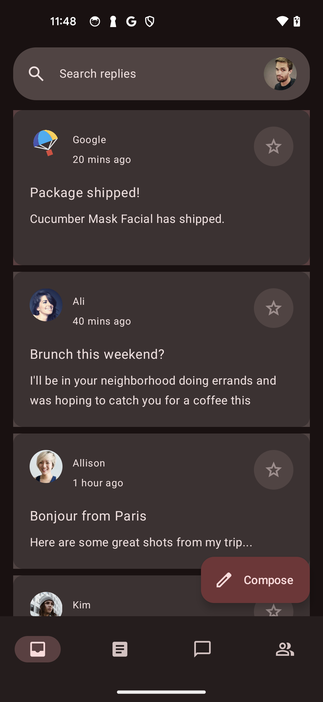

# Reply (C# port)

A simplified C# port of Google's
[`Reply`](https://github.com/android/compose-samples/tree/4c1fe7586e2fbf1c934925ef8ab64d3803361423/Reply)
Material 3 adaptive design study, rebuilt on the `Microsoft.AndroidX.Compose`
facade. Upstream Reply is a polished email client demonstrating
adaptive layouts (compact / medium / expanded), foldable awareness,
multi-pane list-detail, a docked search bar, multi-select, and a
fully animated bottom-nav / nav-rail / nav-drawer switchover.

This port keeps the **inbox/search data faithful** (12 emails and 13
accounts with matching IDs, subjects and sender names), switches top-level
navigation with the pinned width/height policy, and renders email content
through Material 3 Adaptive's fold-aware list/detail scaffold. Compact
windows animate between list and detail; expanded or separated windows show
both panes while avoiding configured hinge bounds.
Thread ordering is fixed in C# but shuffled for most Kotlin emails; see the
[data comparison boundary](../parity-baseline.md#data-and-rendering-caveats).

The [sample parity baseline](../parity-baseline.md) fixes the reference,
capture conditions, finite interaction checklist and remaining differences
for [#349](https://github.com/jonathanpeppers/Microsoft.AndroidX.Compose/issues/349).
Search and navigation are integrated; neither the checkmark in the sample
index nor the focused device results below establish whole-app parity.

The historical API 36 emulator comparisons record search/selected-detail behavior
across the size matrix and both themes, and actual activity recreation in
both implementations. They also demonstrate the avatar difference: Kotlin
toggles selection in place, while the pre-#383 C# build opens detail. The C# tab-Back captures
include an unfinished navigation transition, so this driver does **not**
establish settled tab/scroll equivalence. See the
[per-case results and limits](../parity-baseline.md#reply); the historical
physical-device results below keep their original source/APK identities.



## What's here

- Faithful port of upstream `data/local/*`:
  - `Email`, `Account`, `MailboxType`, `EmailAttachment`
  - `LocalAccountsDataProvider` — 3 user accounts + 10 contacts
  - `LocalEmailsDataProvider` — 12 emails with thread replies,
    matching upstream string content
- Routes: `Inbox`, `Articles`, `DirectMessages`, `Groups`,
  `EmailDetail/{emailId}` (the four top-level routes mirror upstream's
  `Route` sealed interface; the extra detail route remains the durable
  save/restore owner while Material 3's pane navigator owns presentation)
- Top-level destinations + `ReplyNavigationActions` wrapper using native
  pop-to-Inbox, save/restore-state and single-top navigation
- `NavigationSuiteScaffold` — bottom bar below 600 dp width or 480 dp
  height, rail from 600 through 1199 dp, and permanent drawer from 1200 dp,
  with the same four destinations
- `ReplyInboxScreen` — `LazyColumn` of `ReplyEmailListItem`s with a
  functioning docked search bar pinned to the top and an
  `ExtendedFloatingActionButton` ("Compose") whose label follows native
  scroll direction in compact windows
- `ReplyEmailListItem` — card-shaped `Surface` with `Modifier.CombinedClickable`
  (tap → open, long-press → toggle multi-select), `AnimatedContent`
  swapping a checkmark avatar in/out when selected, selected accessibility
  semantics, and no-indication avatar selection
- `ReplyEmailDetail` — a centered, inset-aware toolbar as the first
  `LazyColumn` item, followed by `ReplyEmailThreadItem`s with styled
  Reply / Reply All buttons; compact detail retains the Compose FAB
- `EmptyComingSoon` — placeholder for the Articles / DMs / Groups
  tabs

## Adaptive navigation, list/detail, and scoped styling

`ReplyApp` reads `CurrentWindowAdaptiveInfo().WindowSizeClass` inside
composition and selects `NavigationBar`, `NavigationRail`, or
`NavigationDrawer` using the pinned policy: bottom navigation below 600 dp
width or 480 dp height, rail through 1199 dp, and drawer from 1200 dp. This is
top-level navigation adaptation only; fold and expanded pane presentation is
handled separately by
`ListDetailPaneScaffold`. Its directive is calculated from the same live
`WindowAdaptiveInfo`, including separating or occluding hinges. The low-level
scaffold intentionally installs no competing Back handler: the existing
`EmailDetail/{emailId}` NavHost route continues to own system Back, tab
save/restore, and activity recreation, while the Material 3 navigator owns
pane visibility and animation. Search results and inbox rows share this same
open-email path.

The sample now uses the pinned Reply light/dark palette, type scale, 4/8/16/24/32
dp shape scale, system-bar inset readers, and Android string resources.
Dynamic color remains off, matching pinned Reply's default. Contrast-level
palette switching on API 34+ is not modeled, so high-contrast system settings
remain a documented theme difference.

The Material 3 runtime binding was inspected at the member level:
`CardDefaults.CardColors(...)`, `CardColors`, `CardDefaults.GetShape(...)`,
`TopAppBarDefaults.TopAppBarColors(...)`, and app-bar window insets are bound
in `Xamarin.AndroidX.Compose.Material3Android` 1.4.0.5. The current C# `Card`
and `TopAppBar` facades do not expose those color parameters. Reply therefore
uses zero-elevation `Surface` compositions with the pinned container colors
and 16 dp card shape, plus a `Surface`-based detail toolbar. This is a bounded
sample substitution, not evidence of a missing official binding.

## Docked search

Search follows `ReplyDockedSearchBar` in
[`ReplyAppBars.kt`](https://github.com/android/compose-samples/blob/4c1fe7586e2fbf1c934925ef8ab64d3803361423/Reply/app/src/main/java/com/example/reply/ui/components/ReplyAppBars.kt),
with selection/navigation behavior from the same revision's
[`ReplyListContent.kt`](https://github.com/android/compose-samples/blob/4c1fe7586e2fbf1c934925ef8ab64d3803361423/Reply/app/src/main/java/com/example/reply/ui/ReplyListContent.kt)
and English labels from `Reply/app/src/main/res/values/strings.xml`.

Typing filters the existing 12 emails immediately by **case-insensitive
subject or sender full-name prefix**. It does not trim whitespace or search
bodies/substrings. Results retain source order and `Email.Id` keys, showing
the subject, sender full name, and 32 dp avatar in Material 3 list items.
An empty query shows "No search history"; unmatched input shows "No item
found". Selecting a result calls the same email-ID navigation callback as an
inbox row, then clears the query and collapses search without changing the
multi-selection set.

| Action | Query | Search |
|--------|-------|--------|
| Tap the input | retained | expands and focuses the editor |
| Leading Back arrow | cleared | collapses |
| Keyboard Search action | retained | collapses |
| System Back while search is expanded | retained | collapses without navigating |
| Tap outside the state-based popup | retained | dismisses the popup |
| Leave the inbox search composition, then return | reset to empty | collapsed |

The query and expansion wrappers are remembered **inside the search
composition**, not on the reconstructed tree node or in app-wide navigation
state. Ordinary recomposition preserves them; tab/detail departure and
activity recreation reset them, matching upstream's `remember` (not
`rememberSaveable`) ownership. The native expanded popup handles dismissal;
there is no competing app-wide search `BackHandler`.
On the tested Pixel, one system Back dismissed both the expanded popup and
its IME. A second Back would reach the underlying activity/navigation; the
test must not assume an extra IME-only Back is always required.

API adaptation: upstream uses the older query/expanded `DockedSearchBar`;
this port uses the existing state-based `SearchBar`, `SearchBarInputField`,
and `ExpandedDockedSearchBar` pair. Both resolve native Material 3 1.4.0,
but the new API uses a **focusable popup**, whereas upstream's older API
expands an inline surface. Outside taps therefore dismiss this popup rather
than directly activating the underlying inbox. Its width is constrained to
the measured, padded search host so the popup retains both 16 dp side margins
instead of overflowing the right edge of the window. Popup animation and
IME focus details must not be described as pixel-identical without a matched
device comparison. No JNI or binding
changes are part of this integration. Search uses native theme typography;
the surrounding sample's existing theme/adaptive-layout differences remain.

`ReplySearchTests` in the device-test project covers prefix matching,
empty/no-match results, recomposition, native Back, leading-arrow clearing,
result selection, and removal/re-entry using the real search component and
linked sample data.

### Device validation

On 2026-09-18, the #168 candidate passed its focused fold-aware acceptance on
a Pixel 6 Pro (Android 16 / API 36) at the original 1440 x 3120, 560 dpi
viewport. `CurrentTabDoesNotDuplicate_AndSystemBackSelectsInbox`,
`InboxViewportAndSelectionSurviveTabsAndDetail`,
`AdaptiveTransitionsPreserveSearchAndTabState`, and
`SimulatedHingeSeparatesPanes_AndRouteRestores` all passed independently.
The hinge case verified exact selected email IDs, replacement without stacked
detail routes, compact detail-only presentation, a separating/occluding
vertical gap, tabletop vertical partitions, nonseparating and removed folds,
activity recreation, and system Back to Inbox. Raw `WindowLayoutInfo` and
bound `IFoldingFeature` members were observed by
`ListDetailPresentationMatchesAdaptivePaneDirective`.

The same presentation test passed after temporarily resizing the slab window
to 3000 x 2000 pixels (857 x 571 dp), where list and detail were both visible.
The `navigation-list-detail-pane` Gallery route also rendered its list,
actions, and detail content without a fatal runtime error. These are
deterministic simulated `WindowAdaptiveInfo` posture tests plus a resized
phone-window test. They are not physical hinge, tablet, or foldable-hardware
evidence. The size override was reset, both owned packages were removed, and
the original size, density, font scale, night-mode key, and rotation settings
were verified before releasing the device.

Self-contained Debug payloads were rebuilt and rechecked on that device from
22:17:36Z through 22:29:54Z. The build and installed APK hashes matched:
DeviceTests
`08F027E27C11E6A4C2D5DB15F8C41E3D51CE2A46666DCC144BBA46F76CA2E576`
and Gallery
`450C14F9E15ABDE9CC845A3C45D1D4C43B92F5044405F425EE06B07D47BCF21D`.
The compact Back/tab control, simulated-hinge restoration control, adaptive
search/tab control, compact viewport/detail control, compact and resized
expanded directive controls, and Gallery deep link all passed on those
payloads.

Two additional screenshot-driving reruns at 3000 x 2000 initially failed
before reaching their product assertions: the preserved TRXs reported
`Reply 'Articles' node was not present` and
`Selected tab 'Inbox' is missing`. The permanent drawer exposes those labels
through accessibility text, while the compact navigation items expose content
descriptions. The shared test helper now accepts either semantic form. A final
test-only DeviceTests rebuild from commit `0385492`, with matching build and
installed APK hash
`EF1F6DF66011446133AE401F5CA117FBB10B99EDD8EA6A9CEB44005095820BD0`,
passed both corrected cases at 3000 x 2000. The failed and passing
instrumentation streams and TRXs were retained separately.

On 2026-09-17, executable source `0edae77` passed all nine
`ReplyNavigationTests` and all three `ReplySearchTests` on a Pixel 10
(Android 16 / API 36) at its original 1080 x 2424, 420 dpi viewport
(411 x 923.4 dp), font scale 1.0. The exact fresh-install APKs were
`C1D39A2B49B87FAD8CE3CD5E085810C2015F7127D4EAF9EACE8F29DBFAA18DA0`
(Reply) and
`E16AFC837DBE9B604D5CA0D43B9414C100378B3105E764735F46AF19790810BA`
(tests), both target/compile SDK 37 and signed by certificate
`32e84c1bd44dde6fa8157c10affd36d0dfa9d0a2400e2278f599d441e91b9d30`.
Fresh installation removed fast-deployment overrides; the installed APK
hashes matched and both override directories were absent.

The native navigation suite covers selected avatar tap, long press, exact
bounded checked-state accessibility publication and deselection, forward /
backward FAB expansion, compact detail preservation and activity restoration
of both collapsed and expanded FAB states, centered toolbar scroll, top-level
navigation, list/detail restoration and activity recreation.
Search remains 3/3 across prefix matching, popup/IME/Back ownership and
composition re-entry. Fresh light/dark inbox screenshots and accessibility
hierarchies were captured after toggling only the authorized system night
mode; the original dark mode and unset raw secure key were restored.
Medium/expanded captures are a separate acceptance pass and are not implied
by these compact results.

The separate adaptive pass used the same Reply executable with source
`0edae77` and exact fresh-installed APK hashes `C1D39A2B...` /
`E16AFC83...`. On the same Pixel 10, the exact
`AdaptiveNavigationMatchesWindowWidth` test matched one case and passed for
each temporary window override:

| Actual app window | Expected and observed navigation |
| --- | --- |
| 600 x 900 dp | Rail |
| 840 x 800 dp | Rail |
| 1200 x 800 dp | Permanent drawer |
| 840 x 450 dp | Bottom navigation (compact-height override) |

Owned native hierarchies prove the localized Inbox label belongs to a
clickable/selected navigation control rather than content text. Earlier
light/dark Inbox/detail frames at 600 and 840 dp remain valid for the
unchanged presentation code; a detail hierarchy confirms the centered title
node. These are emulated phone-window results, not physical tablet or foldable
proof, and they predate the fold-aware list/detail integration.

On 2026-09-15, source `8da2c4f` passed all four focused checks on the attached
Pixel 7: the numeric-padding regression and all three `ReplySearchTests`
(zero failures or skips). This includes no-result-to-match recovery, exact
popup bounds, IME Search, leading/system Back, both Back owners, selected
email ID, and composition departure/re-entry.

The real C# Reply activity also completed collapsed, empty, matching,
no-result, and selected-email capture flows in both light and dark mode.
The debug-only capture harness verified the activity's actual night
configuration; it did not change global settings.

The same five states were then captured in both themes from a
**target-SDK-modernized Kotlin reference**. At the user's request, the
reference's `gradle/libs.versions.toml` target SDK changed from 33 to 36,
matching the target generated by `net11.0-android`. The Kotlin application
code, resources, package name, and signing identity stayed unchanged; the
pristine artifact was retained separately. The updated APK installed through
normal verification, without using "Install anyway" or changing security
settings. The built APKs declare min/target SDK 24/36 for C# and 23/36 for Kotlin.
No SDK numbers are maintained in the C# source `AndroidManifest.xml`.

The ten paired states confirm matching queries, result labels, input bounds,
and selected-email headers. They are **not pixel-identical or whole-app
parity**: the existing app themes differ in palette/typography, Kotlin's
legacy expanded surface includes an additional input-height region, and the
detail toolbar's insets/alignment and randomized thread order differ. The
reference's target-SDK update can also affect edge-to-edge/inset behavior;
these captures are not presented as pristine target-33 behavior.

## Stable list identity

The inbox and email-thread `LazyColumn<Email>` instances use
`Key = static email => email.Id`, matching both upstream `items(...,
key = { it.id })` calls in
[`ReplyListContent.kt`](https://github.com/android/compose-samples/blob/4c1fe7586e2fbf1c934925ef8ab64d3803361423/Reply/app/src/main/java/com/example/reply/ui/ReplyListContent.kt).
The identity reference is pinned to upstream commit
`4c1fe7586e2fbf1c934925ef8ab64d3803361423`.

`Email.Id` is the existing `long` business identifier also used for selection
and navigation, not the email's position, subject, sender, or timestamp.
Keep it unchanged when updating/reordering an email and unique within each
list. IDs may repeat between the inbox and a separate thread list; the seed
data has no repeated IDs within either list. This lets Compose retain an
email's item state and scroll anchor when other emails move around it.
The key API accepts non-null `string`, `int`, or `long` values; omitted keys
retain positional behavior.

## Navigation and Back contract

Behavior is compared with **android/compose-samples
`4c1fe7586e2fbf1c934925ef8ab64d3803361423`**, not a moving `main`:
[`ReplyNavigationActions.kt`](https://github.com/android/compose-samples/blob/4c1fe7586e2fbf1c934925ef8ab64d3803361423/Reply/app/src/main/java/com/example/reply/ui/navigation/ReplyNavigationActions.kt),
[`ReplyListContent.kt`](https://github.com/android/compose-samples/blob/4c1fe7586e2fbf1c934925ef8ab64d3803361423/Reply/app/src/main/java/com/example/reply/ui/ReplyListContent.kt),
and [`ReplyHomeViewModel.kt`](https://github.com/android/compose-samples/blob/4c1fe7586e2fbf1c934925ef8ab64d3803361423/Reply/app/src/main/java/com/example/reply/ui/ReplyHomeViewModel.kt).

| Flow | Pinned Kotlin behavior / C# contract |
|------|------------------------------------|
| Tap the current top-level tab repeatedly | Pop to the graph start without removing it, save popped entries, launch single-top, restore saved state. No duplicate current-tab entries. C# uses `PopUpToRoute = Route.Inbox` because its graph has a flat, fixed start route. |
| Switch tabs and return to Inbox | Restore the destination's native saved state, including the inbox's default Kotlin `rememberLazyListState()`. Do not replace it with a new managed `LazyListState`. |
| Open an email; system Back or app-bar Up | Return to the retained inbox context and reset the opened-email highlight to the first email. The same close action handles both paths. |
| Select another email while both panes are visible | Replace the current detail route and pane destination; Inbox remains the sole predecessor rather than accumulating detail routes. |
| Multi-selection | Long-press toggles a selected email. Selection persists through detail/tab navigation; **selection alone does not consume Back**. The pinned source has no selection Back handler. |
| Selected bottom-navigation item | Derived from the rendered destination, including Inbox for the port's detail route, rather than a separate click-updated route variable. Native Back and restoration cannot leave a stale selected tab. |
| Activity recreation | Compose saves the navigation stack and each destination's list state. `ReplyState` saves opened-email and selected IDs in the activity Bundle. Kotlin's ViewModel retains these on configuration changes; this port also saves them for Android saved-task restoration. |

The port retains its existing `EmailDetail/{emailId}` route instead of rewriting
the app to use Kotlin's in-Inbox detail pane. Switching from detail to another
tab and **tapping Inbox or pressing system Back** restores that saved detail
route. Navigation 2.9.8's non-inclusive saved pop associates the saved stack
with the `popUpTo` destination (Inbox) as well as the popped destination
(EmailDetail); restoring Inbox follows that association. A Back handler
exists only inside the non-Inbox top-level destinations
and uses the same Inbox restore action. This preserves Kotlin's still-open
in-Inbox detail context without changing the existing route architecture.
Inbox-root Back remains unhandled by the sample and exits normally; detail
owns its close action, and selection alone never intercepts.

### Search integration

The interactive `ReplySearchBar` uses the inbox's same `Action<long>` for
row/result opening. Search owns only its local expanded-state dismissal:
native Back collapses it without clearing the query; leading Back clears
and collapses. Result selection invokes the detail callback, then
clears/collapses search, without mutating multi-selection or installing an
app-wide Back handler. See [Docked search](#docked-search) for the interaction
and popup-width contracts.
The pinned search uses ordinary `remember`, not saved state; leaving its
composition resets its query/expansion. The search implementation and paired
Kotlin search artifacts are tracked separately from navigation.

### Regression coverage

`ReplyNavigationTests` in `Microsoft.AndroidX.Compose.DeviceTests` links the
actual sample source and resources, rather than a second navigation model.
The focused native cases cover repeated tab taps and Back, exact visible email
IDs/pixel offsets after tabs and detail Back/Up, retained selection, root Back
fallthrough, saved detail, and activity recreation on a tab, detail, and Inbox.
Assertions run after native lifecycle/transition, recomposer, snapshot, and
layout readiness; they do not poll for expected route/scroll values.

```pwsh
dotnet build samples\Reply
dotnet build src\Microsoft.AndroidX.Compose.DeviceTests
# On a separately authorized device:
adb shell am instrument -w -e filter FullyQualifiedName~ReplyNavigationTests net.compose.devicetests/net.compose.devicetests.TestInstrumentation
```

Physical-device verification on 2026-09-15 used the linked Reply UI at commit
`259f694` on a Pixel 7: all three navigation tests passed in separate native
instrumentation invocations, as did the padding-overload regression control.
Visible inbox email IDs and pixel offsets matched after tab switches, detail
Back/Up, and activity recreation; saved-detail restoration also passed.
Host builds alone are not native proof. These runs do not establish
process-death restoration or matched Kotlin/C# visual parity, and the separate
search implementation remains outside this navigation test suite.

The 2026-09-17 Pixel 10 run supersedes those historical focused test counts
for the integrated #383 UI. It does not supersede the paired Kotlin/C# visual
baseline; it predates the fold-aware dual-pane implementation described
above.

## Remaining differences

Upstream Reply is, before anything else, an **adaptive layouts
showcase**. The port now supports adaptive and fold-aware list/detail, while
the entries below distinguish delivered adaptations from remaining parity
work. They do not prove that the library lacks a corresponding API.

| Upstream feature | Status | Tracking issue |
|------------------|--------|----------------|
| `NavigationSuiteScaffold` compact-height/width, rail and drawer policy | Integrated at pinned 600 dp width / 480 dp height and 1200 dp drawer boundaries. | [#383](https://github.com/jonathanpeppers/Microsoft.AndroidX.Compose/issues/383); #143, #158 and #163 are delivered prerequisites. |
| `accompanist.adaptive.TwoPane` + folding-feature-aware list/detail | Integrated with the supported Material 3 Adaptive replacement (`ListDetailPaneScaffold`, pane navigator, directive calculation) and live Jetpack WindowManager posture rather than deprecated Accompanist. | [#168](https://github.com/jonathanpeppers/Microsoft.AndroidX.Compose/issues/168) |
| Scroll-responsive Compose FAB, detail presence and tertiary colors | Integrated for compact bottom navigation; label expansion uses `lastScrolledBackward || !canScrollBackward`, and compact detail retains the latest inbox-derived expansion state. | #383; [#164](https://github.com/jonathanpeppers/Microsoft.AndroidX.Compose/issues/164) and [#344](https://github.com/jonathanpeppers/Microsoft.AndroidX.Compose/issues/344) shipped. |
| Detail toolbar scroll, title alignment and styling | Integrated as the first detail `LazyColumn` item with a centered title and explicit insets. This is not an `exitUntilCollapsedScrollBehavior` claim. | #383; see pinned `ReplyListContent.kt` and `ReplyAppBars.kt`. |
| Avatar selection and `semantics { selected = isSelected }` on email cards | Integrated without changing row tap or long-press behavior. | #383; [#167](https://github.com/jonathanpeppers/Microsoft.AndroidX.Compose/issues/167) shipped. |
| System-bar spacing, named typography, theme palette and resource-localized strings | Integrated for the scoped Reply UI. Contrast-level palette switching remains different. | #383; [#69](https://github.com/jonathanpeppers/Microsoft.AndroidX.Compose/issues/69), [#61](https://github.com/jonathanpeppers/Microsoft.AndroidX.Compose/issues/61) and [#146](https://github.com/jonathanpeppers/Microsoft.AndroidX.Compose/issues/146) shipped. |
| Legacy inline `DockedSearchBar` | Intentional API adaptation: working state-based popup, with different outside-tap and expansion geometry; not a missing search implementation. | Completed [#348](https://github.com/jonathanpeppers/Microsoft.AndroidX.Compose/issues/348); bounded comparison in #349. |
| `ReplyHomeViewModel` / Kotlin Flow data ownership and in-Inbox detail pane | Intentional C# adaptation: activity-owned `ReplyState`, native saved navigation and a separate detail route. | Completed [#347](https://github.com/jonathanpeppers/Microsoft.AndroidX.Compose/issues/347); ViewModel APIs from [#160](https://github.com/jonathanpeppers/Microsoft.AndroidX.Compose/issues/160) are not a blocker. |

The reply / reply-all buttons, star icon, more-options menu, and
account avatar in the search bar are all wired as no-ops —
upstream Reply doesn't ship implementations either; they're
intentionally-stubbed UI affordances.

## Assets

- 12 icon vector drawables under
  `Resources/drawable/` (Apache 2.0, copied verbatim from upstream
  `Reply/app/src/main/res/drawable/`).
- 12 avatar JPGs + 4 paris photos under
  `Resources/drawable-nodpi/` (Apache 2.0, copied verbatim from
  upstream `Reply/app/src/main/res/drawable-nodpi/`).

## Run

```pwsh
dotnet build samples/Reply           # build
dotnet build samples/Reply -t:Run    # deploy + run on connected device
```

## Attribution

The data-layer string content (email subjects/bodies/account names),
icon vectors, and avatar / photo bitmaps are copied from
[android/compose-samples](https://github.com/android/compose-samples/tree/4c1fe7586e2fbf1c934925ef8ab64d3803361423/Reply)
under the
[Apache License 2.0](https://github.com/android/compose-samples/blob/4c1fe7586e2fbf1c934925ef8ab64d3803361423/LICENSE).
The C# UI code is original to this repo and built against the
`Microsoft.AndroidX.Compose` facade.
