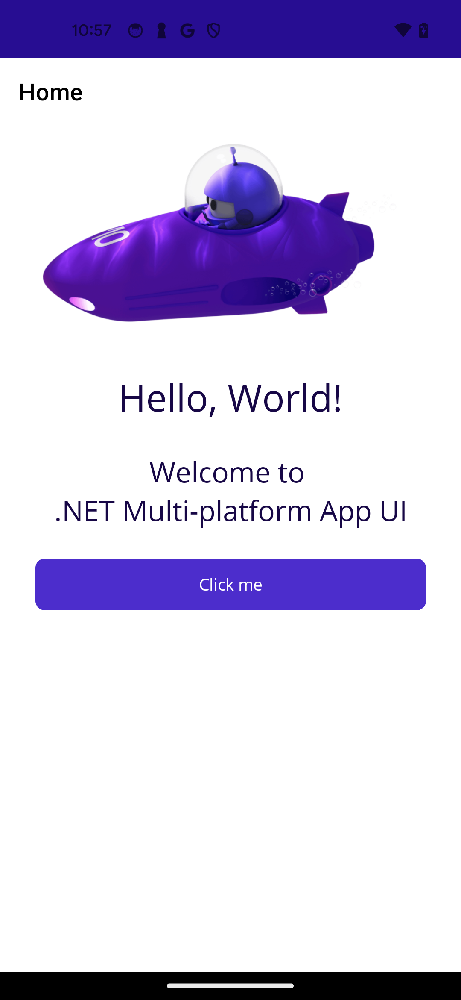

# Microsoft.AndroidX.Compose.Maui sample

The smallest possible .NET MAUI app wired up to the experimental
**`Microsoft.AndroidX.Compose.Maui`** handler backend. It mirrors the
shape of `dotnet new maui` (Shell + `MainPage.xaml` + Resources/Styles
+ OpenSans fonts + splash + appicon) so the rendered output can be
compared to the stock AppCompat-backed template one-for-one.

The interesting line is in
[`MauiProgram.cs`](MauiProgram.cs):

```csharp
builder
    .UseMauiApp<App>()
    .UseAndroidXCompose();   // <-- swap stock handlers for Compose ones
```

`UseAndroidXCompose()` overwrites the Android registrations for the
controls the backend currently owns (Label, Button). Everything else
falls back to MAUI's stock handler, so the rest of the page renders
through normal AppCompat views.

## Side-by-side with `dotnet new maui`

Same APK shape, same fonts, same status bar, same splash. The only
intentional visible delta in Phase 1 is the **Button container color** —
Compose Material 3 ships `#6750A4` and we don't yet wire up MAUI's
`Primary` resource (`#512BD4`). That's tracked as a Phase 2 follow-up
in [`docs/maui-backend.md`](../../docs/maui-backend.md).

| Compose backend (this sample)                                 | Stock MAUI template (`dotnet new maui`)                              |
| :-----------------------------------------------------------: | :-------------------------------------------------------------------: |
|  |  |

## Run

```pwsh
dotnet build src/Microsoft.AndroidX.Compose.Maui.Sample -t:Run
```

Requires the `android` workload and a connected device or emulator.

## What's verified

- Splash → Shell handoff matches the template (`Maui.SplashTheme`,
  `colorPrimaryDark` status bar).
- `Label` renders through Compose `Text` — TextColor, FontSize, FontWeight,
  HorizontalTextAlignment, HorizontalLayoutAlignment (→
  `Modifier.FillMaxWidth()`).
- `Button` renders through Compose Material 3 `Button` — Click event,
  Text, HorizontalLayoutAlignment, `IView.Background` suppressed so we
  don't double-paint behind the Compose `Surface`.
- Layout / Shell / Page / Application / Window all stay on stock
  handlers; Compose-backed leaves nest cleanly inside them.

## What's intentionally deferred

See [`docs/maui-backend.md`](../../docs/maui-backend.md) for the full
phased plan. Notable Phase 1 omissions:

- Material 3 → MAUI `Primary` color bridge (button paints M3 mauve,
  not `#512BD4`).
- All other leaf controls: Entry, Editor, Image, CheckBox, Switch,
  Slider, ProgressBar, ActivityIndicator, …
- One-`ComposeView`-per-page (Option 2 in the design doc). Phase 1 uses
  one `ComposeView` per Compose-backed leaf, which is enough to prove
  the architecture works inside MAUI's stock layout system.
- BackgroundColor, Border, Shadow, custom FontFamily / italic /
  decoration / line-height passthrough.
